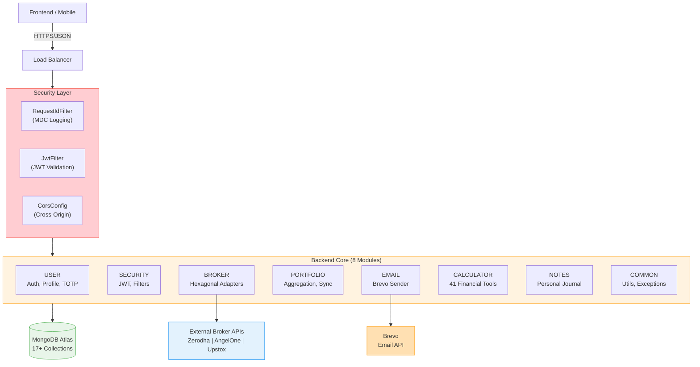
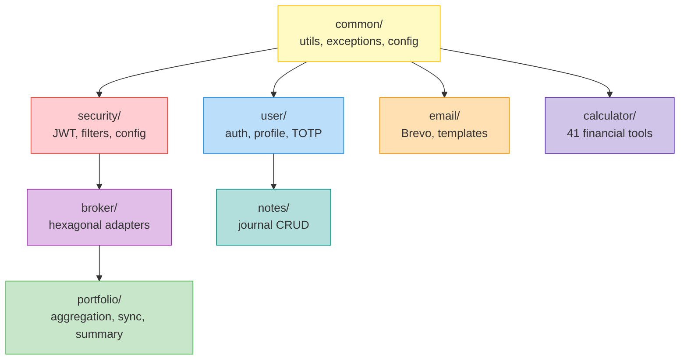
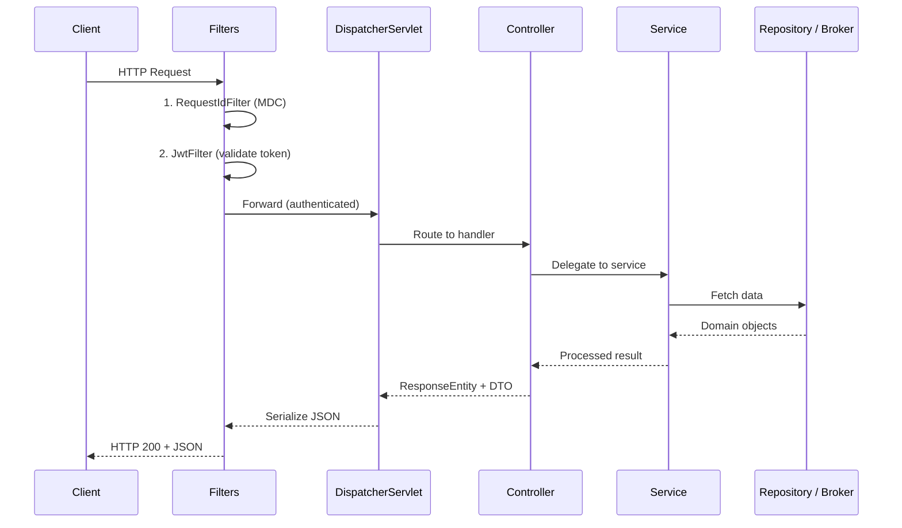
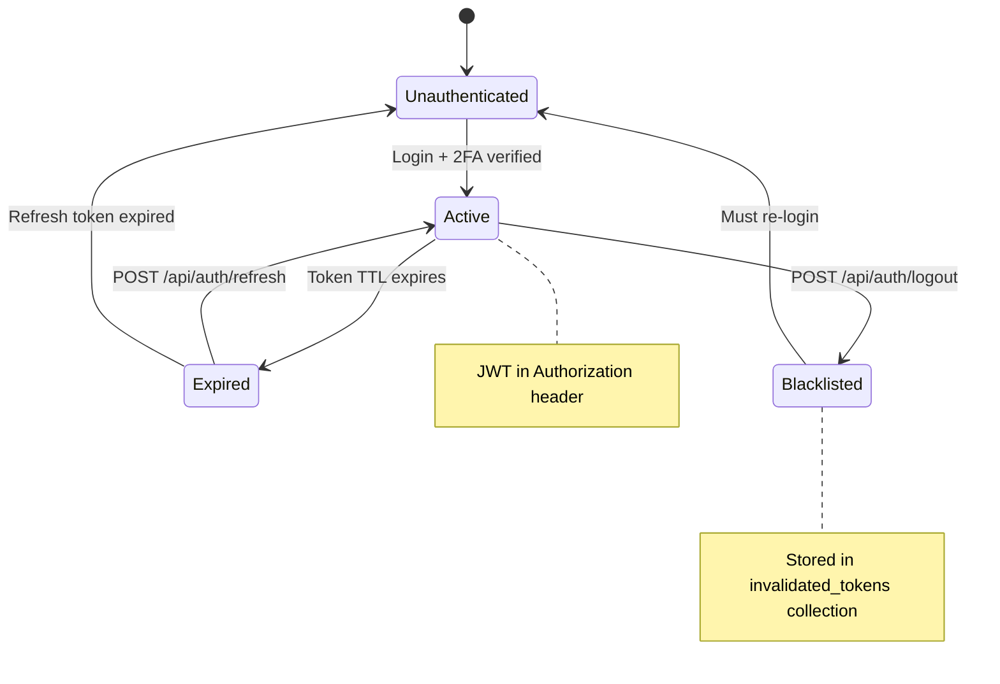
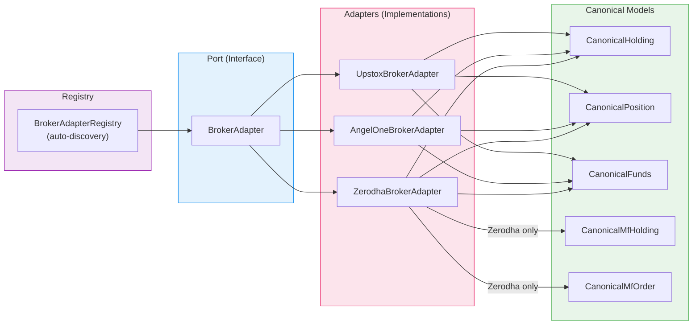
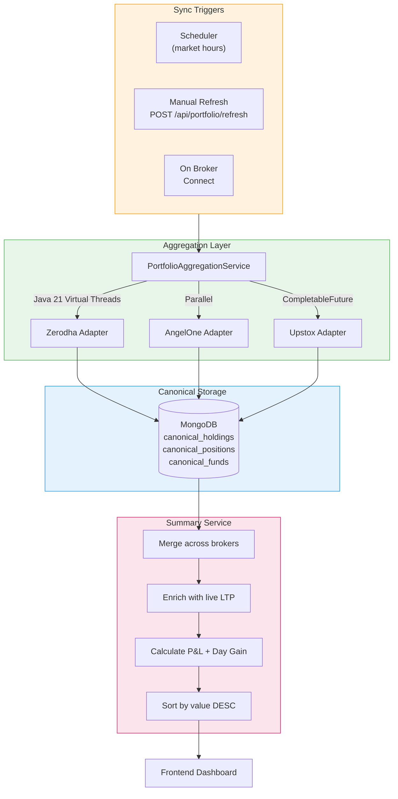
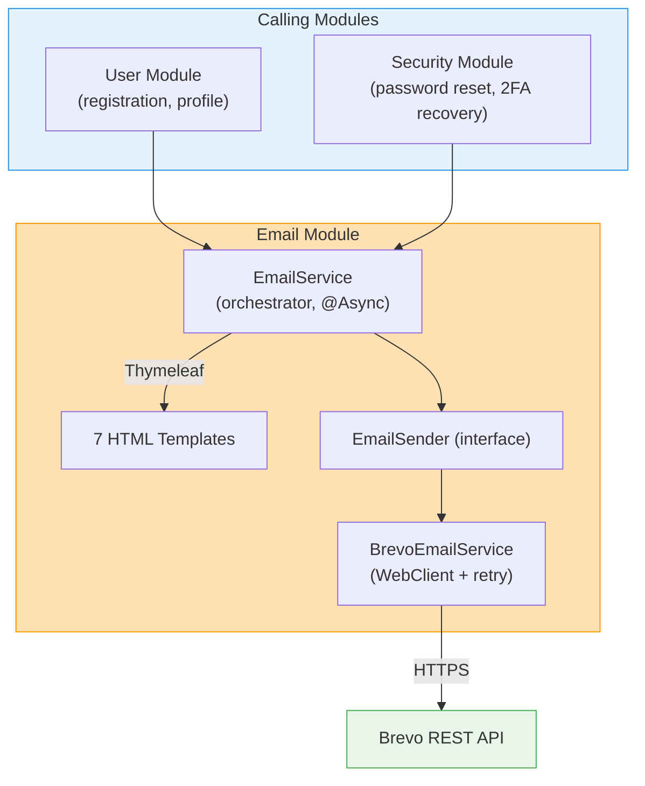
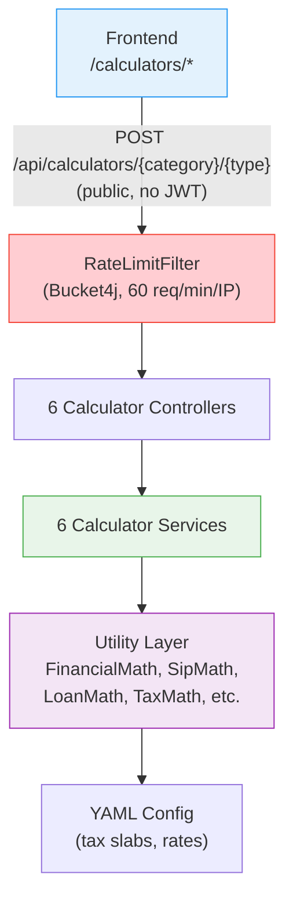
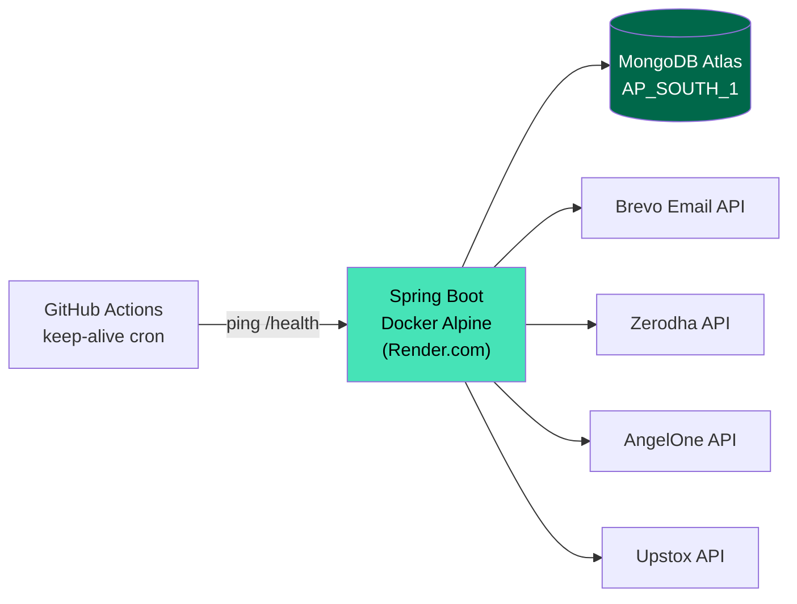

# CoinTrack Backend Architecture & Developer Guide

> **Version**: 3.0.0
> **Status**: Production-Ready
> **Tech Stack**: Java 21, Spring Boot 3.5.5, MongoDB Atlas, Spring Security (JWT + TOTP 2FA)
> **Last Updated**: 2026-03-19

---

## Table of Contents

1. [Project Overview](#1-project-overview)
2. [Key Architectural Principles](#2-key-architectural-principles)
3. [High-Level System Architecture](#3-high-level-system-architecture)
4. [Module Directory](#4-module-directory)
5. [Folder Structure](#5-folder-structure)
6. [Request Lifecycle](#6-request-lifecycle)
7. [Authentication & Authorization](#7-authentication--authorization)
8. [TOTP 2FA System](#8-totp-2fa-system)
9. [Broker Integration (Hexagonal)](#9-broker-integration-hexagonal)
10. [Portfolio & Sync Architecture](#10-portfolio--sync-architecture)
11. [Email System](#11-email-system)
12. [Calculator Suite](#12-calculator-suite)
13. [Error Handling Strategy](#13-error-handling-strategy)
14. [Logging Strategy](#14-logging-strategy)
15. [Configuration & Environments](#15-configuration--environments)
16. [Testing Strategy](#16-testing-strategy)
17. [Extension Guide](#17-extension-guide)
18. [Anti-Patterns](#18-anti-patterns)
19. [Deployment & Runtime](#19-deployment--runtime)
20. [Codebase Statistics](#20-codebase-statistics)
21. [Documentation Index](#21-documentation-index)

---

## 1. Project Overview

### What is CoinTrack?

CoinTrack is a **multi-broker portfolio aggregation engine**. It connects to various trading platforms (Zerodha, Angel One, Upstox), fetches user holdings and positions, and consolidates them into a single, unified financial view.

### The Business Problem

Active traders and investors often hold assets across multiple brokerage accounts to diversify risk or leverage specific features. However, this fragmentation makes it impossible to verify their true **Net Worth** or **Day's P&L** in real-time without manually checking multiple apps and spreadsheets.

### Why It's Hard

- **Lack of Standards**: Every broker API has a different schema for "Holdings" and "Positions".
- **Security Risks**: Handling API keys and secrets requires banking-grade encryption and hygiene.
- **Data Freshness**: Synchronizing volatile market data across diverse APIs while respecting rate limits is a distributed systems challenge.

CoinTrack solves this by acting as a **secure, normalizing middleware** between the user and the fragmented broker ecosystem.

### Key Features

| Feature | Description |
|---------|-------------|
| **Multi-Broker Support** | Zerodha, Upstox, AngelOne with unified API |
| **TOTP 2FA** | Mandatory two-factor authentication for all users |
| **Portfolio Aggregation** | Cross-broker holdings with unified P&L |
| **Holdings-Only Summary** | Positions excluded for mathematical consistency |
| **Encrypted Secrets** | AES-256-GCM encryption for all sensitive data |
| **Background Sync** | Scheduled portfolio synchronization |
| **EmailSender Interface** | Strategy pattern for email dispatch (Brevo prod) |
| **41 Financial Calculators** | Stateless, public, rate-limited computation suite |

---

## 2. Key Architectural Principles

We strictly adhere to **Domain-Driven Design (DDD)** and **Separation of Concerns**.

| Principle | Why it matters in CoinTrack |
|-----------|----------------------------|
| **Domain-Driven Design** | Finance is complex. Code structure (`portfolio`, `broker`) must match business language to prevent logic errors. |
| **Separation of Concerns** | `User` module shouldn't know about `Zerodha` APIs. Keeps the codebase modular and testable. |
| **Thin Controllers** | Controllers only handle HTTP translation. All logic resides in Services. Prevents "spaghetti code" in endpoints. |
| **Rich Domain Models** | Entities (`BrokerAccount`) contain business logic validation, not just getters/setters. |
| **Security-First** | "Trust nothing." Tokens are validated on *every* request. Secrets are *never* cleartext. |
| **Hexagonal (Ports & Adapters)** | Adding a new broker should not require changing portfolio or sync logic. |
| **Trust the Broker** | Use Zerodha's computed values (P&L, Day Change) rather than recalculating locally. |
| **Raw Pass-Through** | Every DTO includes a `raw` field preserving the complete original API response. |

---

## 3. High-Level System Architecture

CoinTrack follows a **Layered Hexagonal Architecture** with 8 domain modules.



### Module Dependency Graph



---

## 4. Module Directory

Each module has its own comprehensive README documentation.

| Module | Purpose | Size | README |
|--------|---------|------|--------|
| **broker** | Hexagonal multi-broker adapters, OAuth, canonical models | 2000+ lines | [broker/README.md](src/main/java/com/urva/myfinance/coinTrack/broker/README.md) |
| **calculator** | 41 financial calculators, config-driven, rate-limited | 1500+ lines | [calculator/README.md](src/main/java/com/urva/myfinance/coinTrack/calculator/README.md) |
| **common** | Shared infrastructure, exceptions, encryption utils | 400+ lines | [common/README.md](src/main/java/com/urva/myfinance/coinTrack/common/README.md) |
| **email** | Brevo transactional email, strategy-based sender | 300+ lines | [email/README.md](src/main/java/com/urva/myfinance/coinTrack/email/README.md) |
| **notes** | Personal investment journal (CRUD) | 200+ lines | [notes/README.md](src/main/java/com/urva/myfinance/coinTrack/notes/README.md) |
| **portfolio** | Aggregation, sync engine, P&L calculation | 2000+ lines | [portfolio/README.md](src/main/java/com/urva/myfinance/coinTrack/portfolio/README.md) |
| **security** | JWT auth, filter chain, token blacklist | 628 lines | [security/README.md](src/main/java/com/urva/myfinance/coinTrack/security/README.md) |
| **user** | Registration, profile, TOTP 2FA, refresh tokens | 750+ lines | [user/README.md](src/main/java/com/urva/myfinance/coinTrack/user/README.md) |

---

## 5. Folder Structure

The top-level structure is partitioned by **Domain**, not by technical layer.

```
backend/src/main/java/com/urva/myfinance/coinTrack/
│
├── broker/                          # Broker Integration (2000+ lines)
│   ├── adapters/                    # Hexagonal adapter implementations
│   │   ├── zerodha/                 #   Zerodha Kite Connect
│   │   │   ├── ZerodhaBrokerAdapter.java
│   │   │   ├── mapper/             #   Zerodha → Canonical mappers
│   │   │   └── raw/                #   Zerodha raw API DTOs (13 files)
│   │   ├── angelone/               #   Angel One SmartAPI
│   │   │   ├── AngelOneBrokerAdapter.java
│   │   │   ├── mapper/             #   3 mappers (Holding, Position, Funds)
│   │   │   └── raw/                #   3 raw DTOs
│   │   └── upstox/                 #   Upstox v2 API
│   │       ├── UpstoxBrokerAdapter.java
│   │       ├── mapper/             #   3 mappers
│   │       └── raw/                #   3 raw DTOs
│   ├── core/                        # Ports & domain
│   │   ├── canonical/              #   CanonicalHolding, CanonicalPosition, etc.
│   │   ├── capability/             #   BrokerCapability enum + checker
│   │   ├── exception/              #   Broker-specific exceptions (4 types)
│   │   ├── port/                   #   BrokerAdapter interface (THE PORT)
│   │   └── session/                #   BrokerSession, per-broker credentials
│   ├── controller/                  #   BrokerConnectController, BrokerStatusController, ZerodhaBridgeController
│   ├── dto/                         #   BrokerAccountDTO, 3 credential DTOs
│   ├── model/                       #   BrokerAccount, Broker enum, ExpiryReason
│   ├── normalization/               #   Symbol, Exchange, Price, Date normalizers
│   ├── registry/                    #   BrokerAdapterRegistry (auto-discovery)
│   ├── repository/                  #   BrokerAccountRepository
│   └── service/                     #   BrokerConnectService, ZerodhaLiveDataService
│
├── calculator/                      # Financial Calculators (1500+ lines)
│   ├── config/                      #   CalculatorConfigLoader, RateLimitFilter
│   ├── controller/                  #   6 category controllers
│   ├── dto/request/                 #   37 request DTOs (Java records)
│   ├── dto/response/                #   37 response DTOs
│   ├── service/                     #   6 interfaces + 6 implementations
│   └── util/                        #   FinancialMath facade, 7 math classes
│
├── common/                          # Shared Infrastructure (400+ lines)
│   ├── config/                      #   CorsConfig, WebClientConfig, EncryptionConfig, OpenApiConfig
│   ├── exception/                   #   DomainException hierarchy + GlobalExceptionHandler
│   ├── filter/                      #   RequestIdFilter (MDC)
│   ├── health/                      #   HealthController, HomeController
│   ├── response/                    #   ApiResponse, ApiErrorResponse
│   ├── service/                     #   NotificationService interface + impl
│   └── util/                        #   EncryptionUtil, HashUtil, RequestUtils
│
├── email/                           # Email Service (300+ lines)
│   ├── config/                      #   BrevoConfigProperties, EmailConfigProperties
│   ├── controller/                  #   6 controllers (Verification, ForgotPassword, Contact, etc.)
│   ├── model/                       #   EmailToken
│   ├── repository/                  #   EmailTokenRepository
│   └── service/                     #   EmailSender (interface), BrevoEmailService, EmailService
│
├── notes/                           # Personal Notes (200+ lines)
│   ├── controller/                  #   NoteController
│   ├── model/                       #   Note (with text search indexes)
│   ├── repository/                  #   NoteRepository
│   └── service/                     #   NoteService
│
├── portfolio/                       # Core Portfolio (2000+ lines)
│   ├── aggregation/                 #   PortfolioAggregationService (bridge to BrokerAdapter)
│   ├── controller/                  #   PortfolioController, ManualRefreshController, SyncStatusController
│   ├── dto/                         #   Summary, Holdings, Positions, MF DTOs + kite/ sub-DTOs
│   ├── fno/                         #   F&O position handling
│   ├── market/                      #   MarketDataService (LTP enrichment)
│   ├── model/                       #   SyncLog, SyncCooldown, SyncStatus, MarketPrice
│   ├── repository/                  #   8 repositories (Canonical*, MarketPrice, Sync*)
│   ├── scheduler/                   #   PortfolioSyncScheduler
│   ├── service/                     #   PortfolioSummaryServiceImpl, enrichers, calculators
│   ├── sync/                        #   PortfolioSyncService, SyncSafetyService
│   └── util/                        #   FnoUtils
│
├── security/                        # Authentication (628 lines)
│   ├── config/                      #   SecurityConfig (filter chain, public endpoints)
│   ├── filter/                      #   JwtFilter (OncePerRequest)
│   ├── model/                       #   UserPrincipal, InvalidatedToken (JWT blacklist)
│   ├── repository/                  #   InvalidatedTokenRepository
│   └── service/                     #   JWTService, CustomerUserDetailService
│
└── user/                            # User Management (750+ lines)
    ├── controller/
    │   ├── AuthController.java      #   Login, register, TOTP, refresh
    │   ├── TotpController.java      #   2FA setup, verify, reset
    │   └── UserController.java      #   Profile, password, email change
    ├── dto/                         #   9 DTOs (Login, Register, TOTP, etc.)
    ├── model/
    │   ├── User.java                #   16+ fields incl. TOTP + rate limiting
    │   ├── BackupCode.java          #   One-time 2FA recovery codes
    │   ├── PendingRegistration.java #   Email verification queue
    │   └── RefreshToken.java        #   JWT refresh token persistence
    ├── repository/                  #   4 repositories (User, BackupCode, Pending, Refresh)
    └── service/
        ├── TotpService.java         #   14 methods, 361 lines
        ├── UserService.java         #   Registration, profile management
        ├── UserAuthenticationService.java  # Login, token generation
        └── UserProfileService.java  #   Profile updates
```

> **Rule:** `common` is the only module that should be widely imported. Avoid circular dependencies between domains.

---

## 6. Request Lifecycle

Every HTTP request traverses a strict pipeline.



---

## 7. Authentication & Authorization

Security is stateless and JWT-based with mandatory TOTP 2FA.

### Components

| Component | File | Purpose |
|-----------|------|---------|
| **JWTService** | `security/service/JWTService.java` | Sign/validate tokens (HMAC-SHA256) |
| **JwtFilter** | `security/filter/JwtFilter.java` | Extract Bearer token, validate, set SecurityContext |
| **SecurityConfig** | `security/config/SecurityConfig.java` | Define public/protected routes, filter chain |
| **UserPrincipal** | `security/model/UserPrincipal.java` | Spring Security `UserDetails` adapter |
| **InvalidatedToken** | `security/model/InvalidatedToken.java` | JWT blacklist (logout support) |

### JWT Token Lifecycle



### Critical Rules

- **Manual Parsing Forbidden**: Never manually parse `Authorization` headers. Use `@AuthenticationPrincipal` or `Principal`.
- **Public Routes**: Explicitly whitelisted in `SecurityConfig` (e.g., `/login`, `/register`, `/api/calculators/**`). All others are deny-by-default.

---

## 8. TOTP 2FA System

CoinTrack enforces **mandatory TOTP 2FA** for all users.

### Components

| Component | Location | Purpose |
|-----------|----------|---------|
| **AuthController** | `user/controller/AuthController.java` | Registration + login TOTP flows |
| **TotpController** | `user/controller/TotpController.java` | 2FA setup, verify, reset |
| **TotpService** | `user/service/TotpService.java` | 361 lines, 14 methods |
| **BackupCode** | `user/model/BackupCode.java` | One-time recovery codes |

### TOTP Flow

```mermaid
flowchart TD
    subgraph REG["Registration (New Users)"]
        R1["1. POST /api/auth/register"] -->|"tempToken"| R2["2. POST /api/auth/2fa/register/setup"]
        R2 -->|"qrCode, secret"| R3["3. User scans QR in authenticator"]
        R3 --> R4["4. POST /api/auth/2fa/register/verify"]
        R4 -->|"JWT + backupCodes"| R5["5. User saved, authenticated"]
    end

    subgraph LOGIN["Login (Existing Users)"]
        L1["1. POST /api/auth/login"] -->|"requiresOtp: true, tempToken"| L2["2. POST /api/auth/login/totp"]
        L2 -->|"JWT + refreshToken"| L3["Authenticated"]
    end

    subgraph REC["Recovery (Lost Authenticator)"]
        RC1["1. POST /api/auth/login"] -->|"tempToken"| RC2["2. POST /api/auth/login/recovery"]
        RC2 -->|"uses one-time backup code"| RC3["Authenticated"]
    end

    style REG fill:#e8f5e9,stroke:#4CAF50
    style LOGIN fill:#e3f2fd,stroke:#2196F3
    style REC fill:#fff3e0,stroke:#FF9800
```



### Security Measures

| Measure | Implementation |
|---------|----------------|
| **Secret Encryption** | AES-256-GCM via `EncryptionUtil` |
| **Backup Codes** | 10 codes, BCrypt hashed, one-time use |
| **Rate Limiting** | 5 failed attempts → 15-minute lockout |
| **Temp Tokens** | 5-minute expiry for TOTP verification |
| **Refresh Tokens** | Persisted in MongoDB, rotated on use |

---

## 9. Broker Integration (Hexagonal)

The **Broker Module** uses **Hexagonal Architecture (Ports & Adapters)** to isolate the system from 3rd-party API chaos.

### Architecture



### BrokerAdapter Port

```java
public interface BrokerAdapter {
    Broker getBrokerType();
    Set<BrokerCapability> getCapabilities();

    CompletableFuture<List<CanonicalHolding>> fetchHoldings(BrokerSession session);
    CompletableFuture<List<CanonicalPosition>> fetchPositions(BrokerSession session);
    CompletableFuture<CanonicalFunds> fetchFunds(BrokerSession session);

    // MF operations (default: throw UnsupportedBrokerOperationException)
    CompletableFuture<List<CanonicalMfHolding>> fetchMfHoldings(BrokerSession session);
    CompletableFuture<List<CanonicalMfOrder>> fetchMfOrders(BrokerSession session);
}
```

### Registry Pattern (Auto-Discovery)

```java
BrokerAdapter adapter = registry.getAdapter(Broker.ZERODHA);
```

The `BrokerAdapterRegistry` collects all `BrokerAdapter` beans at startup and provides O(1) lookup by broker type.

### Capability System

Each adapter declares its capabilities. Before calling any fetch method, `BrokerCapabilityChecker` verifies support:

```java
public enum BrokerCapability {
    HOLDINGS, POSITIONS, FUNDS, ORDERS, TRADES,
    MF_HOLDINGS, MF_ORDERS, MF_SIPS, MF_INSTRUMENTS,
    USER_PROFILE, LIVE_MARKET_DATA
}
```

### Supported Brokers

| Broker | Status | Holdings | Positions | Funds | MF | Orders | Live Data |
|--------|--------|----------|-----------|-------|----|--------|-----------|
| Zerodha | Complete | Yes | Yes | Yes | Yes | Yes | Yes |
| Angel One | Complete | Yes | Yes | Yes | -- | -- | -- |
| Upstox | Complete | Yes | Yes | Yes | -- | -- | -- |

### Normalization Layer

4 normalizers ensure consistent data across brokers:

| Normalizer | Purpose |
|-----------|---------|
| `SymbolNormalizer` | Standardize trading symbols (e.g., `RELIANCE` vs `RELIANCE-EQ`) |
| `ExchangeNormalizer` | Map broker exchange codes to canonical `Exchange` enum |
| `PriceNormalizer` | Handle decimal precision and currency |
| `DateNormalizer` | Normalize date formats across broker APIs |

### Token Lifecycle

1. **Connect**: OAuth exchange → tokens encrypted with AES-256-GCM & saved
2. **Expiry**: Most tokens expire daily (~6 AM IST)
3. **Re-Auth**: Backend detects 401/403 → marks `REQUIRES_REAUTH`

---

## 10. Portfolio & Sync Architecture

This is the system's "Heartbeat".

### Data Flow



### Core Concepts

| Concept | Description |
|---------|-------------|
| **Holdings** | Long-term delivery assets (Stocks, ETFs) |
| **Positions** | Intraday or F&O contracts |
| **Canonical Models** | Broker-agnostic DTOs persisted in MongoDB |
| **Sync** | Pull data from Broker Adapters → Persist canonical models |

### Sync Strategy: Cache-First

1. **User Request**: Returns data from MongoDB (fast, ms latency)
2. **Background Sync**: Updates MongoDB from Broker APIs via adapters
3. **Cooldown**: 5-minute minimum between syncs per broker (prevents rate limiting)

### Holdings-Only Rule

**Positions are EXCLUDED from portfolio summary totals** to maintain mathematical consistency:
- `Total Day Gain = Total Current Value - Total Previous Value`
- Positions lack stable "Previous Close" concept

### Zerodha Guardrails (CRITICAL)

| Rule | Reason |
|------|--------|
| **No Re-computation** | Never recompute values Zerodha provides (`m2m`, `pnl`) |
| **F&O Safety** | Never use `quantity * price` for derivatives |
| **Current Value** | `Invested + Total P&L` (not `qty * price`) |
| **Day Gain** | Use `m2m` directly from broker |

### Key Services

| Service | Responsibility |
|---------|---------------|
| `PortfolioAggregationService` | ONLY class that touches `BrokerAdapter` — bridge between broker and portfolio |
| `PortfolioSummaryServiceImpl` | Merges holdings, enriches with LTP, calculates P&L (largest file: 55KB) |
| `PortfolioSyncServiceImpl` | Orchestrates sync: fetch → normalize → persist |
| `SyncSafetyServiceImpl` | Cooldown enforcement, prevents excessive API calls |
| `HoldingEnricher` / `PositionEnricher` | Add market prices and computed fields |
| `MarketDataServiceImpl` | LTP cache with Zerodha market data API |

---

## 11. Email System

### Architecture



### Email Templates

| Template | Trigger | Has Magic Link |
|----------|---------|---------------|
| `welcome.html` | Registration | No |
| `verify-email.html` | Registration, email change | Yes (10 min expiry) |
| `reset-password.html` | Forgot password | Yes (10 min expiry) |
| `change-email.html` | Email update | Yes (10 min expiry) |
| `2fa-recovery.html` | Lost authenticator | Yes (10 min expiry) |
| `security-alert.html` | Password/2FA/email change | No |
| `contact-form.html` | Public contact form | No |

### Controllers (6)

`AdminEmailPreviewController` (dev-only preview), `ContactController`, `EmailChangeController`, `EmailVerificationController`, `ForgotPasswordController`, `TwoFactorRecoveryController`

---

## 12. Calculator Suite

41 financial calculators organized into 6 categories. All **public** (no authentication) and **rate-limited** (60 req/min/IP via Bucket4j).

### Architecture



### Categories

| Category | Controllers | Calculators |
|----------|------------|-------------|
| **Investment** | `InvestmentCalculatorController` | SIP, Lumpsum, Step-up SIP, XIRR, CAGR, Inflation, Stock Average |
| **Loans** | `LoanCalculatorController` | EMI, Home Loan, Car Loan, Compound Interest, Simple Interest, Flat vs Reducing |
| **Savings** | `SavingsCalculatorController` | PPF, NPS, FD, RD, SSY, NSC, SCSS, MIS, APY, EPF |
| **Tax** | `TaxCalculatorController` | Income Tax, Salary, HRA, Gratuity, TDS, GST |
| **Trading** | `TradingCalculatorController` | Brokerage, Margin |
| **Planning** | `PlanningCalculatorController` | Retirement |

### Design Principles

- **Stateless**: No database, no sessions — pure computation
- **BigDecimal everywhere**: No `double` or `float` in financial calculations
- **Records for DTOs**: All request/response types are Java records (immutable)
- **Externalized config**: Tax slabs and rates loaded from YAML files

---

## 13. Error Handling Strategy

Global exception handling via `@RestControllerAdvice`.

### Exception Hierarchy

| Exception | HTTP Status | Use Case |
|-----------|-------------|----------|
| `DomainException` | varies | Base class |
| `AuthenticationException` | 401 | Bad credentials |
| `AuthorizationException` | 403 | Insufficient permissions |
| `ExternalServiceException` | 502 | Broker API down |
| `ValidationException` | 400 | Bad input |
| `BrokerAuthException` | 401 | Broker token expired |
| `BrokerApiDownException` | 502 | Broker API unreachable |
| `BrokerRateLimitException` | 429 | Broker rate limit exceeded |

### Response Format

```json
{
  "success": false,
  "error": {
    "code": "BROKER_CONNECTION_FAILED",
    "message": "Zerodha API rejected the token."
  },
  "requestId": "a1b2-c3d4"
}
```

> **Rule**: Never expose Java stack traces to the client.

---

## 14. Logging Strategy

SLF4J with **MDC (Mapped Diagnostic Context)**.

### Principles

1. **Correlation**: Every log line includes `[requestId=...]`
2. **Sanitization**: Never log `access_token`, `password`, `api_secret`
3. **Levels**: INFO (business), WARN (recoverable), ERROR (failures)

### Example

```
INFO  [requestId=abc-123] c.u.m.c.u.s.UserAuthenticationService : Login successful for user: urva123
ERROR [requestId=xyz-789] c.u.m.c.b.a.z.ZerodhaBrokerAdapter : Broker sync failed - TokenException
```

---

## 15. Configuration & Environments

### Files

- `application-dev.properties`: Local DB, debug logging
- `application-prod.properties`: Remote DB, info logging
- `application-secret.properties`: Secrets (gitignored)

### Environment Variables

| Variable | Required | Purpose |
|----------|----------|---------|
| `MONGODB_URI` | Yes | MongoDB Atlas connection string |
| `MONGODB_DB` | No | Database name (default: `Finance`) |
| `JWT_SECRET` | Yes | 256-bit JWT signing key (hex) |
| `ENCRYPTION_SECRET_KEY` | Yes | AES-256 key (exactly 32 chars) |
| `TOTP_ENCRYPTION_KEY` | Yes | TOTP secret encryption (64 hex chars) |
| `BREVO_API_KEY` | Yes | Brevo transactional email API key |
| `FRONTEND_URL` | Yes | Frontend origin for email links |
| `CORS_ALLOWED_ORIGINS` | Yes | Allowed CORS origins |
| `PORT` | No | Server port (default: 8080) |

> **Commit Rule**: Never commit real credentials to Git.

---

## 16. Testing Strategy

### Philosophy

- **Unit Tests**: Test logic in isolation. Mock all dependencies.
- **Integration Tests**: Test Controller → Service → DB flow.

### Mocking

```java
@MockBean
private BrokerAdapterRegistry registry;

when(registry.getAdapter(Broker.ZERODHA)).thenReturn(mockAdapter);
when(mockAdapter.fetchHoldings(any())).thenReturn(CompletableFuture.completedFuture(mockHoldings));
```

---

## 17. Extension Guide

### Adding a New Broker (e.g., Groww)

1. Add `GROWW` to `Broker` enum
2. Create `broker/adapters/groww/` directory:
   - `GrowwBrokerAdapter.java` implementing `BrokerAdapter`
   - `mapper/` with `GrowwHoldingMapper`, `GrowwPositionMapper`, `GrowwFundsMapper`
   - `raw/` with Groww API response DTOs
3. Implement `getCapabilities()` returning supported `BrokerCapability` set
4. Implement `fetchHoldings()`, `fetchPositions()`, `fetchFunds()`
5. Add `GrowwCredentials` in `core/session/`
6. Add `GrowwCredentialsDTO` in `dto/`
7. The `BrokerAdapterRegistry` **auto-discovers** the new bean — no manual registration needed

### Adding a New Domain

1. Create folder under `coinTrack/newdomain`
2. Create subfolders: `controller`, `service`, `repository`, `model`
3. Add `README.md` for that domain
4. Whitelist public routes in `SecurityConfig` if needed

---

## 18. Anti-Patterns (STRICTLY FORBIDDEN)

| Anti-Pattern | Why Forbidden |
|--------------|---------------|
| Business Logic in Controllers | Hard to test, duplicates logic |
| Manual JWT Parsing | Vulnerable to spoofing |
| `e.printStackTrace()` | Clutters logs, security risk |
| God Services | Creates tight coupling |
| Hardcoded Secrets | Security vulnerability |
| Frontend Math | Inconsistent calculations |
| Direct Broker API in Portfolio | Always go through `BrokerAdapter` port |
| `double`/`float` in Finance | Use `BigDecimal` for all monetary calculations |

---

## 19. Deployment & Runtime

### Startup Sequence

1. Spring Context loads
2. MongoDB connection established
3. `BrokerAdapterRegistry` auto-discovers adapter beans
4. `PortfolioSyncScheduler` starts background sync

### Resilience

- **Stateless**: Can scale horizontally behind Load Balancer
- **DB Down**: API returns 500, cached data unavailable
- **Broker Down**: Per-broker error isolation, other brokers unaffected
- **Email Down**: Fail-safe (returns false), never blocks auth flows

### Production Architecture



---

## 20. Codebase Statistics

| Metric | Value |
|--------|-------|
| **Total Modules** | 8 |
| **Total Source Files** | ~200+ |
| **Total Lines of Code** | ~15,000+ |
| **API Endpoints** | ~50+ |
| **MongoDB Collections** | 17+ |
| **DTOs** | 80+ |
| **Broker Adapters** | 3 |
| **Financial Calculators** | 41 |

### Key Files by Size

| File | Purpose | Lines |
|------|---------|-------|
| `PortfolioSummaryServiceImpl.java` | P&L calculation, LTP enrichment | 1,500+ |
| `ZerodhaBrokerAdapter.java` | Complete Zerodha integration | 400+ |
| `PortfolioSyncServiceImpl.java` | Sync orchestration | 500+ |
| `TotpService.java` | 2FA logic, 14 methods | 361 |
| `UserAuthenticationService.java` | Login, token management | 300+ |
| `FinancialMath.java` | Calculator math facade | 500+ |

### MongoDB Collections

| Collection | Module | Purpose |
|-----------|--------|---------|
| `users` | user | User accounts |
| `backup_codes` | user | 2FA recovery codes |
| `pending_registrations` | user | Email verification queue |
| `refresh_tokens` | user | JWT refresh sessions |
| `broker_accounts` | broker | Broker connection state |
| `canonical_holdings` | portfolio | Equity holdings (cross-broker) |
| `canonical_positions` | portfolio | Open positions |
| `canonical_funds` | portfolio | Cash balances |
| `canonical_mf_holdings` | portfolio | Mutual fund holdings |
| `canonical_mf_orders` | portfolio | MF order history |
| `market_prices` | portfolio | Cached LTP data |
| `sync_cooldown` | portfolio | Rate limit cooldown |
| `sync_log` | portfolio | Sync audit trail |
| `invalidated_tokens` | security | JWT blacklist |
| `email_tokens` | email | Verification/reset tokens |
| `notes` | notes | User notes (text indexed) |

---

## 21. Documentation Index

### Module READMEs

| Module | Location | Lines |
|--------|----------|-------|
| Broker | [broker/README.md](src/main/java/com/urva/myfinance/coinTrack/broker/README.md) | 680+ |
| Calculator | [calculator/README.md](src/main/java/com/urva/myfinance/coinTrack/calculator/README.md) | 560+ |
| Common | [common/README.md](src/main/java/com/urva/myfinance/coinTrack/common/README.md) | 750+ |
| Email | [email/README.md](src/main/java/com/urva/myfinance/coinTrack/email/README.md) | 450+ |
| Notes | [notes/README.md](src/main/java/com/urva/myfinance/coinTrack/notes/README.md) | 660+ |
| Portfolio | [portfolio/README.md](src/main/java/com/urva/myfinance/coinTrack/portfolio/README.md) | 700+ |
| Security | [security/README.md](src/main/java/com/urva/myfinance/coinTrack/security/README.md) | 660+ |
| User | [user/README.md](src/main/java/com/urva/myfinance/coinTrack/user/README.md) | 760+ |

### Related

- [Frontend Documentation](../frontend/README.md)
- [Swagger UI (Local)](http://localhost:8080/swagger-ui.html)

---

## Final Notes for Maintainers

You are the custodian of a financial system. User trust is our currency.

1. **Review Carefully**: One bad import can break banking-grade architecture
2. **Respect the Layers**: Don't bypass Service layer from Controllers
3. **Security is Everyone's Job**: Fix hardcoded secrets immediately
4. **Use the Port**: All broker access goes through `BrokerAdapter` — never call broker APIs directly from portfolio

*Build securely. Code cleanly.*

**CoinTrack Backend Engineering**
