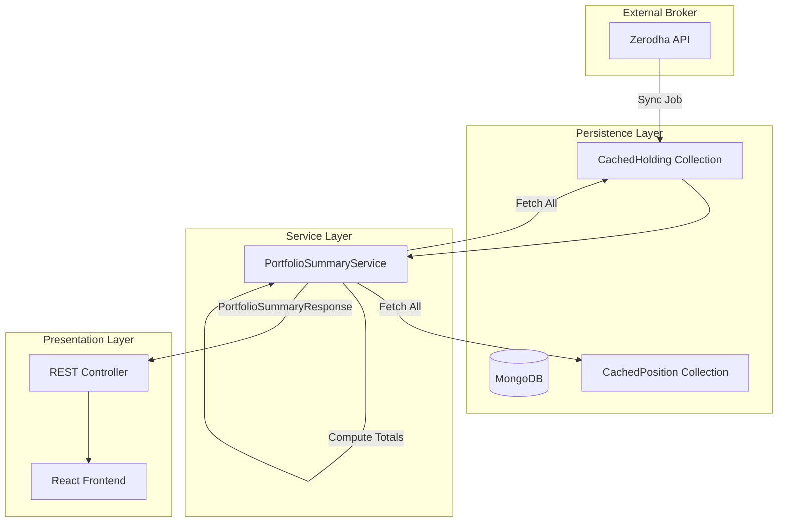

# Portfolio Summary Architecture

> **Version**: 1.0.1
> **Module**: Portfolio Core
> **Status**: Production-Ready
> **Author**: CoinTrack Backend Team

---

## 1. Executive Summary

The **Portfolio Summary** is the financial heart of the CoinTrack dashboard. It aggregates a user's disparate holding records into a single, cohesive financial snapshot.

Crucially, this module is built to be **Zerodha-Compliant**, meaning its values are mathematically derived to match exactly what a user would see on their broker app, even if that requires stricter logic than generic portfolio trackers.

**Key capabilities:**
*   **Total Portfolio Value** aggregation.
*   **Day's Gain** calculation with "Previous Day" auditing.
*   **Unrealized P&L** tracking.
*   **Zero-latency** derived views (from cached data).

---

## 2. Architecture & Data Flow

### 2.1 System Context

The Portfolio Summary is a **read-only** aggregation layer that sits on top of the persistence layer. It does not fetch live data from the broker itself; rather, it computes summaries from the data already synced into the `CachedHolding` table.



### 2.2 Component Drill-Down

#### A. `PortfolioSummaryServiceImpl` ( The Brain)
This class allows no ambiguity. It iterates through holdings and sums them up.
*   **Location**: `backend/src/main/java/.../service/impl/PortfolioSummaryServiceImpl.java`
*   **Responsibility**:
    1.  Fetch `CachedHolding` by `userId`.
    2.  Sum up quantities and values.
    3.  Compute derived metrics (`DayGain`, `P&L`).
    4.  Apply "Holdings Only" filter for totals.

#### B. `PortfolioSummaryResponse` (The Contract)
This DTO defines exactly what the frontend receives.
*   **Location**: `backend/src/main/java/.../dto/PortfolioSummaryResponse.java`
*   **Key Fields**:
    *   `previousDayTotalValue`: The mathematical baseline.
    *   `totalDayGain`: The movement from that baseline.
    *   `totalUnrealizedPLPercent`: Overall return percentage.

---

## 3. The Financial Kernel (Calculations)

This section details the **exact** math used. No approximations.

### 3.1 The "Holdings Only" Axiom

> **Axiom**: The "Day's Gain" of a portfolio is defined strictly as the change in value of its **Delivery Assets** (Holdings) compared to their **Previous Close**.

**Why exclude Intraday Positions?**
Intraday positions (MIS, BO, CO) do not exist "overnight". They have no "Previous Close" in the context of your portfolio value yesterday. Including them creates phantom variance. For example:
*   *Yesterday*: Portfolio = ₹10L.
*   *Today*: You take a ₹50L intraday position.
*   *Incorrect Logic*: Current Value = ₹60L. Day Gain = ₹50L (Wrong!).
*   *Correct Logic (Ours)*: Current Value (Holdings) = ₹10L. Day Gain = ₹0. (Intraday P&L is separate).

### 3.2 Formulas

For a set of holdings $H = \{h_1, h_2, ... h_n\}$:

#### **1. Total Current Value ($V_{now}$)**
$$
V_{now} = \sum_{i=1}^{n} (Q_i \times LTP_i)
$$
*   Where $Q$ is Quantity and $LTP$ is Last Traded Price.

#### **2. Previous Day Total ($V_{prev}$)**
$$
V_{prev} = \sum_{i=1}^{n} (Q_i \times P_{close,i})
$$
*   Where $P_{close}$ is the official Previous Close price from the exchange.

#### **3. Total Day Gain ($G_{day}$)**
$$
G_{day} = V_{now} - V_{prev}
$$
*   *Note*: We do **NOT** sum the individual `dayChange` fields from Zerodha. We sum the portfolio values and *derive* the difference. This handles rounding errors better.

#### **4. Day Gain Percent ($\%G_{day}$)**
$$
\%G_{day} = \left( \frac{G_{day}}{V_{prev}} \right) \times 100
$$
*   **Guardrail**: If $V_{prev} == 0$, then $\%G_{day} = 0.00$.

#### **5. Total Unrealized P&L ($P\&L_{total}$)**
$$
P\&L_{total} = V_{now} - \sum_{i=1}^{n} (Q_i \times P_{avg,i})
$$

#### **6. Total Unrealized P&L % ($\%P\&L_{total}$)**
$$
\%P\&L_{total} = \left( \frac{P\&L_{total}}{V_{invested}} \right) \times 100
$$
*   **Guardrail**: If $V_{invested} == 0$, then $\%P\&L_{total} = 0.00$.

### 3.3 Precision Specification

We use `java.math.BigDecimal` exclusively.

| Step | Precision | Rounding | Rationale |
| :--- | :--- | :--- | :--- |
| **Ingestion** | As received (4-6 decimals) | None | Preserve Broker raw fidelity. |
| **Summation** | Full precision | None | Prevent cascading rounding errors. |
| **Division** | 6 decimals (Internal), 8 (DayGain) | `HALF_UP` | Essential for accurate percentage calc. |
| **JSON Output** | 4 decimals | `HALF_UP` | Standard API precision. |
| **UI Display** | 2 decimals | `HALF_UP` | User readability standard. |

---

## 4. API Data Dictionary

A step-by-step guide to the `PortfolioSummaryResponse` JSON.

| Field Name | Type | Description |
| :--- | :--- | :--- |
| `totalCurrentValue` | `BigDecimal` | The absolute current market value of all holdings. |
| `previousDayTotalValue` | `BigDecimal` | The theoretical value of these exact holdings at yesterday's close. |
| `totalInvestedValue` | `BigDecimal` | The total cost basis (Book Value). |
| `totalUnrealizedPL` | `BigDecimal` | Total paper profit/loss (`Current - Invested`). |
| `totalUnrealizedPLPercent`| `BigDecimal` | Overall portfolio return percentage. |
| `totalDayGain` | `BigDecimal` | Today's monetary movement (`Current - Prev`). |
| `totalDayGainPercent` | `BigDecimal` | Percentage movement for the day. |
| `holdingsList` | `List<Object>` | The list of individual assets contributing to the above sums. |
| `positionsList` | `List<Object>` | **Display Only**. Intraday/F&O positions. **Excluded** from totals. |
| `lastHoldingsSync` | `Date` | Timestamp of the last successful broker sync. |

---

## 5. Frontend Integration Guide

The frontend is a "dumb" terminal. It blindly trusts the values from the backend.

### 5.1 The "Micro-Change" Rule
Users hate seeing `0.00%` when their portfolio actually moved by ₹50.
*   **Problem**: ₹50 on ₹50L is `0.001%`. Rounding to 2 decimals gives `0.00%`.
*   **Solution**: The frontend logic checks:
    ```javascript
    if (dayGain != 0 && abs(percent) < 0.01) {
        return "< 0.01%";
    }
    ```

### 5.2 Color Coding
*   **Green**: Value $\ge 0$
*   **Red**: Value $< 0$

---

## 6. Troubleshooting & Edge Cases

### 6.1 "My Day Gain is higher than the sum of my stocks!"
*   **Cause**: You likely had a stock that was excluded or computed differently in a manual check.
*   **Verification**: The Backend sums *everything*. Check if a specific holding has a missing `previousClose` (making its contribution to PrevTotal = 0, effectively treating the whole value as gain).

### 6.2 "Why are my F&O positions missing from the total?"
*   **Feature, not bug.** F&O positions are MTM (Mark-to-Market) settled daily. They do not have "Holding" value in the long-term sense. They are shown in the "Positions" tab.

### 6.3 "The percentage is infinite!"
*   **Scenario**: You bought a stock today that just listed (IPO). Previous Close is 0.
*   **Result**: Previous Total = 0. Divisor is 0.
*   **Fix**: System hard-codes `0.00%` in this edge case to prevent `NaN` or Infinity errors.

---

## 7. Concrete Example

**Portfolio State**: 2 Stocks.

| Stock | Qty | Buy Price | Prev Close | Current Price |
| :--- | :--- | :--- | :--- | :--- |
| **INFY** | 10 | 1400 | 1480 | 1500 |
| **TCS** | 5 | 3000 | 3200 | 3100 |

**Backend Execution**:

1.  **INFY Sums**:
    *   Current: $10 \times 1500 = 15,000$
    *   Prev: $10 \times 1480 = 14,800$

2.  **TCS Sums**:
    *   Current: $5 \times 3100 = 15,500$
    *   Prev: $5 \times 3200 = 16,000$

3.  **Aggregates**:
    *   **Total Current**: $15,000 + 15,500 = 30,500$
    *   **Total Prev**: $14,800 + 16,000 = 30,800$

4.  **Derived**:
    *   **Day Gain**: $30,500 - 30,800 = -300$
    *   **Day Gain %**: $(-300 / 30,800) \times 100 = -0.97\%$

**JSON Response**:
```json
{
  "totalCurrentValue": 30500.0000,
  "previousDayTotalValue": 30800.0000,
  "totalDayGain": -300.0000,
  "totalDayGainPercent": -0.9700
}
```

---

## 8. Timeline Events System

### 8.1 Overview

The Portfolio Summary service generates a **timeline of events** representing significant portfolio milestones. Events are stored and displayed chronologically to provide users with a historical view of their investment journey.

### 8.2 Event Types

| Event Type | Trigger | Contains |
|------------|---------|----------|
| `HOLDINGS_SYNC` | First successful holdings sync | Count of holdings, total value |
| `MF_HOLDINGS_SYNC` | First MF holdings sync | Count of funds, total value |
| `POSITION_OPENED` | New position detected | Symbol, quantity, entry price |
| `SIP_CREATED` | New SIP registered | Fund name, amount, frequency, initial status |
| `SIP_STATUS_CHANGE` | SIP paused/cancelled | Previous status, new status |
| `ORDER_EXECUTED` | Trade completed | Symbol, quantity, price, side |
| `PORTFOLIO_MILESTONE` | Value crosses milestone | Milestone amount (₹1L, ₹5L, etc.) |

### 8.3 SIP Event Semantics

**Design Decision**: SIP status changes are handled carefully to avoid redundancy:

1. **SIP_CREATED event** includes the initial status (typically ACTIVE)
2. **SIP_STATUS_CHANGE** is emitted **only** for deviations:
   - `ACTIVE → PAUSED`
   - `ACTIVE → CANCELLED`
   - `PAUSED → ACTIVE` (reactivation)

This prevents duplicate "SIP is active" events on every sync.

### 8.4 Timeline Event DTO

```java
public class TimelineEventDTO {
    private String id;
    private String eventType;      // e.g., "SIP_CREATED"
    private String title;          // Human-readable title
    private String description;    // Detailed description
    private Instant timestamp;     // When event occurred
    private String entityId;       // e.g., SIP ID, Order ID
    private String entityType;     // "SIP", "ORDER", "HOLDING"
    private Map<String, Object> metadata;  // Additional event data
}
```

---

## 9. Kite List Response Wrapper

### 9.1 Purpose

All list endpoints (Holdings, Positions, MF data) use a standardized wrapper that includes metadata about the data freshness.

### 9.2 Structure

```java
public class KiteListResponse<T> {
    private List<T> data;           // The actual list items
    private String source;          // "ZERODHA", "CACHE"
    private Instant lastSyncedAt;   // When data was last fetched
    private boolean isStale;        // True if data may be outdated
    private String broker;          // "ZERODHA"
}
```

### 9.3 JSON Example

```json
{
  "data": [ /* list of holdings/positions */ ],
  "source": "ZERODHA",
  "lastSyncedAt": "2025-12-17T10:30:00Z",
  "isStale": false,
  "broker": "ZERODHA"
}
```

---

## 10. Advanced Configuration

### 10.1 Precision Settings

```java
// In PortfolioSummaryServiceImpl
private static final int INTERNAL_SCALE = 6;        // Internal calculations
private static final int PERCENTAGE_SCALE = 4;      // Percentage values
private static final int DISPLAY_SCALE = 2;         // UI display
private static final RoundingMode ROUND_MODE = RoundingMode.HALF_UP;
```

### 10.2 Staleness Thresholds

```yaml
# application.yml
portfolio:
  staleness:
    market-hours-minutes: 15      # Data older than 15 mins during market
    off-hours-hours: 6            # Data older than 6 hours off-market
```

### 10.3 Aggregation Flags

| Flag | Default | Description |
|------|---------|-------------|
| `includePositionsInTotal` | `false` | If true, positions are included in portfolio value |
| `useBrokerPnL` | `true` | If true, use Zerodha's P&L; if false, compute locally |
| `computePreviousClose` | `true` | Whether to compute previous day value |

---

## 11. Performance Considerations

### 11.1 Optimization Strategies

1. **Batch Processing**: Holdings are processed in batches to avoid memory pressure
2. **Parallel Aggregation**: Uses parallel streams for large portfolios (50+ holdings)
3. **Lazy Loading**: Positions and MF data loaded only when requested

### 11.2 Benchmarks

| Portfolio Size | Holdings Only | With Positions | With MF |
|----------------|---------------|----------------|---------|
| 10 stocks | ~5ms | ~8ms | ~15ms |
| 50 stocks | ~15ms | ~25ms | ~40ms |
| 100+ stocks | ~30ms | ~50ms | ~80ms |

---

## 12. Related Documentation

- [Zerodha Master Integration Guide](./zerodha/Zerodha_Master_Integration_Guide.md) - Complete integration reference
- [Zerodha Holdings Architecture](./zerodha/Zerodha_Holdings_Architecture.md) - Holdings-specific details
- [Zerodha Positions Architecture](./zerodha/Zerodha_Positions_Architecture.md) - Positions handling
- [Zerodha CoinTrack Mapping](./zerodha/Zerodha_CoinTrack_Mapping.md) - Field mapping reference

---

## Appendix: Changelog

| Version | Date | Changes |
|---------|------|---------|
| 1.0.2 | 2025-12-17 | Added Timeline Events, Kite Response Wrapper, Advanced Config |
| 1.0.1 | 2025-12-15 | Added edge case handling, precision specs |
| 1.0.0 | 2025-12-14 | Initial architecture document |

