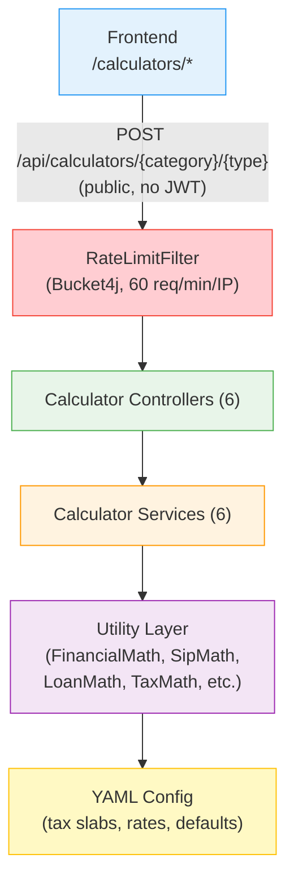
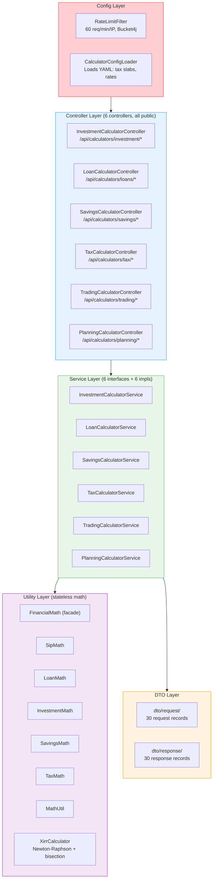

# Calculator Module -- CoinTrack

> **Domain**: Financial calculators for Indian investors
> **Responsibility**: Stateless computation of investment, loan, savings, tax, trading, and planning scenarios
> **Version**: 3.0.0
> **Last Updated**: 2026-03-19

---

## Table of Contents

1. [Overview](#1-overview)
2. [Architecture](#2-architecture)
3. [Directory Structure](#3-directory-structure)
4. [Controllers](#4-controllers)
5. [Services](#5-services)
6. [Utility Layer](#6-utility-layer)
7. [DTOs](#7-dtos)
8. [Configuration](#8-configuration)
9. [Rate Limiting](#9-rate-limiting)
10. [API Reference](#10-api-reference)
11. [Response Format](#11-response-format)
12. [Security](#12-security)
13. [Common Pitfalls](#13-common-pitfalls)

---

## 1. Overview

### 1.1 Purpose

The Calculator module provides **30+ financial calculators** tailored to Indian investors.
All endpoints are public (no authentication required) and rate-limited per IP.

### 1.2 Calculator Categories

| Category | Controller | Calculators |
|----------|-----------|-------------|
| **Investment** | `InvestmentCalculatorController` | SIP, Step-Up SIP, Lumpsum, CAGR, XIRR, Stock Average, Inflation, Mutual Fund Returns |
| **Loans** | `LoanCalculatorController` | EMI (Generic, Home, Car), Simple Interest, Compound Interest, Flat vs Reducing |
| **Savings** | `SavingsCalculatorController` | PPF, EPF, FD, RD, SSY, NPS, NSC, SCSS, MIS, APY |
| **Tax** | `TaxCalculatorController` | Income Tax (Old + New Regime), HRA, Salary, Gratuity, GST, TDS |
| **Trading** | `TradingCalculatorController` | Brokerage Charges, Margin Requirements |
| **Planning** | `PlanningCalculatorController` | Retirement Planning |

### 1.3 Key Features

| Feature | Description |
|---------|-------------|
| **Public Access** | No authentication required |
| **Rate Limited** | 60 requests/minute per IP via Bucket4j |
| **Debug Mode** | Optional `?debug=true` returns formulas and intermediate values |
| **Yearly Breakdown** | Investment/loan calculators include year-by-year tables |
| **Externalized Config** | Tax slabs, interest rates loaded from YAML files |
| **BigDecimal Precision** | All calculations use `BigDecimal` (no floating-point drift) |
| **Validated Inputs** | Jakarta Bean Validation on all request DTOs |

### 1.4 System Position



---

## 2. Architecture

### 2.1 Layer Diagram



### 2.2 Design Principles

- **Stateless**: No database, no sessions -- pure computation
- **Interface-segregated**: Each calculator category has its own service interface
- **Facade pattern**: `FinancialMath` delegates to focused math classes (`SipMath`, `LoanMath`, etc.)
- **BigDecimal everywhere**: No `double` or `float` in financial calculations
- **Records for DTOs**: All request/response types are Java records (immutable)

---

## 3. Directory Structure

```
calculator/
+-- README.md                              # This file
|
+-- config/
|   +-- CalculatorConfigLoader.java        # Loads YAML config (tax slabs, rates)
|   +-- RateLimitFilter.java               # Bucket4j rate limiter (60 req/min/IP)
|
+-- controller/
|   +-- InvestmentCalculatorController.java # 8 endpoints (SIP, CAGR, XIRR, ...)
|   +-- LoanCalculatorController.java      # 6 endpoints (EMI, SI, CI, ...)
|   +-- SavingsCalculatorController.java   # 10 endpoints (PPF, EPF, FD, ...)
|   +-- TaxCalculatorController.java       # 6 endpoints (Income Tax, HRA, ...)
|   +-- TradingCalculatorController.java   # 2 endpoints (Brokerage, Margin)
|   +-- PlanningCalculatorController.java  # 1 endpoint (Retirement)
|
+-- service/
|   +-- InvestmentCalculatorService.java   # Interface
|   +-- LoanCalculatorService.java         # Interface
|   +-- SavingsCalculatorService.java      # Interface
|   +-- TaxCalculatorService.java          # Interface
|   +-- TradingCalculatorService.java      # Interface
|   +-- PlanningCalculatorService.java     # Interface
|   +-- impl/
|       +-- InvestmentCalculatorServiceImpl.java
|       +-- LoanCalculatorServiceImpl.java
|       +-- SavingsCalculatorServiceImpl.java
|       +-- TaxCalculatorServiceImpl.java
|       +-- TradingCalculatorServiceImpl.java
|       +-- PlanningCalculatorServiceImpl.java
|
+-- dto/
|   +-- request/                           # 30 request records
|   |   +-- SipRequest.java, EmiRequest.java, IncomeTaxRequest.java, ...
|   +-- response/                          # 30 response records
|       +-- SipResponse.java, EmiResponse.java, CalculatorResponse.java, ...
|
+-- util/
    +-- FinancialMath.java                 # Facade over all math classes
    +-- SipMath.java                       # SIP, step-up SIP
    +-- LoanMath.java                      # EMI, simple/compound interest
    +-- InvestmentMath.java                # CAGR, lumpsum, inflation
    +-- SavingsMath.java                   # PPF, EPF, FD, RD, SSY, NPS, NSC, SCSS
    +-- TaxMath.java                       # Income tax slab calculations
    +-- MathUtil.java                      # Rounding, formatting
    +-- XirrCalculator.java               # Newton-Raphson with bisection fallback

External config (in resources):
  calculator-config/
    +-- tax-slabs.yml                      # Old/new regime tax brackets
    +-- savings-rates.yml                  # PPF, EPF, FD rates
    +-- default-assumptions.yml            # Inflation, retirement defaults
```

---

## 4. Controllers

All controllers share these properties:
- **Authentication**: None required (public endpoints)
- **Rate Limiting**: 60 requests/minute per IP (via `RateLimitFilter`)
- **Validation**: Jakarta Bean Validation on all `@RequestBody` DTOs
- **Debug Mode**: Optional `?debug=true` query parameter includes formulas in response

### 4.1 InvestmentCalculatorController

**Base Path**: `/api/calculators/investment`

| Endpoint | Method | Description |
|----------|--------|-------------|
| `/sip` | POST | SIP returns (monthly compounding) |
| `/step-up-sip` | POST | SIP with annual increment |
| `/lumpsum` | POST | One-time investment returns |
| `/cagr` | POST | Compound Annual Growth Rate |
| `/mutual-fund-returns` | POST | MF returns (SIP mode) |
| `/xirr` | POST | Extended IRR (irregular cash flows) |
| `/stock-average` | POST | Weighted average stock price |
| `/inflation` | POST | Inflation-adjusted future value |

### 4.2 LoanCalculatorController

**Base Path**: `/api/calculators/loans`

| Endpoint | Method | Description |
|----------|--------|-------------|
| `/emi` | POST | Generic loan EMI |
| `/home-loan-emi` | POST | Home loan EMI |
| `/car-loan-emi` | POST | Car loan EMI |
| `/simple-interest` | POST | Simple interest calculation |
| `/compound-interest` | POST | Compound interest (configurable frequency) |
| `/flat-vs-reducing` | POST | Compare flat rate vs reducing balance EMI |

### 4.3 SavingsCalculatorController

**Base Path**: `/api/calculators/savings`

| Endpoint | Method | Description |
|----------|--------|-------------|
| `/ppf` | POST | Public Provident Fund maturity |
| `/epf` | POST | Employee Provident Fund maturity |
| `/fd` | POST | Fixed Deposit maturity |
| `/rd` | POST | Recurring Deposit maturity |
| `/ssy` | POST | Sukanya Samriddhi Yojana |
| `/nps` | POST | National Pension System corpus + pension |
| `/nsc` | POST | National Savings Certificate |
| `/scss` | POST | Senior Citizen Savings Scheme |
| `/mis` | POST | Post Office Monthly Income Scheme |
| `/apy` | POST | Atal Pension Yojana contributions |

### 4.4 TaxCalculatorController

**Base Path**: `/api/calculators/tax`

| Endpoint | Method | Description |
|----------|--------|-------------|
| `/income-tax` | POST | Old + new regime comparison |
| `/hra` | POST | HRA exemption calculation |
| `/salary` | POST | Net take-home salary |
| `/gratuity` | POST | Gratuity amount |
| `/gst` | POST | GST breakdown (CGST + SGST/IGST) |
| `/tds` | POST | TDS deduction by payment type |

### 4.5 TradingCalculatorController

**Base Path**: `/api/calculators/trading`

| Endpoint | Method | Description |
|----------|--------|-------------|
| `/brokerage` | POST | Brokerage + transaction charges |
| `/margin` | POST | Margin requirements |

### 4.6 PlanningCalculatorController

**Base Path**: `/api/calculators/planning`

| Endpoint | Method | Description |
|----------|--------|-------------|
| `/retirement` | POST | Retirement corpus + required SIP |

---

## 5. Services

Each service follows the same pattern: interface + implementation in `impl/`.

| Service | Impl | Key Methods |
|---------|------|-------------|
| `InvestmentCalculatorService` | `InvestmentCalculatorServiceImpl` | `calculateSip`, `calculateCagr`, `calculateXirr`, etc. |
| `LoanCalculatorService` | `LoanCalculatorServiceImpl` | `calculateEmi`, `calculateSimpleInterest`, `compareFlatVsReducing` |
| `SavingsCalculatorService` | `SavingsCalculatorServiceImpl` | `calculatePpf`, `calculateEpf`, `calculateFd`, `calculateNps`, etc. |
| `TaxCalculatorService` | `TaxCalculatorServiceImpl` | `calculateIncomeTax`, `calculateHra`, `calculateSalary`, `calculateGst` |
| `TradingCalculatorService` | `TradingCalculatorServiceImpl` | `calculateBrokerage`, `calculateMargin` |
| `PlanningCalculatorService` | `PlanningCalculatorServiceImpl` | `calculateRetirement` |

All methods accept a `boolean debug` parameter. When `true`, the response includes
`DebugInfo` with the formula used, monthly/annual rate, and number of periods.

---

## 6. Utility Layer

### 6.1 FinancialMath (Facade)

**Location**: `util/FinancialMath.java`

Static facade that delegates to focused math classes. Preserves backward compatibility
so service implementations call `FinancialMath.sipFutureValue(...)` without knowing
which underlying class performs the computation.

**Delegates to**:

| Class | Responsibility |
|-------|---------------|
| `SipMath` | SIP future value, step-up SIP, total investment |
| `LoanMath` | EMI, simple interest, compound interest, amortization |
| `InvestmentMath` | CAGR, lumpsum future value, inflation-adjusted value |
| `SavingsMath` | PPF, EPF, FD, RD, SSY, NPS, NSC, SCSS maturity |
| `TaxMath` | Income tax slab computation, HRA exemption |
| `MathUtil` | Rounding helpers, percentage formatting |
| `XirrCalculator` | XIRR via Newton-Raphson with bisection fallback |

### 6.2 XirrCalculator

Uses **Newton-Raphson** method as the primary solver with **bisection fallback**
when Newton-Raphson fails to converge. Requires at least one positive and one
negative cash flow.

---

## 7. DTOs

### 7.1 Request Records

All request DTOs are Java `record` types with Jakarta Bean Validation annotations.

**Examples**:
- `SipRequest(monthlyInvestment, expectedReturn, years)`
- `EmiRequest(principal, annualRate, months)`
- `IncomeTaxRequest(grossIncome, ...deductions)`
- `XirrRequest(cashFlows)` where each cash flow has `date` and `amount`

### 7.2 Response Records

All response DTOs are Java `record` types.

### 7.3 CalculatorResponse (Wrapper)

Every endpoint returns `CalculatorResponse<T>` which wraps:

| Field | Type | Description |
|-------|------|-------------|
| `success` | `boolean` | Always `true` for successful calculations |
| `metadata` | `CalculatorMetadata` | Calculator name, category, assumptions list |
| `result` | `T` | The actual calculation result |
| `breakdown` | `List<YearlyBreakdown>` | Year-by-year table (nullable) |
| `debug` | `DebugInfo` | Formula, rate, periods (only when `?debug=true`) |

---

## 8. Configuration

### 8.1 CalculatorConfigLoader

**Location**: `config/CalculatorConfigLoader.java`

Loads financial parameters from YAML files on startup (`@PostConstruct`):

| File | Contents |
|------|----------|
| `calculator-config/tax-slabs.yml` | Income tax brackets for old and new regime |
| `calculator-config/savings-rates.yml` | Current PPF, EPF, FD, NSC, SCSS interest rates |
| `calculator-config/default-assumptions.yml` | Default inflation rate, retirement assumptions |

Supports **dot-notation access**: `getValue(taxSlabs, "newRegime.slab3.rate")`.

---

## 9. Rate Limiting

### 9.1 RateLimitFilter

**Location**: `config/RateLimitFilter.java`
**Library**: Bucket4j
**Scope**: Only `/api/calculators/**` endpoints

| Setting | Value |
|---------|-------|
| Limit | 60 requests per minute per IP |
| Bucket strategy | In-memory `ConcurrentHashMap` (single-instance) |
| Client IP extraction | `X-Forwarded-For` header (first entry), fallback to `remoteAddr` |
| Overflow cleanup | Clears all buckets when map exceeds 10,000 entries |

**Rate Limit Response** (HTTP 429):
```json
{
  "success": false,
  "error": {
    "code": "RATE_LIMIT_EXCEEDED",
    "message": "Too many requests. Please wait 45 seconds."
  }
}
```

Includes `Retry-After` header with seconds until bucket refill.

**Limitation**: In-memory buckets are not shared across instances. Suitable for
single-instance deployments (e.g., Render free tier). For multi-instance, migrate
to Redis-backed Bucket4j.

---

## 10. API Reference

### 10.1 Example: SIP Calculation

**Request**:
```http
POST /api/calculators/investment/sip?debug=false
Content-Type: application/json

{
  "monthlyInvestment": 10000,
  "expectedReturn": 12,
  "years": 10
}
```

**Response**:
```json
{
  "success": true,
  "metadata": {
    "calculator": "sip",
    "category": "investment",
    "assumptions": [
      "Returns are compounded monthly",
      "SIP installments are made at the beginning of each month",
      "No exit load or taxes considered"
    ]
  },
  "result": {
    "totalInvestment": 1200000.00,
    "futureValue": 2323391.58,
    "totalGains": 1123391.58,
    "absoluteReturns": 93.62,
    "cagr": 12.00
  },
  "breakdown": [
    { "year": 1, "invested": 120000.00, "interest": 7884.88, "balance": 127884.88 },
    { "year": 2, "invested": 120000.00, "interest": 24089.43, "balance": 264089.43 }
  ]
}
```

### 10.2 Example: EMI Calculation

**Request**:
```http
POST /api/calculators/loans/emi
Content-Type: application/json

{
  "principal": 5000000,
  "annualRate": 8.5,
  "months": 240
}
```

### 10.3 Example: Income Tax

**Request**:
```http
POST /api/calculators/tax/income-tax
Content-Type: application/json

{
  "grossIncome": 1500000
}
```

---

## 11. Response Format

All calculator responses use the `CalculatorResponse<T>` wrapper:

```
CalculatorResponse<T>
  +-- success: boolean
  +-- metadata: CalculatorMetadata
  |     +-- calculator: String        (e.g., "sip", "emi", "income-tax")
  |     +-- category: String          (e.g., "investment", "loans", "tax")
  |     +-- assumptions: List<String> (human-readable disclaimers)
  +-- result: T                       (calculator-specific response record)
  +-- breakdown: List<YearlyBreakdown> (nullable)
  |     +-- year: int
  |     +-- invested: BigDecimal
  |     +-- interest: BigDecimal
  |     +-- balance: BigDecimal
  +-- debug: DebugInfo (only when ?debug=true)
        +-- periodicRate: BigDecimal
        +-- totalPeriods: int
        +-- formula: String
```

---

## 12. Security

### 12.1 Public Endpoints

All calculator endpoints are **unauthenticated** -- they are excluded from JWT
security filters in `SecurityConfig`. The only protection is rate limiting.

### 12.2 Input Validation

All request DTOs use Jakarta Bean Validation annotations (`@NotNull`, `@Positive`,
`@Min`, `@Max`) to reject invalid inputs before computation.

### 12.3 No Sensitive Data

Calculators are stateless and do not access any user data, database records, or
credentials. They are pure mathematical functions.

---

## 13. Common Pitfalls

| Pitfall | Impact | Prevention |
|---------|--------|------------|
| Using `double` for money | Floating-point rounding errors | All math uses `BigDecimal` |
| Missing rate limiting | API abuse, compute cost | `RateLimitFilter` on all `/api/calculators/**` |
| XIRR non-convergence | Error response | Bisection fallback after Newton-Raphson |
| Stale tax slabs | Wrong tax calculations | Update `tax-slabs.yml` annually |
| In-memory rate limiter across instances | Rate limit bypassed | Migrate to Redis for multi-instance |
| Missing `@Valid` on controller params | Unvalidated inputs | All `@RequestBody` params annotated |

---

## Appendix A: Calculator Count Summary

| Category | Endpoints | Request DTOs | Response DTOs |
|----------|-----------|-------------|---------------|
| Investment | 8 | 8 | 7 |
| Loans | 6 | 3 | 5 |
| Savings | 10 | 10 | 10 |
| Tax | 6 | 6 | 6 |
| Trading | 2 | 2 | 2 |
| Planning | 1 | 1 | 1 |
| **Total** | **33** | **30** | **31** |

---

## Appendix B: Related Documentation

- [Common Module README](../common/README.md) -- Shared utilities and error handling
- [Security Module README](../security/README.md) -- SecurityConfig (calculator endpoints excluded from auth)

---

## Appendix C: Changelog

| Version | Date | Changes |
|---------|------|---------|
| 3.0.0 | 2026-03-19 | Refactored: FinancialMath facade, split math utils, CalculatorConfigLoader, RateLimitFilter |
| 2.0.0 | 2025-12-17 | Added savings (10), tax (6), trading (2), planning (1) calculators |
| 1.0.0 | 2025-11-01 | Initial module with investment and loan calculators |
