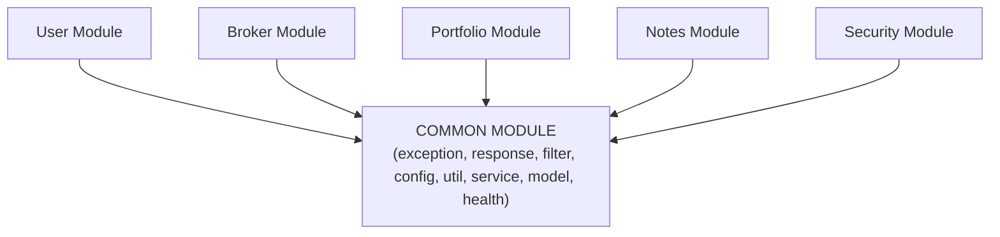
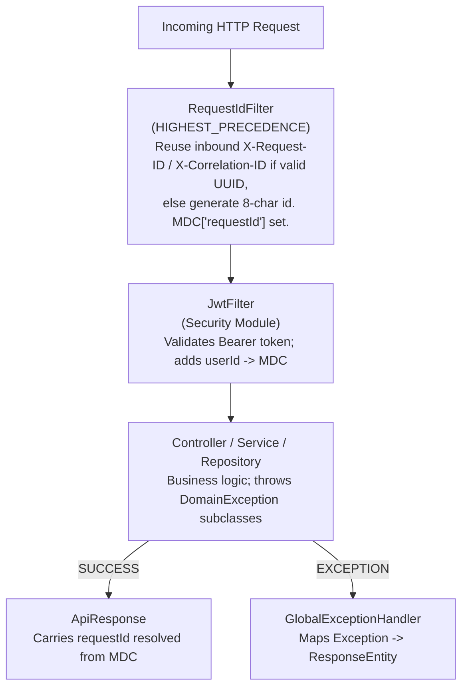
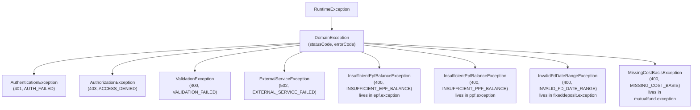
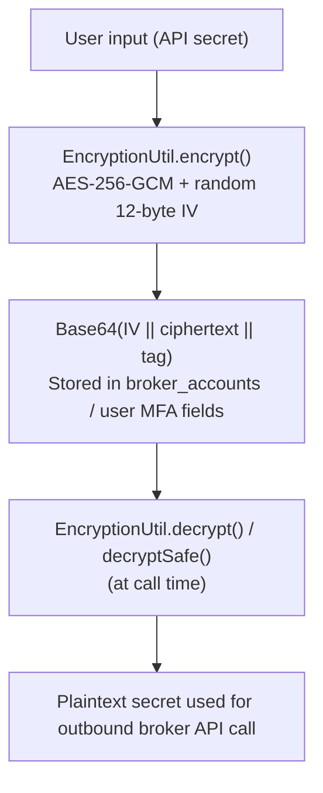

# Common Module – CoinTrack

> **Domain**: Cross-cutting infrastructure and shared utilities
> **Responsibility**: Configuration, exception handling, request tracing, response wrappers, sequence generation, encryption utilities
> **Version**: 2.2.0
> **Last Updated**: 2026-08-28 *(every claim below verified against source on this date)*

---

## Table of Contents

1. [Overview](#1-overview)
2. [Architecture](#2-architecture)
3. [Directory Structure](#3-directory-structure)
4. [Configuration](#4-configuration)
5. [Exception Handling](#5-exception-handling)
6. [Request Filtering](#6-request-filtering)
7. [Health Checks &amp; Home Page](#7-health-checks--home-page)
8. [Response Wrappers](#8-response-wrappers)
9. [Services](#9-services)
10. [Utility Classes](#10-utility-classes)
11. [Logging Standards](#11-logging-standards)
12. [Security Utilities](#12-security-utilities)
13. [Usage Guidelines](#13-usage-guidelines)
14. [Common Pitfalls](#14-common-pitfalls)

---

## 1. Overview

### 1.1 Purpose

The Common module provides foundational infrastructure shared across all domain modules.
It owns exactly **one MongoDB collection (`counters`)**; everything else is stateless
cross-cutting code.

### 1.2 Core Responsibilities

| Area                         | Components                                                                                                                                     | Purpose                                    |
| ---------------------------- | ---------------------------------------------------------------------------------------------------------------------------------------------- | ------------------------------------------ |
| **Configuration**      | CorsConfig, EncryptionConfig, WebClientConfig, MongoConfig, MongoTransactionConfig, OpenApiConfig, StartupLogger | Application-wide settings                  |
| **Exception Handling** | DomainException hierarchy + GlobalExceptionHandler + 3 module-specific exceptions                                                              | Consistent error responses                 |
| **Request Tracing**    | RequestIdFilter                                                                                                                                | Correlation ID via SLF4J MDC               |
| **Health Monitoring**  | HealthController, HomeController                                                                                                               | System status endpoints + landing page     |
| **Response Wrappers**  | ApiResponse, ApiErrorResponse                                                                                                                  | Standardized API responses                 |
| **Sequences**          | Counter model, SequenceGeneratorService, TransactionSequenceService                                                                            | Auto-increment numbers + ledger reordering |
| **Notifications**      | NotificationService + NotificationServiceImpl                                                                                                  | Security-alert / welcome email delegation  |
| **Utilities**          | EncryptionUtil, HashUtil, FinancialYearUtil, HolderName, OwnerGrouping, MarketHoursUtil, RequestUtils, UrlResolverUtil, UserLookupUtil, ExcelExportUtil, LoggingConstants | Reusable helpers                           |

### 1.3 System Position



<details>
<summary>Click to view ASCII Diagram</summary>

```text
        ┌──────────┐ ┌──────────┐ ┌──────────┐ ┌──────────┐ ┌──────────┐
        │   User   │ │  Broker  │ │Portfolio │ │  Notes   │ │ Security │ ...
        └────┬─────┘ └────┬─────┘ └────┬─────┘ └────┬─────┘ └────┬─────┘
             └────────────┴────────────┴────────────┴────────────┘
                                      │ depends on
                                      ▼
        ┌─────────────────────────────────────────────────────────────┐
        │                       COMMON MODULE                          │
        │  exception/ · response/ · filter/ · config/ · util/          │
        │  service/ (sequences, notifications) · model/ · health/      │
        └─────────────────────────────────────────────────────────────┘
```

</details>

**ARCHITECTURAL NOTE — common is NOT a pure leaf module.**
While every other module imports common (mutualfund 11 files, broker 7, epf 7,
user 7, email 5, goldsilver 5, portfolio 5, ppf 5, fixeddeposit 3, notes 2,
security 2), common itself holds **five outbound dependency edges**:

1. `TransactionSequenceService` -> repositories/models of **mutualfund, fixeddeposit,
   goldsilver, ppf, epf** (async ledger reordering).
2. `GlobalExceptionHandler` -> `broker.service.exception.BrokerException`.
3. `NotificationService`(+Impl) -> **user.model.User** and **email.service.EmailService**.
4. `UserLookupUtil` -> **user.model.User + UserRepository**.
5. `MongoConfig` -> **mutualfund.model.GainType** converters.

Also: the **calculator module imports zero common classes** - it is fully
self-contained (own math facades, response envelope, and rate limiter), and its
README documents this explicitly.

---

## 2. Architecture

### 2.1 Request Processing Flow



<details>
<summary>Click to view ASCII Diagram</summary>

```text
Incoming HTTP Request
        |
        v
+----------------------+  Reuse inbound X-Request-ID / X-Correlation-ID
|  RequestIdFilter     |  if valid UUID, else generate 8-char id.
| (HIGHEST_PRECEDENCE) |  MDC["requestId"] set; cleared in finally block.
+----------------------+
        |
        v
+----------------------+
|     JwtFilter        |  Validates Bearer token (security module);
|                      |  adds userId -> MDC.
+----------------------+
        |
        v
+----------------------+
| Controller / Service |  Business logic; throws DomainException subclasses.
|    / Repository      |
+----------------------+
        |
   +----+-----+
   v          v
SUCCESS    EXCEPTION
   |          |
   v          v
ApiResponse  GlobalExceptionHandler -> ApiErrorResponse
   |          |
   +----+-----+
        v
JSON response carries requestId resolved from MDC
```

</details>

---

## 3. Directory Structure

Verified tree: **36 Java files, ~2,819 LOC**.

```
common/
|-- config/                              # 8 files
|   |-- CorsConfig.java                  # property-driven CORS source bean (60 ln)
|   |-- EncryptionConfig.java            # fail-fast AES key validation (42 ln)
|   |-- MongoConfig.java                 # YearMonth + GainType converters (63 ln)
|   |-- MongoTransactionConfig.java      # MongoTransactionManager bean registration for @Transactional (34 ln)
|   |-- OpenApiConfig.java               # Swagger UI bearerAuth scheme (47 ln)
|   |-- StartupLogger.java               # startup banner + DB/email status (137 ln)
|   |-- WebClientConfig.java             # outbound HTTP timeouts (43 ln)
|   +-- package-info.java                # historical reorg plan doc, stale (73 ln)
|-- exception/                           # 6 files
|   |-- DomainException.java             # base: errorCode + httpStatus (41 ln)
|   |-- AuthenticationException.java     # 401 AUTH_FAILED (16 ln)
|   |-- AuthorizationException.java      # 403 ACCESS_DENIED (16 ln)
|   |-- ValidationException.java         # 400 VALIDATION_FAILED (+field) (24 ln)
|   |-- ExternalServiceException.java    # 502 EXTERNAL_SERVICE_FAILED (24 ln)
|   +-- GlobalExceptionHandler.java      # @RestControllerAdvice (208 ln)
|   (Module-specific exceptions RELOCATED 2026-08-26 to their owning modules:
|    InvalidFdDateRangeException → fixeddeposit/exception/,
|    InsufficientEpfBalanceException → epf/exception/,
|    InsufficientPpfBalanceException → ppf/exception/,
|    MissingCostBasisException → mutualfund/exception/)
|-- filter/
|   +-- RequestIdFilter.java             # MDC correlation ID (100 ln)
|-- health/
|   |-- HealthController.java            # /api/health + ping + /health (357 ln)
|   +-- HomeController.java              # / landing page + /favicon.ico (55 ln)
|-- model/
|   +-- Counter.java                     # @Document("counters"): {id, seq} (20 ln)
|-- response/
|   |-- ApiResponse.java                 # success envelope w/ MDC requestId (99 ln)
|   +-- ApiErrorResponse.java            # error envelope w/ fieldErrors (104 ln)
|-- service/
|   |-- SequenceGeneratorService.java    # atomic findAndModify inc (31 ln)
|   |-- TransactionSequenceService.java  # @Async ledger reordering x7 (120 ln)
|   |-- NotificationService.java         # interface taking user.model.User (49 ln)
|   +-- impl/
|       +-- NotificationServiceImpl.java # delegates to email module (73 ln)
+-- util/                                # 11 files
    |-- EncryptionUtil.java              # AES-256-GCM (265 ln)
    |-- ExcelExportUtil.java             # XLSX builder + SheetConfig (313 ln)
    |-- FinancialYearUtil.java           # Indian FY math (53 ln)
    |-- HashUtil.java                    # SHA-256 hex (37 ln)
    |-- HolderName.java                  # canonical holder-name normalize (64 ln)
    |-- LoggingConstants.java            # log message patterns + MDC keys (69 ln)
    |-- MarketHoursUtil.java             # NSE/BSE window check (31 ln)
    |-- OwnerGrouping.java               # shared (place/platform, holder) groupKey (45 ln)
    |-- RequestUtils.java                # client IP / user-agent extraction (89 ln)
    |-- UrlResolverUtil.java             # Origin/Referer/Host URL matching (63 ln)
    +-- UserLookupUtil.java              # identifier-to-user lookup (30 ln)
```

> **Historical note:** earlier revisions of this README listed `RestTemplateConfig`,
> `FnoUtils`, `DatabaseSequence`, and a `response/user/` DTO folder here. None of those
> exist in this module: RestTemplate was replaced by WebClientConfig; FnoUtils lives in
> `portfolio/util/FnoUtils.java`; the sequence entity is `model/Counter.java`; shared
> user DTOs live in the user module.

---

## 4. Configuration

### 4.1 CorsConfig

Origins are read exclusively from property `app.cors.allowed-origins`
(env `CORS_ALLOWED_ORIGINS`; dev fallback `http://localhost:3000,http://127.0.0.1:3000`)
via `setAllowedOriginPatterns`. Registered as a `CorsConfigurationSource` bean consumed
by Spring Security's filter chain for `/api/**` only - deliberately no duplicate
WebMvcConfigurer CORS handling.

```java
private static final List<String> ALLOWED_METHODS  =
        List.of("GET", "POST", "PUT", "DELETE", "PATCH", "OPTIONS");
private static final List<String> ALLOWED_HEADERS  =
        List.of("Authorization", "Content-Type", "X-Request-ID");   // explicit, not "*"
private static final List<String> EXPOSED_HEADERS  =
        List.of("Authorization", "Content-Type", "X-Request-ID", "X-Correlation-ID");
private static final long MAX_AGE_SECONDS = 3600L;

configuration.setAllowCredentials(true);
source.registerCorsConfiguration("/api/**", configuration);
```

Note: `/health`, `/`, and `/zerodha/callback` are outside `/api/**` and therefore
have no CORS config (harmless for non-browser callers).

### 4.2 EncryptionConfig

Fail-fast AES key validation at startup (`@PostConstruct`):

| Variable                  | Required | Description                                                                                                                                                |
| ------------------------- | -------- | ---------------------------------------------------------------------------------------------------------------------------------------------------------- |
| `ENCRYPTION_SECRET_KEY` | Yes      | Exactly 32 characters; wired to`app.encryption.secret-key`. Startup throws `IllegalStateException` if left at the default placeholder or wrong length. |

### 4.3 WebClientConfig (replaces legacy RestTemplate)

Provides the pre-configured outbound HTTP client used by broker/external API calls:

| Setting              | Value                                          |
| -------------------- | ---------------------------------------------- |
| Connect timeout      | **10 s**                                 |
| Response timeout     | **15 s**                                 |
| Max in-memory buffer | **2 MB** (OOM guard)                     |
| Bean                 | `WebClient.Builder brokerWebClientBuilder()` |

**Verified consumers (inherit these settings via builder injection):**
`ZerodhaBrokerAdapter`, `UpstoxBrokerAdapter`, `AngelOneBrokerAdapter`,
`ZerodhaLiveDataService` (broker) · `MarketDataServiceImpl` (portfolio) ·
`GoogleOAuthService` (security, injected by type as `WebClient.Builder`).

Known exception: `email/service/BrevoEmailService.java:38` builds a raw
`WebClient.create()`, bypassing this bean — it does NOT inherit these timeouts.

> Earlier README revisions documented a RestTemplateConfig with 5s connect / 30s read
> timeouts - that class no longer exists.

### 4.4 MongoConfig

Registers four custom Mongo converters:

- `YearMonth` <-> `String`
- `GainType` <-> `String`, including special stored forms `"STCG/LTCG"` and `"STCL/LTCL"`

Note the inverted edge: these converters import `mutualfund.model.GainType`.

### 4.5 OpenApiConfig

Swagger UI at `/swagger-ui.html`; defines the `bearerAuth` HTTP scheme
(JWT from `/api/auth/login`).

### 4.6 StartupLogger

Prints an ASCII banner on `ApplicationReadyEvent`: active profiles, port, URL
(`RENDER_EXTERNAL_URL` when set), DB status (verified via `mongoTemplate.executeCommand(ping)` network round-trip), email-configured flag
(via `brevo.api-key` presence).

### 4.7 MongoTransactionConfig (added 2026-08-26)

Registers the platform `MongoTransactionManager` bean:

```java
@Bean
public MongoTransactionManager transactionManager(MongoDatabaseFactory mongoDatabaseFactory) {
    return new MongoTransactionManager(mongoDatabaseFactory);
}
```

Enables Spring's `@Transactional` annotation across MongoDB multi-document write operations app-wide (used in `fixeddeposit`, `ppf`, `epf`, `notes`, `broker`, `portfolio`). Requires MongoDB deployment to be a replica set (satisfied in production by MongoDB Atlas and in integration testing by Flapdoodle `--replSet rs0`).

---

## 5. Exception Handling

### 5.1 Exception Hierarchy (complete)



<details>
<summary>Click to view ASCII Diagram</summary>

```text
RuntimeException
 +-- DomainException (base: errorCode + httpStatus; default 400 / DOMAIN_ERROR)
      |-- AuthenticationException          401 AUTH_FAILED
      |-- AuthorizationException           403 ACCESS_DENIED
      |-- ValidationException              400 VALIDATION_FAILED (+ optional field name)
      |-- ExternalServiceException         502 EXTERNAL_SERVICE_FAILED (+ serviceName)
      |-- InsufficientEpfBalanceException  400 INSUFFICIENT_EPF_BALANCE   (RELOCATED 2026-08-26:
      |                                                                   epf/exception/)
      |-- InsufficientPpfBalanceException  400 INSUFFICIENT_PPF_BALANCE   (RELOCATED 2026-08-26:
      |                                                                   ppf/exception/)
      |-- InvalidFdDateRangeException      400 INVALID_FD_DATE_RANGE      (RELOCATED 2026-08-26:
      |                                                                   fixeddeposit/exception/)
      +-- MissingCostBasisException        400 MISSING_COST_BASIS         (RELOCATED 2026-08-26:
                                                                          mutualfund/exception/)

broker.service.exception.BrokerException is handled by common's GlobalExceptionHandler
but lives in the broker module.
```

</details>

### 5.2 DomainException (Base Class) - exact constructor order

```java
public class DomainException extends RuntimeException {
    private final String errorCode;
    private final int httpStatus;

    public DomainException(String message)                          // -> DOMAIN_ERROR, 400
    public DomainException(String message, String errorCode, int httpStatus)
    public DomainException(String message, String errorCode, int httpStatus, Throwable cause)
}
```

WARNING: the argument order is `(message, errorCode, httpStatus)` - an earlier README
revision showed `(message, httpStatus, errorCode)` which would compile but swap values.

### 5.3 GlobalExceptionHandler - full handler table

| Exception Type                                   | HTTP     | Error Code                  | Notes                                             |
| ------------------------------------------------ | -------- | --------------------------- | ------------------------------------------------- |
| AuthenticationException                          | 401      | `AUTH_FAILED`             | WARN log                                          |
| AuthorizationException                           | 403      | `ACCESS_DENIED`           | WARN log                                          |
| ExternalServiceException                         | 502      | `EXTERNAL_SERVICE_FAILED` | message masked to service name                    |
| DomainException (other)                          | from ex. | from ex.                    | unresolved status falls back to 400               |
| BrokerException                                  | 503      | `BROKER_ERROR`            | ERROR log w/ broker name                          |
| MethodArgumentNotValidException                  | 400      | `VALIDATION_FAILED`       | returns per-field`fieldErrors[]`                |
| ConstraintViolationException                     | 400      | `VALIDATION_FAILED`       | per-field`fieldErrors[]`                        |
| HttpMessageNotReadableException                  | 400      | `MALFORMED_REQUEST`       | unparseable JSON body                             |
| IllegalArgumentException / IllegalStateException | 400      | `VALIDATION_FAILED`       | business validation                               |
| NoSuchElementException                           | 404      | `NOT_FOUND`               | missing entity lookups (e.g. Note by id)          |
| NoHandlerFoundException                          | 404      | `NOT_FOUND`               | requires throw-exception-if-no-handler-found=true |
| Exception (catch-all)                            | 500      | `INTERNAL_ERROR`          | generic message only, never leaks ex              |

Logging policy: 4xx -> WARN (message only); 5xx -> ERROR (full stack trace);
stack traces NEVER appear in responses.

### 5.4 Actual Error Response Shape

```json
{
  "timestamp": "2026-08-23T10:30:00Z",
  "status": 401,
  "errorCode": "AUTH_FAILED",
  "message": "Invalid credentials",
  "path": "/api/auth/login",
  "requestId": "a1b2c3d4"
}
```

Fields are null-stripped (`@JsonInclude(NON_NULL)`); `fieldErrors` appears only for
bean-validation failures. NOTE: there is no `success` field and no `code` field -
the error envelope differs from ApiResponse (see section 8).

---

## 6. Request Filtering

### 6.1 RequestIdFilter

- Order: `Ordered.HIGHEST_PRECEDENCE` (runs before every other filter).
- Resolution order: inbound `X-Request-ID` -> `X-Correlation-ID` -> generated.
  Inbound values are reused only if they match a strict UUID pattern; the
  generated fallback is a short 8-char UUID prefix for log readability.
- Sets BOTH `X-Request-ID` and `X-Correlation-ID` response headers so frontend
  and infra can read either. CORS exposes both to browsers.
- MDC key set by THIS filter: only `requestId`. (`userId` is added later by the
  security module's JwtFilter - an earlier README revision wrongly attributed it here.)
- `MDC.clear()` in a finally block prevents leakage into pooled threads.

---

## 7. Health Checks & Home Page

### 7.1 HealthController endpoints

| Endpoint             | Method | Behavior                                                                                                                                                                                                                                                                                            |
| -------------------- | ------ | --------------------------------------------------------------------------------------------------------------------------------------------------------------------------------------------------------------------------------------------------------------------------------------------------- |
| `/api/health`      | GET    | Full check: DB connectivity + users-collection access probe, JVM version/memory/processors, uptime.**503 when DB is down**; otherwise 200. Content-negotiated: `Accept: text/html` returns an auto-refreshing HTML status dashboard (3s poll), else JSON. Hardcodes `"version": "3.0.0"`. |
| `/api/health/ping` | GET    | Always 200, minimal`{status, service, timestamp}`.                                                                                                                                                                                                                                                |
| `/health`          | GET    | Render keep-alive: returns just`{status:"UP"}` with `Cache-Control: no-store`. NOT an alias of the full check.                                                                                                                                                                                  |

Actuator is also exposed (`/actuator/**`; prod profile narrows to health) - this is what
the Docker HEALTHCHECK and render.yaml healthCheckPath use.

None of these endpoints have a frontend caller; they are infrastructure-only.

### 7.2 HomeController

NOT a redirect: serves a styled HTML landing page at `/` ("CoinTrack API is running!",
links to /api/health and /actuator) plus `/favicon.ico`, which streams
`classpath:static/logo/coinTrack.png` as image/png.

---

## 8. Response Wrappers

### 8.1 ApiResponse (success envelope) - exact fields

```java
boolean success;      // true
T data;               // payload (null for message-only success)
String message;       // "Success" default or custom
Instant timestamp;
String requestId;     // from MDC at construction time
```

Factories: `success(data)`, `success(data, message)`, `success(message)` (void endpoints),
`error(message)` (success=false). Nulls stripped via `@JsonInclude(NON_NULL)`.

```json
{
  "success": true,
  "message": "User created successfully",
  "data": { },
  "timestamp": "...",
  "requestId": "a1b2c3d4"
}
```

There is NO `status` field on ApiResponse.

### 8.2 ApiErrorResponse (error envelope) - exact fields

```java
Instant timestamp; int status; String errorCode; String message;
String path; String requestId; List<FieldError> fieldErrors;   // FieldError(field, message)
```

No `success` boolean, no `code` field (it is `errorCode`). The two envelopes are
structurally different - frontend code must branch on HTTP status rather than
assuming one shape.

> Earlier README revisions showed a shared `user/` DTO folder under response/.
> User DTOs live in the user module; common/response contains exactly these two classes.

---

## 9. Services

### 9.1 SequenceGeneratorService

Atomic Mongo auto-increment via `findAndModify` upsert:

```java
long next = sequenceGeneratorService.getNextSequence("ppf_txn_no_<userId>");
// Query {_id: seqName}, Update {$inc: {seq: 1}}, returnNew + upsert, fallback 1
```

Backs `transactionNo` / `fdNo` / `itemNo` sequences across modules via MongoTemplate.
(The former CounterRepository interface was removed on 2026-08-23 — audit confirmed
zero consumers; it was dead code.)

### 9.2 TransactionSequenceService (the big inverted dependency)

Seven `@Async` reorder methods, one per ledger. After any create/update/delete, the
owning module calls its reorder to keep human-facing sequence numbers contiguous in
chronological order:

| Method                        | Sorts by                   | Rewrites                            |
| ----------------------------- | -------------------------- | ----------------------------------- |
| reorderLumpsumTransactions    | investmentDate, createdAt  | LumpsumTransaction.transactionNo    |
| reorderRedemptionTransactions | redemptionDate, createdAt  | RedemptionTransaction.transactionNo |
| reorderSipContributions       | contributionDate, id       | SipContribution.transactionNo       |
| reorderFixedDeposits          | issueDate, createdAt       | FixedDeposit.fdNo                   |
| reorderGoldSilverInvestments  | purchaseDate, createdAt    | GoldSilverInvestment.itemNo         |
| reorderPpfTransactions        | transactionDate, createdAt | PpfTransaction.transactionNo        |
| reorderEpfTransactions        | transactionDate, createdAt | EpfTransaction.transactionNo        |

All sorts are ascending with nulls-last tiebreaks; each loads ALL of a user's rows,
re-numbers 1..N in memory, then `saveAll`. This is orchestration logic living in the
shared layer - it imports six other modules' models AND repositories.

### 9.3 NotificationService / NotificationServiceImpl

NOT a placeholder. The interface (which takes `user.model.User`) exposes:
`sendSecurityAlert(user, event, metadata)`, `sendSecurityAlertWithIP(user, event, ip)`,
`sendWelcomeNotification(user)`, `notifySessionExpiry(accountId, brokerName)`,
`isEmailEnabled()`.

The impl optionally injects email module's EmailService (`@Autowired(required=false)`)
and degrades to WARN logs when absent. Only `notifySessionExpiry` is a stub
(log-only, "Future: send email/push").

---

## 10. Utility Classes

### 10.1 EncryptionUtil - AES-256-GCM (verified)

- Algorithm `AES/GCM/NoPadding`; 12-byte random IV per encryption (SecureRandom);
  128-bit auth tag; output format `Base64(IV || ciphertext || tag)`.
- **Key handling**: the 32-char secret's raw UTF-8 bytes are used directly as the AES
  key - there is NO PBKDF2/KDF step. Static override variants accept a 32-char raw key
  OR a 64-char hex string (decoded to 32 bytes); anything else throws.
- Migration helpers: `isEncrypted(data)` (base64 length heuristic) and
  `decryptSafe(data)` (returns input as-is when it does not look encrypted; on
  decrypt failure of ciphertext-shaped input it logs a warning and returns the
  ciphertext unchanged - callers must handle possibly-still-encrypted values).

### 10.2 HashUtil

`HashUtil.sha256(String)` -> lowercase hex SHA-256; null-safe input returns null.
Used for Zerodha checksum: `sha256(apiKey + requestToken + apiSecret)`.

### 10.3 FinancialYearUtil

- `getFinancialYear(LocalDate)` -> `"YYYY-YY"` (Indian FY: Apr 1 - Mar 31).
- `resolveFinancialYear("2025-26")` -> `[2025-04-01, 2026-03-31]`; validates format
  and that end year == start year + 1; throws IllegalArgumentException otherwise.

### 10.4 MarketHoursUtil

`isMarketOpen()` - Mon-Fri, 09:15-15:30 Asia/Kolkata. No holiday calendar here
(NSE holidays live in mutualfund's NSEHolidayService).

### 10.5 RequestUtils

`extractIpAddress(HttpServletRequest)`: X-Forwarded-For first entry -> X-Real-IP ->
remoteAddr; normalizes IPv6/IPv4 loopback to `127.0.0.1 (localhost)`.
Also `extractUserAgent`.

### 10.6 UrlResolverUtil

`resolveUrl(commaSeparatedUrls)` picks the right URL for multi-env deployments:
match request Origin/Referer first, then Host localhost-vs-prod classification;
falls back to the first entry. Used for OAuth redirect building.

### 10.7 UserLookupUtil

`findByIdentifier(UserRepository, identifier)` tries email -> username -> phone.
Static helper importing user module types.

### 10.8 HolderName (added 2026-08-28)

Canonical owner-name normalizer, shared by the FD and MF modules so owner grouping can
never drift between them:

```java
public static String normalize(String raw)
```

Rule (mirrors `FixedDepositServiceImpl.normalizeHolderName`, extracted here): trim + collapse
internal whitespace sequences to a single space + title-case each whitespace-delimited token
(`"  RAHUL   das "` → `"Rahul Das"`). Hyphenated/apostrophe tokens (`"kumar-das"`) are treated
as single tokens with only the first letter uppercased — deterministic and lossless-enough for
grouping. Null/blank returns blank. This is the single source of truth for what a canonical
`holderName` looks like at rest and in aggregation keys.

### 10.9 OwnerGrouping (added 2026-08-28)

Shared grouping helper that the FD/MF consumers MUST use instead of inline string concat, so
the group key is identical across TDS summary, Excel export, MF aggregation, summaries and
dashboards:

```java
public static String groupKey(String placeOrPlatform, String holderName)
// = whitespaceCollapse(placeOrPlatform) + "|" + HolderName.normalize(holderName)
```

- The **place/platform keeps its original case**; only the holder passes through
  `HolderName.normalize` (canonical key = canonical owner per place).
- Both blank inputs fall back to `"Unknown"` so the key is never empty.
- All six consumers route through it (`FixedDepositServiceImpl.getTdsSummary`,
  `FixedDepositExcelExporter`, `MfSchemeAggregationService`, `MfSummaryController`,
  `MfSchemeService`, `PortfolioDashboardService`) — see
  `local/TODOs/TODO_HOLDERNAME_ATTRIBUTION_FIX.md`.

  > [DEPRECATED-TDS] The **FD TDS summary** consumer (`FixedDepositServiceImpl.getTdsSummary`) has
  > been **commented out** of the codebase (Section 194A TDS feature deprecated). The other five
  > consumers remain active.

### 10.10 ExcelExportUtil

Static XLSX builder on Apache POI:

- Single-sheet `exportToExcel(filename, sheetName, headers, data, extractors, rightAlignedIndices)`
- Multi-sheet `exportToExcelMultiSheet(filename, List<SheetConfig<T>>)`
- Generic column extractors as functions; fast width computation (no POI autoSize)
  clamped 14-45 chars; header style bold/gray-fill; column 0 gets a special bold
  right-aligned style ("FD No" legacy).
- Returns `ResponseEntity<byte[]>` with proper xlsx content type + attachment filename.

---

## 11. Logging Standards

### 11.1 Log Format

All logs automatically include MDC context:

```
TIMESTAMP LEVEL [logger] - [Context] Message   (requestId via MDC pattern)
```

### 11.2 Log Levels

| Level     | When to Use                                                           |
| --------- | --------------------------------------------------------------------- |
| `ERROR` | Unrecoverable errors, 5xx responses, external service failures        |
| `WARN`  | Recoverable issues, validation failures (4xx), degraded notifications |
| `INFO`  | Key business events (login, sync, emails sent)                        |
| `DEBUG` | Detailed flow for troubleshooting                                     |

### 11.3 What NOT to Log

| Never Log                           | Why                    |
| ----------------------------------- | ---------------------- |
| Passwords / OTPs                    | Security               |
| API secrets / access tokens         | Security               |
| Email HTML content or Brevo key     | Security               |
| Raw request/response bodies in prod | Performance + Security |

---

## 12. Security Utilities

### 12.1 Encryption Flow



<details>
<summary>Click to view ASCII Diagram</summary>

```text
User input (API secret)
        |
        v
EncryptionUtil.encrypt()      AES-256-GCM + random 12-byte IV
        |
        v
Base64(IV || ciphertext || tag) stored in broker_accounts / user MFA fields
        |
        v  (at call time)
EncryptionUtil.decrypt()/decryptSafe()
        |
        v
Plaintext secret used for the outbound broker API call
```

</details>

Key source: `app.encryption.secret-key` (32 chars) validated by EncryptionConfig at
startup; raw bytes are the AES key (no KDF). See section 10.1.

### 12.2 Checksum Calculation

```java
String checksum = HashUtil.sha256(apiKey + requestToken + apiSecret);
```

Used for the Zerodha `/session/token` exchange inside the broker module.

---

## 13. Usage Guidelines

### 13.1 Throwing Exceptions

```java
// BAD - bypasses error taxonomy
throw new RuntimeException("User not found");

// GOOD
throw new AuthenticationException("Invalid credentials");

// GOOD - custom code/status; NOTE constructor order: (message, errorCode, httpStatus)
throw new DomainException("Invalid data", "INVALID_DATA", 400);
```

### 13.2 Using Log Constants

```java
import static com.urva.myfinance.coinTrack.common.util.LoggingConstants.*;

logger.info(AUTH_LOGIN_SUCCESS, username);          // structured + consistent
```

### 13.3 Wrapping Responses

```java
return ResponseEntity.ok(ApiResponse.success(data, "Operation successful"));
// Errors: just throw a DomainException subclass; GlobalExceptionHandler formats them.
```

---

## 14. Common Pitfalls

| Pitfall                                             | Why It's Bad                                       | Prevention                                              |
| --------------------------------------------------- | -------------------------------------------------- | ------------------------------------------------------- |
| Throwing raw RuntimeException                       | Loses error codes -> generic 500 shape             | Always throw DomainException subclasses                 |
| Logging secrets                                     | Security breach                                    | Never log keys/tokens/OTPs                              |
| Adding business logic to common                     | Creates inverted deps (already happened - see 1.3) | Keep new common additions stateless and dependency-free |
| Hardcoding config                                   | Environment drift                                  | Use @Value properties / env vars                        |
| Ignoring requestId                                  | Untraceable support issues                         | Return envelopes include it automatically               |
| Inconsistent log format                             | Unparsable logs                                    | Use LoggingConstants patterns                           |
| Storing secrets plaintext                           | Security violation                                 | Always route through EncryptionUtil                     |
| Assuming one response envelope                      | ApiResponse and ApiErrorResponse differ            | Branch on HTTP status, not body shape                   |
| Treating decryptSafe output as definitely-plaintext | Sends ciphertext downstream (e.g., broker 403s)    | Check isEncrypted/log-warning path                      |

---

## Appendix A: File Reference (verified line counts)

| File                            | Lines | Notes                                            |
| ------------------------------- | ----- | ------------------------------------------------ |
| ExcelExportUtil.java            | 313   | XLSX single/multi-sheet builder                  |
| HealthController.java           | 357   | full health + HTML dashboard + ping + keep-alive |
| EncryptionUtil.java             | 265   | AES-256-GCM + migration helpers                  |
| GlobalExceptionHandler.java     | 208   | 11 handler methods                               |
| StartupLogger.java              | 137   | startup banner                                   |
| TransactionSequenceService.java | 120   | 7 @Async ledger reorders                         |
| ApiErrorResponse.java           | 104   | error envelope                                   |
| RequestIdFilter.java            | 100   | correlation ID filter                            |
| ApiResponse.java                | 99    | success envelope                                 |
| HolderName.java                 | 64    | canonical holder-name normalize (added 2026-08-28)|
| OwnerGrouping.java              | 45    | shared (place/platform, holder) groupKey (added 2026-08-28)|
| RequestUtils.java               | 89    | IP/user-agent extraction                         |

(All other files <= 73 lines.)

## Appendix B: Related Documentation

- [Broker Module README](../broker/README.md)
- [Security Module README](../security/README.md)
- ~~docs/zerodha/Zerodha_Master_Integration_Guide.md~~ - no longer exists (docs/ removed)

## Appendix C: Changelog

| Version | Date       | Changes                                                                                                                                                                                                                                                                                                                                                                                                                                                   |
| ------- | ---------- | --------------------------------------------------------------------------------------------------------------------------------------------------------------------------------------------------------------------------------------------------------------------------------------------------------------------------------------------------------------------------------------------------------------------------------------------------------- |
| 2.2.0   | 2026-08-28 | Owner-attribution normalization: added `util/HolderName.java` (canonical holder-name normalizer extracted from `FixedDepositServiceImpl.normalizeHolderName`) and `util/OwnerGrouping.java` (shared `groupKey(placeOrPlatform, holderName)`). Both modules (FD + MF) route all grouping/filter/export sites through them so owner grouping is stable and correct across FD TDS, MF aggregation/summary and exports — see `local/TODOs/TODO_HOLDERNAME_ATTRIBUTION_FIX.md`. Tree now 36 Java files / 11 utils. |
| 2.1.3   | 2026-08-26 | Module-boundary cleanup: relocated the last three module-specific exceptions out of `common.exception` to their owning modules (`InsufficientEpfBalanceException` → epf, `InsufficientPpfBalanceException` → ppf, `MissingCostBasisException` → mutualfund; error codes + 400 status unchanged). Exception tree now 6 files — common is business-logic-free again. |
| 2.1.2   | 2026-08-26 | Systemic transaction support: documented `MongoTransactionConfig` bean registration (`MongoTransactionManager`) in §4.7 & tree §3, enabling `@Transactional` across MongoDB multi-document write paths app-wide.                                                                                                                                                                                                                                          |
| 2.1.1   | 2026-08-23 | Post-audit cleanup: removed dead`repository/CounterRepository.java` (zero consumers, confirmed by repo-wide grep); documented verified `brokerWebClientBuilder` consumers (6 classes) and the BrevoEmailService raw-WebClient exception.                                                                                                                                                                                                              |
| 2.1.0   | 2026-08-23 | Full source verification pass: corrected directory tree (removed phantom RestTemplateConfig/FnoUtils/DatabaseSequence/response-user-DTOs), documented WebClientConfig/MongoConfig/OpenApiConfig/StartupLogger, exact DomainException ctor order, complete handler table incl. 404/catch-all, real envelope JSON shapes, TransactionSequenceService + NotificationServiceImpl details, all 9 utils, honest outbound-dependency note, verified line counts. |
| 2.0.0   | 2025-12-17 | Comprehensive rewrite with accurate structure (partially stale).                                                                                                                                                                                                                                                                                                                                                                                          |
| 1.0.0   | 2025-12-14 | Initial documentation.                                                                                                                                                                                                                                                                                                                                                                                                                                    |

### Excel Export Utilities

Provides standardized styling, header formatting, and fast auto-sizing logic for Excel
exports across modules (FD, PPF, EPF, MutualFund, GoldSilver each add their own styled
exporters on top of this shared base).

---

## Cross-Module Events

### `UserDeletedEvent` (`common/event/UserDeletedEvent.java`, added 2026-08-23)

Record `{userId, username}` published by `user/UserService.deleteUser()` after the account
document is removed and refresh tokens are revoked. Each domain module owns a
`UserDataCleanupListener` that reacts to this event and purges its own user-keyed
collections — keeping the dependency direction clean (modules depend on common only,
never on each other). Consumed today by: notes, broker, portfolio, mutualfund, ppf,
epf, fixeddeposit, goldsilver, security.
