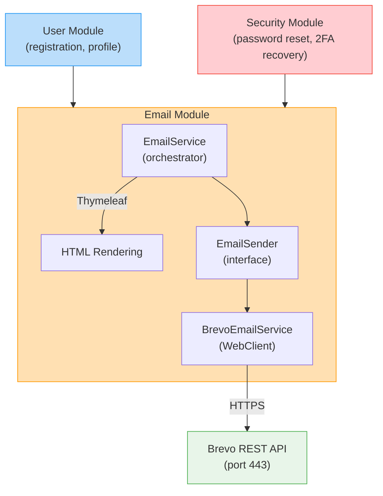
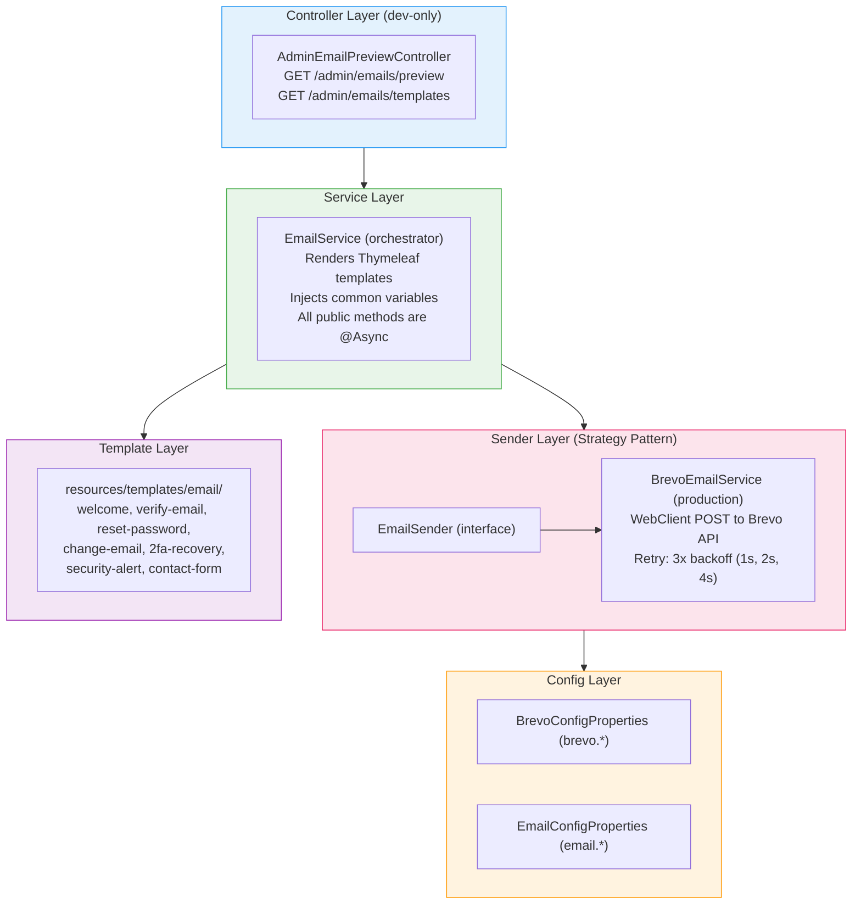
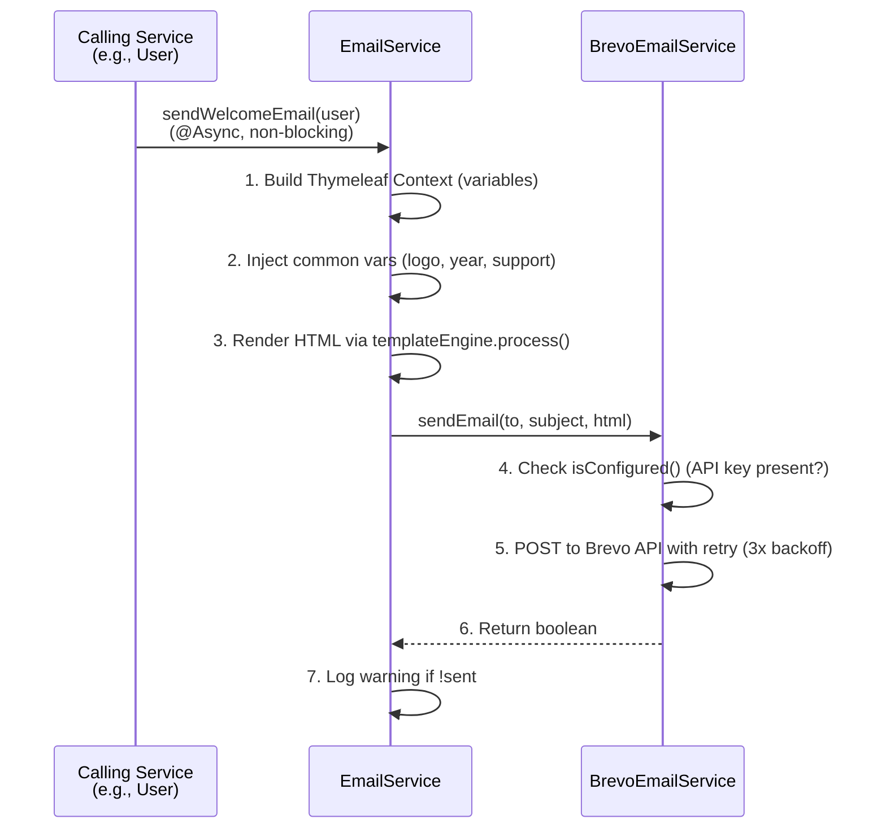
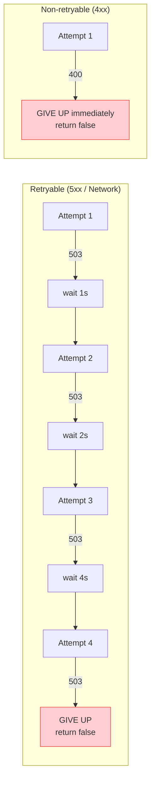

# Email Module -- CoinTrack

> **Domain**: Transactional email delivery and template rendering
> **Responsibility**: Send templated emails via Brevo API for auth flows, security alerts, and contact forms
> **Version**: 3.0.0
> **Last Updated**: 2026-03-19

---

## Table of Contents

1. [Overview](#1-overview)
2. [Architecture](#2-architecture)
3. [Directory Structure](#3-directory-structure)
4. [Configuration](#4-configuration)
5. [Service Layer](#5-service-layer)
6. [Controller](#6-controller)
7. [Templates](#7-templates)
8. [API Reference](#8-api-reference)
9. [Data Flow](#9-data-flow)
10. [Security](#10-security)
11. [Common Pitfalls](#11-common-pitfalls)

---

## 1. Overview

### 1.1 Purpose

The Email module handles all **transactional email delivery** for CoinTrack. It renders
Thymeleaf HTML templates and sends them via the Brevo (Sendinblue) REST API over HTTPS.

### 1.2 Business Problem Solved

- Gmail SMTP is blocked on cloud providers like Render (ports 25, 587, 465 are unavailable)
- Brevo uses HTTPS (port 443), which works on all cloud platforms
- Email failures must never block user flows (registration, login, password reset)

### 1.3 Key Features

| Feature | Description |
|---------|-------------|
| **Brevo API Integration** | Sends via REST API over HTTPS (port 443) |
| **Thymeleaf Templates** | 7 HTML email templates with shared branding |
| **Async Delivery** | All send methods are `@Async` -- never blocks callers |
| **Fail-Safe** | Email failures return `false`, never throw exceptions |
| **Retry with Backoff** | 3 retries with exponential backoff for 5xx/network errors |
| **Template Preview** | Dev-only admin endpoint to preview rendered templates |
| **Embedded Logo** | Logo loaded from classpath and embedded as base64 data URI |

### 1.4 Email Types

| Email | Trigger | Magic Link? |
|-------|---------|-------------|
| Welcome | User registration | No |
| Verify Email | Registration, email change | Yes (10 min expiry) |
| Reset Password | Forgot password flow | Yes (10 min expiry) |
| Change Email | Email update request | Yes (10 min expiry) |
| 2FA Recovery | Lost authenticator + backup codes | Yes (10 min expiry) |
| Security Alert | Password/2FA/email/username change | No |
| Contact Form | Public contact form submission | No |

### 1.5 System Position



---

## 2. Architecture

### 2.1 Layer Diagram



---

## 3. Directory Structure

```
email/
+-- README.md                              # This file
|
+-- config/
|   +-- BrevoConfigProperties.java         # Brevo API config (key, sender, URL)
|   +-- EmailConfigProperties.java         # App-level config (from, support, base URLs)
|
+-- controller/
|   +-- AdminEmailPreviewController.java   # Dev-only template preview (2 endpoints)
|
+-- service/
    +-- EmailSender.java                   # Interface: sendEmail(), isConfigured()
    +-- BrevoEmailService.java             # Brevo REST API implementation with retry
    +-- EmailService.java                  # Orchestrator: template rendering + send

Templates (outside module, in resources):
  resources/templates/email/
    +-- welcome.html
    +-- verify-email.html
    +-- reset-password.html
    +-- change-email.html
    +-- 2fa-recovery.html
    +-- security-alert.html
    +-- contact-form.html

Total: 6 Java files + 7 HTML templates
```

---

## 4. Configuration

### 4.1 BrevoConfigProperties

**Prefix**: `brevo.`

| Property | Default | Description |
|----------|---------|-------------|
| `apiKey` | (none) | Brevo API key -- required for production |
| `senderEmail` | `no-reply@cointrack.app` | Verified sender address |
| `senderName` | `CoinTrack` | Display name in From header |
| `apiUrl` | `https://api.brevo.com/v3/smtp/email` | Brevo transactional API endpoint |

### 4.2 EmailConfigProperties

**Prefix**: `email.`

| Property | Default | Description |
|----------|---------|-------------|
| `from` | `noreply@cointrack.app` | Sender email (From header) |
| `support` | `support@cointrack.app` | Support email shown in templates |
| `baseUrl` | `https://cointrack-finance.vercel.app` | Frontend URL for magic links |
| `magicLinkExpiryMinutes` | `10` | Magic link token TTL |
| `magicLinkSecret` | (none) | JWT signing secret for magic links |
| `apiBaseUrl` | `https://cointrack-15gt.onrender.com` | Backend URL for static assets |

### 4.3 Required Environment Variables (Production)

```
BREVO_API_KEY=xkeysib-...
BREVO_SENDER_EMAIL=no-reply@cointrack.app
BREVO_SENDER_NAME=CoinTrack
EMAIL_BASE_URL=https://cointrack-finance.vercel.app
EMAIL_MAGIC_LINK_SECRET=<strong-random-secret>
EMAIL_SUPPORT=support@cointrack.app
```

---

## 5. Service Layer

### 5.1 EmailSender (Interface)

**Location**: `service/EmailSender.java`

Abstraction for email delivery. Allows swapping implementations by profile.

| Method | Returns | Description |
|--------|---------|-------------|
| `sendEmail(to, subject, html)` | `boolean` | Send email, return success/failure |
| `sendEmail(to, toName, subject, html)` | `boolean` | Send with recipient display name |
| `isConfigured()` | `boolean` | Check if API key is present |

### 5.2 BrevoEmailService

**Location**: `service/BrevoEmailService.java`
**Implements**: `EmailSender`

Production email sender using Brevo Transactional Email API via `WebClient`.

**Retry Strategy**:

| Error Type | Retryable? | Behavior |
|------------|------------|----------|
| 5xx server error | Yes | 3 retries, exponential backoff (1s base, 10s max) |
| Network/IO error | Yes | Same retry policy |
| 400 bad request | No | Immediate failure |
| 401 unauthorized | No | Immediate failure, logs critical error |

**Timeout**: 10 seconds per request.

**Fail-Safe**: The `sendEmail` method catches all exceptions and returns `false` -- it never throws.

### 5.3 EmailService (Orchestrator)

**Location**: `service/EmailService.java`

Central service that renders templates and delegates delivery. All public send methods
are annotated `@Async` so email dispatch never blocks the calling thread.

**Public Methods**:

| Method | Template Used | Called By |
|--------|---------------|-----------|
| `sendWelcomeEmail(user)` | `welcome` | UserService (registration) |
| `sendEmailVerification(user, link)` | `verify-email` | UserService (registration) |
| `sendPasswordResetLink(user, link)` | `reset-password` | AuthController (forgot password) |
| `sendEmailChangeVerification(user, newEmail, link)` | `change-email` | ProfileService |
| `send2FARecoveryLink(user, link)` | `2fa-recovery` | TwoFactorService |
| `sendSecurityAlert(user, event, metadata)` | `security-alert` | Various security flows |
| `sendSecurityAlert(user, event)` | `security-alert` | Convenience (no metadata) |
| `sendSecurityAlertWithIP(user, event, ip)` | `security-alert` | Convenience (with IP) |
| `sendContactFormEmail(name, email, msg)` | `contact-form` | ContactController |
| `previewEmailTemplate(name, vars)` | Any | AdminEmailPreviewController |

**Common Template Variables** (injected into all templates automatically):
- `logoUrl` -- base64 data URI or fallback URL
- `supportEmail` -- support address
- `year` -- current year for footer copyright

**Logo Loading**: On startup (`@PostConstruct`), the logo is loaded from
`classpath:static/logo/coinTrack.png` and encoded as a base64 data URI. If loading
fails, it falls back to the configured URL.

**Design Rule**: Welcome email and verification email are always sent separately,
never combined into one message.

---

## 6. Controller

### 6.1 AdminEmailPreviewController

**Location**: `controller/AdminEmailPreviewController.java`
**Base Path**: `/admin/emails`
**Access**: Dev profile only (secured via SecurityConfig)

| Method | Endpoint | Description |
|--------|----------|-------------|
| GET | `/admin/emails/preview` | Render and return HTML for a template |
| GET | `/admin/emails/templates` | List available template names |

**Query Parameters for Preview**:

| Parameter | Required | Default | Description |
|-----------|----------|---------|-------------|
| `template` | Yes | -- | Template name (e.g., `welcome`, `verify-email`) |
| `username` | No | `TestUser` | Username for template variable |
| `name` | No | (uses username) | Display name |
| `magicLink` | No | Sample URL | Magic link URL |
| `oldEmail` | No | `old@example.com` | For change-email template |
| `newEmail` | No | `new@example.com` | For change-email template |
| `event` | No | `Password Changed` | For security-alert template |
| `expiryMinutes` | No | `10` | Magic link expiry display |

---

## 7. Templates

All templates are Thymeleaf HTML files located at `resources/templates/email/`.

| Template | Subject Line | Key Variables |
|----------|-------------|---------------|
| `welcome.html` | Welcome to CoinTrack | `username`, `name` |
| `verify-email.html` | Verify Your Email Address | `magicLink`, `expiryMinutes` |
| `reset-password.html` | Reset Your Password | `magicLink`, `expiryMinutes` |
| `change-email.html` | Confirm Your Email Change | `oldEmail`, `newEmail`, `magicLink` |
| `2fa-recovery.html` | Reset Your 2-Factor Authentication | `magicLink`, `expiryMinutes` |
| `security-alert.html` | Security Alert: {event} | `event`, `timestamp`, `metadata` |
| `contact-form.html` | New Contact Form Submission from {name} | `name`, `email`, `message` |

All templates share common variables: `logoUrl`, `supportEmail`, `year`.

---

## 8. API Reference

### 8.1 Preview Template (Dev Only)

```http
GET /admin/emails/preview?template=welcome&username=John
```

**Response**: Raw HTML (Content-Type: text/html)

### 8.2 List Templates (Dev Only)

```http
GET /admin/emails/templates
```

**Response**:
```json
{
  "templates": ["welcome", "verify-email", "reset-password", "change-email", "security-alert"],
  "usage": "/admin/emails/preview?template=<name>&username=<user>"
}
```

---

## 9. Data Flow

### 9.1 Send Email Flow



### 9.2 Retry Behavior



---

## 10. Security

### 10.1 API Key Protection

| Concern | Mitigation |
|---------|------------|
| API key in code | Loaded from environment variable `BREVO_API_KEY` |
| API key in logs | Never logged; only presence/absence is checked |
| Missing key (prod) | Logs ERROR at startup; emails fail-safe (return false) |

### 10.2 Magic Link Security

| Concern | Mitigation |
|---------|------------|
| Token forgery | Signed with `magicLinkSecret` (JWT) |
| Token replay | 10-minute expiry by default |
| Link sniffing | HTTPS-only frontend URLs |

### 10.3 Admin Preview Endpoint

| Concern | Mitigation |
|---------|------------|
| Production exposure | Secured via SecurityConfig (dev profile only) |
| Data leakage | Uses sample data, not real user data |

### 10.4 Logging Policy

| Data | Logged? | Reason |
|------|---------|--------|
| Recipient email | Yes | Delivery troubleshooting |
| Subject line | Yes | Delivery troubleshooting |
| HTML content | No | Contains magic links and user data |
| API key | No | Secret credential |

---

## 11. Common Pitfalls

| Pitfall | Impact | Prevention |
|---------|--------|------------|
| Missing `BREVO_API_KEY` in prod | No emails sent | Check startup logs for warning |
| Blocking on email send | Slow registration/login | All methods are `@Async` |
| Throwing on email failure | Registration/login breaks | `sendEmail` catches all exceptions |
| Combining welcome + verify emails | User confusion | Always send as two separate emails |
| Unverified sender in Brevo | Emails rejected by Brevo | Verify sender domain in Brevo dashboard |
| Logo too large for base64 | Email clipped by clients | Keep logo under 50KB |
| Expired magic link secret rotation | Old links break | Coordinate secret rotation with link TTL |

---

## Appendix A: Related Documentation

- [Security Module README](../security/README.md) -- JWT authentication, magic link token generation
- [User Module README](../user/README.md) -- Registration flow (triggers welcome + verify emails)
- [Common Module README](../common/README.md) -- Shared utilities

---

## Appendix B: Changelog

| Version | Date | Changes |
|---------|------|---------|
| 3.0.0 | 2026-03-19 | Refactored: EmailSender interface, BrevoEmailService, removed DevNoOpEmailService |
| 2.0.0 | 2025-12-17 | Migrated from Gmail SMTP to Brevo REST API |
| 1.0.0 | 2025-11-01 | Initial email module with SMTP |
