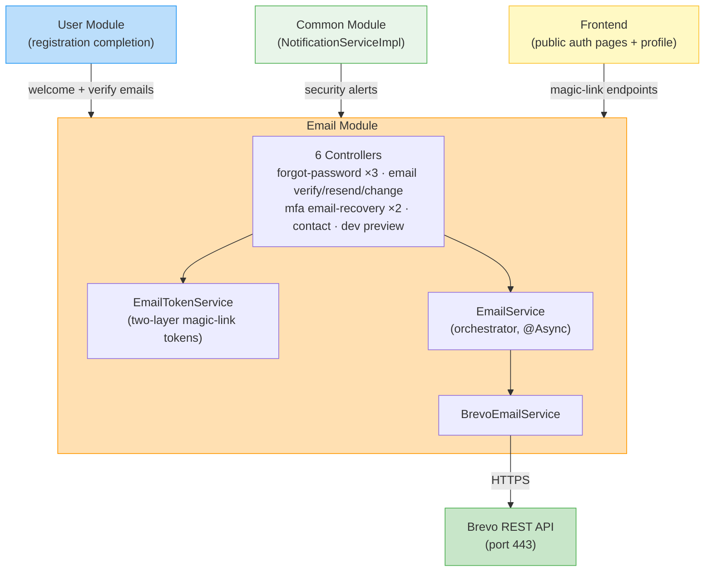
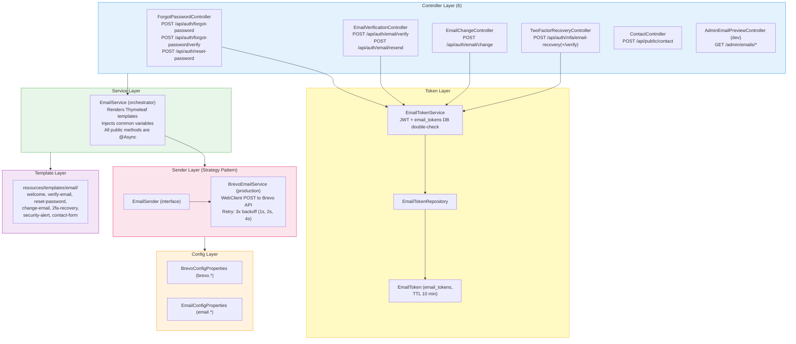
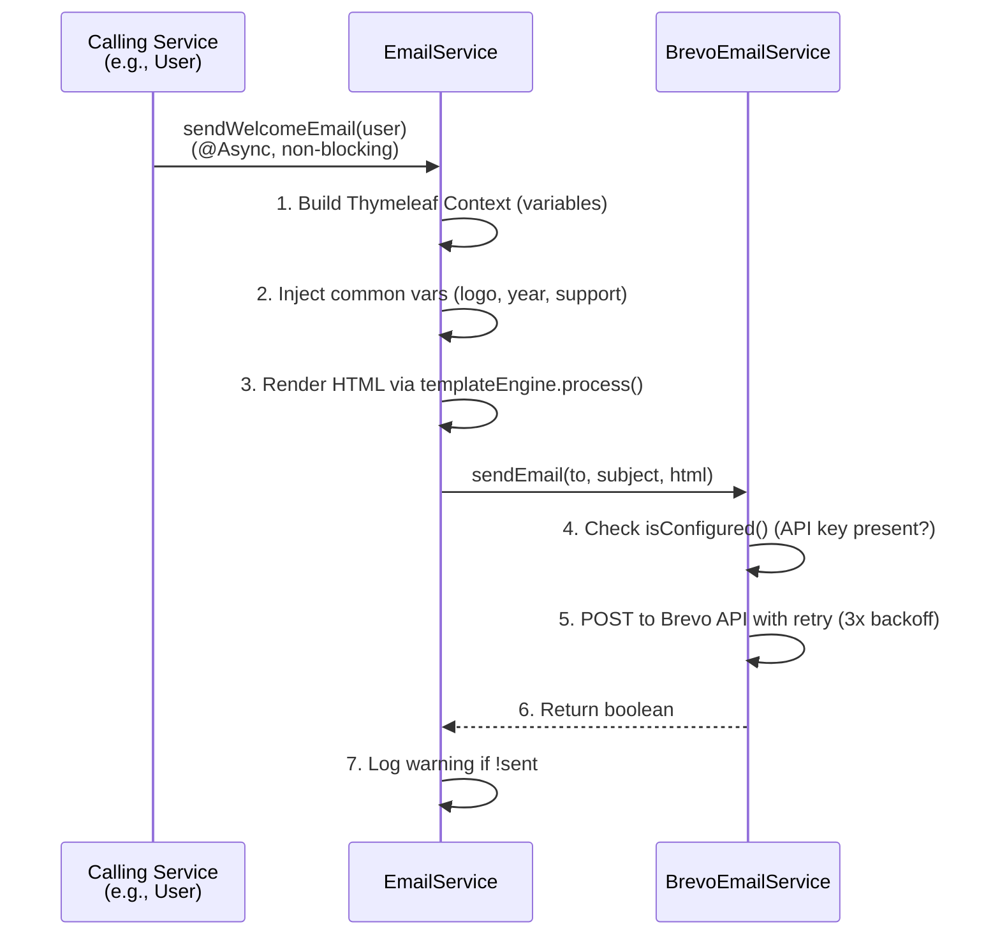
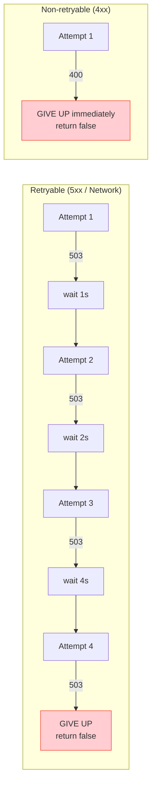

# Email Module -- CoinTrack

> **Domain**: Transactional email delivery, magic-link token lifecycle, and template rendering
> **Responsibility**: Owns the magic-link auth surface (forgot-password, email verification/change, lost-MFA recovery), contact form, templated Brevo delivery, and the `email_tokens` collection
> **Version**: 3.4.0
> **Last Updated**: 2026-08-23

---

## Table of Contents

1. [Overview](#1-overview)
2. [Architecture](#2-architecture)
3. [Directory Structure](#3-directory-structure)
4. [Configuration](#4-configuration)
5. [Service Layer](#5-service-layer)
6. [Controllers](#6-controllers)
7. [Templates](#7-templates)
8. [API Reference](#8-api-reference)
9. [Data Flow](#9-data-flow)
10. [Security](#10-security)
11. [Common Pitfalls](#11-common-pitfalls)

---

## 1. Overview

### 1.1 Purpose

The Email module handles all **transactional email delivery** for CoinTrack. It renders
Thymeleaf HTML templates and sends them via the Brevo (Sendinblue) REST API over HTTPS.

### 1.2 Business Problem Solved

- Gmail SMTP is blocked on cloud providers like Render (ports 25, 587, 465 are unavailable)
- Brevo uses HTTPS (port 443), which works on all cloud platforms
- Email failures must never block user flows (registration, login, password reset)

### 1.3 Key Features

| Feature                           | Description                                                                                                                                           |
| --------------------------------- | ----------------------------------------------------------------------------------------------------------------------------------------------------- |
| **Magic-Link Auth Surface** | Owns forgot-password (3 endpoints), email verify/resend/change, and lost-MFA email recovery (2 endpoints) — 9 runtime endpoints + 2 dev-preview GETs |
| **Two-Layer Tokens**        | Magic links are signed JWTs whose ID must ALSO exist unused in the`email_tokens` Mongo collection (10-min TTL)                                      |
| **Brevo API Integration**   | Sends via REST API over HTTPS (port 443)                                                                                                              |
| **Thymeleaf Templates**     | 7 HTML email templates with shared branding                                                                                                           |
| **Async Delivery**          | All send methods are`@Async` -- never blocks callers                                                                                                |
| **Fail-Safe**               | Email failures return`false`, never throw exceptions                                                                                                |
| **Retry with Backoff**      | 3 retries with exponential backoff for 5xx/network errors                                                                                             |
| **Anti-Enumeration**        | Identical neutral responses for unknown identifiers on forgot-password and MFA recovery                                                               |
| **Template Preview**        | Dev-only admin endpoint to preview rendered templates                                                                                                 |
| **Embedded Logo**           | Logo loaded from classpath and embedded as base64 data URI                                                                                            |

### 1.4 Email Types

| Email          | Trigger                            | Magic Link?         |
| -------------- | ---------------------------------- | ------------------- |
| Welcome        | User registration                  | No                  |
| Verify Email   | Registration, email change         | Yes (10 min expiry) |
| Reset Password | Forgot password flow               | Yes (10 min expiry) |
| Change Email   | Email update request               | Yes (10 min expiry) |
| MFA Recovery   | Lost authenticator + backup codes  | Yes (10 min expiry) |
| Security Alert | Password/MFA/email/username change | No                  |
| Contact Form   | Public contact form submission     | No                  |

### 1.5 System Position


```mermaid
graph TD
    US["User Module<br/>(registration completion)"] -->|"welcome + verify emails"| EM
    NC["Common Module<br/>(NotificationServiceImpl)"] -->|"security alerts"| EM
    FE["Frontend<br/>(public auth pages + profile)"] -->|"magic-link endpoints"| EM

    subgraph EM["Email Module"]
        CTRL["6 Controllers<br/>forgot-password ×3 · email verify/resend/change<br/>mfa email-recovery ×2 · contact · dev preview"]
        TS["EmailTokenService<br/>(two-layer magic-link tokens)"]
        ES["EmailService<br/>(orchestrator, @Async)"]
        SENDER["BrevoEmailService"]
        CTRL --> TS
        CTRL --> ES
        ES --> SENDER
    end

    SENDER -->|"HTTPS"| API["Brevo REST API<br/>(port 443)"]

    style US fill:#bbdefb,stroke:#2196F3
    style NC fill:#e8f5e9,stroke:#4CAF50
    style FE fill:#fff9c4,stroke:#FBC02D
    style EM fill:#ffe0b2,stroke:#FF9800
    style API fill:#c8e6c9,stroke:#4CAF50
```

---

## 2. Architecture

### 2.1 Layer Diagram


```mermaid
graph TD
    subgraph CTRL["Controller Layer (6)"]
        FPC["ForgotPasswordController<br/>POST /api/auth/forgot-password<br/>POST /api/auth/forgot-password/verify<br/>POST /api/auth/reset-password"]
        EVC["EmailVerificationController<br/>POST /api/auth/email/verify<br/>POST /api/auth/email/resend"]
        ECC["EmailChangeController<br/>POST /api/auth/email/change"]
        TRC["TwoFactorRecoveryController<br/>POST /api/auth/mfa/email-recovery(+/verify)"]
        CC["ContactController<br/>POST /api/public/contact"]
        APC["AdminEmailPreviewController (dev)<br/>GET /admin/emails/*"]
    end

    subgraph TOK["Token Layer"]
        ETS["EmailTokenService<br/>JWT + email_tokens DB double-check"]
        ETR["EmailTokenRepository"]
        ET["EmailToken (email_tokens,<br/>TTL 10 min)"]
        ETS --> ETR
        ETR --> ET
    end

    subgraph SVC["Service Layer"]
        ESV["EmailService (orchestrator)<br/>Renders Thymeleaf templates<br/>Injects common variables<br/>All public methods are @Async"]
    end

    subgraph SEND["Sender Layer (Strategy Pattern)"]
        IF["EmailSender (interface)"]
        BES["BrevoEmailService (production)<br/>WebClient POST to Brevo API<br/>Retry: 3x backoff (1s, 2s, 4s)"]
        IF --> BES
    end

    subgraph CFG["Config Layer"]
        BCP["BrevoConfigProperties (brevo.*)"]
        ECP["EmailConfigProperties (email.*)"]
    end

    subgraph TPL["Template Layer"]
        TF["resources/templates/email/<br/>welcome, verify-email, reset-password,<br/>change-email, 2fa-recovery,<br/>security-alert, contact-form"]
    end

    FPC --> ETS
    EVC --> ETS
    ECC --> ETS
    TRC --> ETS
    CTRL --> ESV
    ESV --> SEND
    SEND --> CFG
    SVC --> TPL

    style CTRL fill:#e3f2fd,stroke:#2196F3
    style TOK fill:#fff9c4,stroke:#FBC02D
    style SVC fill:#e8f5e9,stroke:#4CAF50
    style SEND fill:#fce4ec,stroke:#E91E63
    style CFG fill:#fff3e0,stroke:#FF9800
    style TPL fill:#f3e5f5,stroke:#9C27B0
```

---

## 3. Directory Structure

```
email/
+-- README.md                              # This file
|
+-- config/
|   +-- BrevoConfigProperties.java         # Brevo API config (key, sender, URL)
|   +-- EmailConfigProperties.java         # App-level config (support, base URLs, magic-link secret/TTL)
|   +-- MagicLinkSecretGuard.java          # Startup guard: ERROR if magic-link secret == jwt.secret
|
+-- controller/
|   +-- ForgotPasswordController.java      # POST /api/auth/forgot-password(+/verify), /reset-password
|   +-- EmailVerificationController.java   # POST /api/auth/email/verify, /resend
|   +-- EmailChangeController.java         # POST /api/auth/email/change (authenticated)
|   +-- TwoFactorRecoveryController.java   # POST /api/auth/mfa/email-recovery(+/verify)
|   +-- ContactController.java             # POST /api/public/contact
|   +-- AdminEmailPreviewController.java   # Dev-only template preview (2 endpoints)
|
+-- model/
|   +-- EmailToken.java                    # Collection email_tokens — two-layer magic-link token record
|
+-- repository/
|   +-- EmailTokenRepository.java          # findByIdAndUsedFalse, invalidate/delete helpers
|
+-- service/
    +-- EmailSender.java                   # Interface: sendEmail(), isConfigured()
    +-- BrevoEmailService.java             # Brevo REST API implementation with retry
    +-- EmailService.java                  # Orchestrator: template rendering + send
    +-- EmailTokenService.java             # Magic-link JWT minting/validation + single-use enforcement

Templates (outside module, in resources):
  resources/templates/email/
    +-- welcome.html
    +-- verify-email.html
    +-- reset-password.html
    +-- change-email.html
    +-- 2fa-recovery.html
    +-- security-alert.html
    +-- contact-form.html

Total: 15 Java files + 7 HTML templates
```

---

## 4. Configuration

### 4.1 BrevoConfigProperties

**Prefix**: `brevo.`

| Property        | Default                                 | Description                              |
| --------------- | --------------------------------------- | ---------------------------------------- |
| `apiKey`      | (none)                                  | Brevo API key -- required for production |
| `senderEmail` | `no-reply@cointrack.app`              | Verified sender address                  |
| `senderName`  | `CoinTrack`                           | Display name in From header              |
| `apiUrl`      | `https://api.brevo.com/v3/smtp/email` | Brevo transactional API endpoint         |

### 4.2 EmailConfigProperties

**Prefix**: `email.`

| Property                   | Default                                         | Description                                                                                                                 |
| -------------------------- | ----------------------------------------------- | --------------------------------------------------------------------------------------------------------------------------- |
| `support`                | `support@cointrack.app`                       | Support email shown in templates + contact-form recipient                                                                   |
| `baseUrl`                | `https://cointrack-finance.vercel.app`        | Frontend URL for magic links                                                                                                |
| `magicLinkExpiryMinutes` | `10`                                          | Magic link token TTL (JWT exp + DB expiresAt + Mongo TTL)                                                                   |
| `magicLinkSecret`        | (none)                                          | JWT signing secret for magic links                                                                                          |
| `apiBaseUrl`             | `https://cointrack-backend-1g44.onrender.com` | Backend URL for static assets (logo fallback)                                                                               |

> The former `from` property was removed in v3.2.0 — it had zero code consumers; the From
> identity comes solely from `brevo.sender-email`.

> **Defaults vs deployed values**: `application.properties` overrides `email.support`
> (and `brevo.sender-email`) with `${EMAIL_SUPPORT:cointrack.urva@gmail.com}` /
> `${BREVO_SENDER_EMAIL:cointrack.urva@gmail.com}` — so the code defaults above are NOT what
> runs in any environment where the properties file applies. Effective sender/support is
> currently the personal gmail address. Do not change these casually: Brevo only delivers
> from senders verified in the Brevo account.

URL builders on this class: `/verify-email?token=`, `/reset-password?token=`,
`/verify-email?token=..&type=change` (email change), `/reset-2fa?token=` (MFA recovery).

### 4.3 Required Environment Variables (Production)

```
BREVO_API_KEY=xkeysib-...
BREVO_SENDER_EMAIL=no-reply@cointrack.app
BREVO_SENDER_NAME=CoinTrack
EMAIL_BASE_URL=https://cointrack-finance.vercel.app
EMAIL_MAGIC_LINK_SECRET=<strong-random-secret>
EMAIL_SUPPORT=support@cointrack.app
```

---

## 5. Service Layer

### 5.1 EmailSender (Interface)

**Location**: `service/EmailSender.java`

Abstraction for email delivery. `BrevoEmailService` is the sole implementation, active in
ALL profiles (the former dev-only `DevNoOpEmailService` was removed in v3.0.0); without
`BREVO_API_KEY` it degrades to skip-and-warn via `isConfigured()`.

| Method                                   | Returns     | Description                        |
| ---------------------------------------- | ----------- | ---------------------------------- |
| `sendEmail(to, subject, html)`         | `boolean` | Send email, return success/failure |
| `sendEmail(to, toName, subject, html)` | `boolean` | Send with recipient display name   |
| `isConfigured()`                       | `boolean` | Check if API key is present        |

### 5.2 BrevoEmailService

**Location**: `service/BrevoEmailService.java`
**Implements**: `EmailSender`

Production email sender using Brevo Transactional Email API via `WebClient`, built from the
shared `common/config/WebClientConfig` builder (10 s connect timeout, 15 s response timeout,
2 MB in-memory codec limit).

**Retry Strategy**:

| Error Type       | Retryable? | Behavior                                          |
| ---------------- | ---------- | ------------------------------------------------- |
| 5xx server error | Yes        | 3 retries, exponential backoff (1s base, 10s max) |
| Network/IO error | Yes        | Same retry policy                                 |
| 400 bad request  | No         | Immediate failure                                 |
| 401 unauthorized | No         | Immediate failure, logs critical error            |

**Timeout**: 10 seconds overall per send call (`.timeout(10s)`), plus transport-level
10 s connect / 15 s response timeouts from the shared builder.

**Fail-Safe**: The `sendEmail` method catches all exceptions and returns `false` -- it never throws.

### 5.3 EmailService (Orchestrator)

**Location**: `service/EmailService.java`

Central service that renders templates and delegates delivery. All public send methods
are annotated `@Async` so email dispatch never blocks the calling thread.

**Public Methods**:

| Method                                                | Template Used      | Called By                                                                                    |
| ----------------------------------------------------- | ------------------ | -------------------------------------------------------------------------------------------- |
| `sendWelcomeEmail(user)`                            | `welcome`        | UserService (registration), NotificationServiceImpl                                          |
| `sendEmailVerification(user, link)`                 | `verify-email`   | UserService (registration), EmailVerificationController (`/resend`)                        |
| `sendPasswordResetLink(user, link)`                 | `reset-password` | ForgotPasswordController (`/forgot-password`)                                              |
| `sendEmailChangeVerification(user, newEmail, link)` | `change-email`   | EmailChangeController (`/email/change`)                                                    |
| `send2FARecoveryLink(user, link)`                   | `2fa-recovery`   | TwoFactorRecoveryController (`/mfa/email-recovery`)                                        |
| `sendSecurityAlert(user, event, metadata)`          | `security-alert` | Various security flows (password change, email change, MFA disable), NotificationServiceImpl |
| `sendSecurityAlert(user, event)`                    | `security-alert` | Convenience (no metadata)                                                                    |
| `sendSecurityAlertWithIP(user, event, ip)`          | `security-alert` | ForgotPasswordController (reset success), NotificationServiceImpl                            |
| `sendContactFormEmail(name, email, msg)`            | `contact-form`   | ContactController                                                                            |
| `previewEmailTemplate(name, vars)`                  | Any                | AdminEmailPreviewController (not @Async)                                                     |

**Common Template Variables** (injected into all templates automatically):

- `logoUrl` -- base64 data URI or fallback URL
- `supportEmail` -- support address
- `year` -- current year for footer copyright

**Logo Loading**: On startup (`@PostConstruct`), the logo is loaded from
`classpath:static/logo/coinTrack.png` and encoded as a base64 data URI. If loading
fails, it falls back to the configured URL.

**Design Rule**: Welcome email and verification email are always sent separately,
never combined into one message.

### 5.4 Token Subsystem (EmailTokenService + EmailToken)

Magic links are **two-layer credentials**:

1. **JWT layer** — HS256-signed with `email.magic-link-secret`; claims: `jti` (UUID tokenId),
   `sub` (userId), `purpose`, `exp` (= `magicLinkExpiryMinutes`).
2. **Database layer** — the JWT's `jti` MUST also exist in the `email_tokens` Mongo collection
   with `used=false`. JWT validation alone is NEVER sufficient.

Validation order (`validateToken(token, expectedPurpose)`): JWT signature → purpose-claim match →
DB record exists & unused (`findByIdAndUsedFalse`) → DB purpose re-check → expiry double-check.
Consumption calls `markUsed(tokenId)`. `invalidateAllForUser(userId)` deletes all outstanding
tokens on sensitive changes: password reset, email-change verify, MFA recovery — plus call-ins
from user-module password change (`UserController`) and MFA reset/disable (`TotpController`).

**Collection `email_tokens`**: `{_id = UUID tokenId, userId @Indexed, purpose (EMAIL_VERIFY | PASSWORD_RESET | EMAIL_CHANGE_VERIFY | 2FA_RECOVERY), newEmail, expiresAt (@Indexed expireAfterSeconds=0, TTL self-clean), used, ipAddress, userAgent, createdAt}`.

**Third token family**: `/forgot-password/verify` mints a `PASSWORD_RESET_TEMP` JWT
(5 min, same magic-link secret) returned in the body and sent by the frontend as a Bearer
header to `POST /api/auth/reset-password` — separate from the security module's TOTP_* temp tokens.

---

## 6. Controllers

Six controllers own the module's HTTP surface: the magic-link auth family (which lives in
this module, NOT in user/security), the public contact form, and the dev-only preview pair.
Public routes are whitelisted in SecurityConfig exactly as listed; `/resend` and `/change`
require a Bearer token.

### 6.1 Endpoint Inventory (10 endpoints)

| #  | Method | Endpoint                                               | Auth                                                               | Controller                  |
| -- | ------ | ------------------------------------------------------ | ------------------------------------------------------------------ | --------------------------- |
| 1  | POST   | `/api/auth/forgot-password`                          | Public                                                             | ForgotPasswordController    |
| 2  | POST   | `/api/auth/forgot-password/verify`                   | Public                                                             | ForgotPasswordController    |
| 3  | POST   | `/api/auth/reset-password`                           | Public (temp JWT as Bearer header)                                 | ForgotPasswordController    |
| 4  | POST   | `/api/auth/email/verify`                             | Public                                                             | EmailVerificationController |
| 5  | POST   | `/api/auth/email/resend`                             | Authenticated (Bearer)                                             | EmailVerificationController |
| 6  | POST   | `/api/auth/email/change`                             | Authenticated (Bearer)                                             | EmailChangeController       |
| 7  | POST   | `/api/auth/mfa/email-recovery`                       | Public                                                             | TwoFactorRecoveryController |
| 8  | POST   | `/api/auth/mfa/email-recovery/verify`                | Public                                                             | TwoFactorRecoveryController |
| 9  | POST   | `/api/public/contact`                                | Public                                                             | ContactController           |
| 10 | GET    | `/admin/emails/preview`, `/admin/emails/templates` | permitAll route, but bean is`@Profile("dev")` → 404 outside dev | AdminEmailPreviewController |

Frontend callers (all defined in `frontend/src/lib/api.js`): `passwordAPI.forgot/forgotVerify/reset`
→ #1–3, `emailAPI.verify/resend/change` → #4–6, `twofaAPI.requestRecovery/verifyRecovery` → #7–8,
`contactAPI.sendMessage` → #9. Endpoint #5 (`/resend`) is wired to two UI surfaces (since
2026-08-23): profile page's "Resend verification email" button (shown when
`isEmailVerified=false`) and the expired-link error state on verify-email page (offered only
when a live session token exists; unauthenticated users get a login nudge instead).

### 6.2 ForgotPasswordController

**Base Path**: `/api/auth`

Anti-enumeration: unknown identifiers get the identical success response as known ones.

| Endpoint                        | Request                                                            | Response                                                                                                                             |
| ------------------------------- | ------------------------------------------------------------------ | ------------------------------------------------------------------------------------------------------------------------------------ |
| POST`/forgot-password`        | `{identifier}` (email / username / mobile)                       | Always`200 {message: "If an account exists…"}`                                                                                    |
| POST`/forgot-password/verify` | `{token}`                                                        | `200 {verified:true, tempToken, message}` — temp JWT purpose `PASSWORD_RESET_TEMP`, 5 min · `400` invalid/expired/used token |
| POST`/reset-password`         | Header`Authorization: Bearer <tempJwt>` + body `{newPassword}` | `200 {message}` · `400` weak password · `401` missing/invalid token                                                          |

Password policy on reset = registration policy (≥8 chars with upper + lower + digit +
special `@$!%*?&#`). Success also revokes ALL of the user's refresh tokens (session
kill — parity with `UserService.changePassword`), invalidates ALL email tokens, and
sends a security alert with the client IP.

### 6.3 EmailVerificationController

**Base Path**: `/api/auth/email`

| Endpoint        | Request                                                             | Response                                                                                         |
| --------------- | ------------------------------------------------------------------- | ------------------------------------------------------------------------------------------------ |
| POST`/verify` | `{token, type?}` — `type:"change"` selects EMAIL_CHANGE_VERIFY | `200 {verified:true, message}` (+ `alreadyVerified:true` on repeat) · `400` invalid token |
| POST`/resend` | — (principal from Bearer)                                          | `200 {message}` (+ `alreadyVerified:true`) · `401` unauthenticated                        |

With `type=change` this endpoint performs the actual swap: email ← token.newEmail,
emailVerified=true, pendingEmail cleared, all tokens invalidated, security alert sent to
the OLD address. Registration verification only flips emailVerified/emailVerifiedAt.

### 6.4 EmailChangeController

**Base Path**: `/api/auth/email`

| Endpoint        | Request        | Response                                                                                                                 |
| --------------- | -------------- | ------------------------------------------------------------------------------------------------------------------------ |
| POST`/change` | `{newEmail}` | Neutral`200 {message}` even when the email is taken (no enumeration) · `400` missing/invalid format/same-as-current |

`newEmail` is normalized server-side (`trim().toLowerCase()`, parity with registration)
before validation, duplicate check, and storage — case-variant collisions cannot slip
past the exact-match guard.

Stores `pendingEmail` on the user, issues an EMAIL_CHANGE_VERIFY token bound to the new
address, and mails the confirmation link to the NEW inbox.

### 6.5 TwoFactorRecoveryController

**Base Path**: `/api/auth`

Lost-MFA recovery when both the authenticator and all backup codes are gone.

| Endpoint                           | Request          | Response                                                                                                                                                |
| ---------------------------------- | ---------------- | ------------------------------------------------------------------------------------------------------------------------------------------------------- |
| POST`/mfa/email-recovery`        | `{identifier}` | Fully neutral`200` for every non-issuing case: unknown identifier, MFA-disabled, or existing-but-email-unverified (no enumeration oracle) |
| POST`/mfa/email-recovery/verify` | `{token}`      | `200 {verified:true, message}` — calls `TotpService.disable2FA(user)`, invalidates all email tokens, sends security alert · `400` invalid token |

Requires `totpEnabled` AND `emailVerified` to issue a recovery link; all other cases get
the identical neutral response.

### 6.6 ContactController

**Base Path**: `/api/public`

| Endpoint         | Request                                                          | Response                                                                                |
| ---------------- | ---------------------------------------------------------------- | --------------------------------------------------------------------------------------- |
| POST`/contact` | `{name, email, message}` (@Valid: all @NotBlank, email @Email) | `200 {success:true, message:"Message sent successfully", data:null}` (ApiResponse envelope) |

Routes the message to the support inbox via the contact-form template. No persistence.

### 6.7 AdminEmailPreviewController

**Location**: `controller/AdminEmailPreviewController.java`
**Base Path**: `/admin/emails`
**Access**: `@Profile("dev")` at class level (line 36) — bean never instantiates outside dev;
SecurityConfig's permitAll entry is therefore inert in production.

| Method | Endpoint                    | Description                           |
| ------ | --------------------------- | ------------------------------------- |
| GET    | `/admin/emails/preview`   | Render and return HTML for a template |
| GET    | `/admin/emails/templates` | List available template names         |

**Query Parameters for Preview**:

| Parameter         | Required | Default              | Description                                        |
| ----------------- | -------- | -------------------- | -------------------------------------------------- |
| `template`      | Yes      | --                   | Template name (e.g.,`welcome`, `verify-email`) |
| `username`      | No       | `TestUser`         | Username for template variable                     |
| `name`          | No       | (uses username)      | Display name                                       |
| `magicLink`     | No       | Sample URL           | Magic link URL                                     |
| `oldEmail`      | No       | `old@example.com`  | For change-email template                          |
| `newEmail`      | No       | `new@example.com`  | For change-email template                          |
| `event`         | No       | `Password Changed` | For security-alert template                        |
| `expiryMinutes` | No       | `10`               | Magic link expiry display                          |

All 7 renderable templates are listed by `/templates`.

---

## 7. Templates

All templates are Thymeleaf HTML files located at `resources/templates/email/`.

| Template                | Subject Line                            | Key Variables                             |
| ----------------------- | --------------------------------------- | ----------------------------------------- |
| `welcome.html`        | Welcome to CoinTrack                    | `username`, `name`                    |
| `verify-email.html`   | Verify Your Email Address               | `magicLink`, `expiryMinutes`          |
| `reset-password.html` | Reset Your Password                     | `magicLink`, `expiryMinutes`          |
| `change-email.html`   | Confirm Your Email Change               | `oldEmail`, `newEmail`, `magicLink` |
| `2fa-recovery.html`   | Reset Your 2-Factor Authentication      | `magicLink`, `expiryMinutes`          |
| `security-alert.html` | Security Alert: {event}                 | `event`, `timestamp`, `metadata`    |
| `contact-form.html`   | New Contact Form Submission from {name} | `name`, `email`, `message`          |

All templates share common variables: `logoUrl`, `supportEmail`, `year`.

---

## 8. API Reference

### 8.0 Runtime Endpoints (summary)

Full request/response shapes in Section 6. Magic-link endpoints return
`ApiResponse`-wrapped JSON (including contact).

```http
POST /api/auth/forgot-password            {identifier}
POST /api/auth/forgot-password/verify     {token}                    → {tempToken}
POST /api/auth/reset-password             Bearer <PASSWORD_RESET_TEMP JWT> + {newPassword}
POST /api/auth/email/verify               {token, type?}
POST /api/auth/email/resend               (Bearer)
POST /api/auth/email/change               (Bearer) {newEmail}
POST /api/auth/mfa/email-recovery         {identifier}
POST /api/auth/mfa/email-recovery/verify  {token}
POST /api/public/contact                  {name, email, message}
```

### 8.1 Preview Template (Dev Only)

```http
GET /admin/emails/preview?template=welcome&username=John
```

**Response**: Raw HTML (Content-Type: text/html)

### 8.2 List Templates (Dev Only)

```http
GET /admin/emails/templates
```

**Response**:

```json
{
  "templates": ["welcome", "verify-email", "reset-password", "change-email", "2fa-recovery", "security-alert", "contact-form"],
  "usage": "/admin/emails/preview?template=<name>&username=<user>"
}
```

---

## 9. Data Flow

### 9.1 Send Email Flow


```mermaid
sequenceDiagram
    participant CS as Calling Service<br/>(e.g., User)
    participant ES as EmailService
    participant BS as BrevoEmailService

    CS->>ES: sendWelcomeEmail(user)<br/>(@Async, non-blocking)
    ES->>ES: 1. Build Thymeleaf Context (variables)
    ES->>ES: 2. Inject common vars (logo, year, support)
    ES->>ES: 3. Render HTML via templateEngine.process()
    ES->>BS: sendEmail(to, subject, html)
    BS->>BS: 4. Check isConfigured() (API key present?)
    BS->>BS: 5. POST to Brevo API with retry (3x backoff)
    BS-->>ES: 6. Return boolean
    ES->>ES: 7. Log warning if !sent
```

### 9.2 Retry Behavior


```mermaid
flowchart LR
    subgraph Retryable["Retryable (5xx / Network)"]
        A1["Attempt 1"] -->|"503"| W1["wait 1s"]
        W1 --> A2["Attempt 2"] -->|"503"| W2["wait 2s"]
        W2 --> A3["Attempt 3"] -->|"503"| W3["wait 4s"]
        W3 --> A4["Attempt 4"] -->|"503"| FAIL["GIVE UP<br/>return false"]
    end

    subgraph NonRetry["Non-retryable (4xx)"]
        B1["Attempt 1"] -->|"400"| FAIL2["GIVE UP immediately<br/>return false"]
    end

    style FAIL fill:#ffcdd2,stroke:#F44336
    style FAIL2 fill:#ffcdd2,stroke:#F44336
```

---

## 10. Security

### 10.1 API Key Protection

| Concern            | Mitigation                                             |
| ------------------ | ------------------------------------------------------ |
| API key in code    | Loaded from environment variable`BREVO_API_KEY`      |
| API key in logs    | Never logged; only presence/absence is checked         |
| Missing key (prod) | Logs ERROR at startup; emails fail-safe (return false) |

### 10.2 Magic Link Security

| Concern                           | Mitigation                                                                                                                       |
| --------------------------------- | -------------------------------------------------------------------------------------------------------------------------------- |
| Token forgery                     | Signed with`magicLinkSecret` (JWT)                                                                                             |
| Token replay                      | 10-minute expiry by default (JWT exp + DB expiresAt + Mongo TTL sweeper)                                                         |
| Replay after click                | Single-use enforced via DB`used` flag — JWT alone is never sufficient                                                         |
| Cross-purpose reuse               | Purpose bound in the JWT claim AND the DB row, compared against expected purpose twice                                           |
| Stale links after account changes | `invalidateAllForUser` on password reset, email-change verify, MFA recovery, user-module password change and MFA reset/disable |
| **Stolen sessions surviving a reset** | Password reset revokes ALL refresh tokens via `JWTService.revokeAllRefreshTokens` (parity with changePassword) |
| **Secret-domain overlap** | `MagicLinkSecretGuard` logs a startup ERROR if `email.magic-link-secret` == `jwt.secret`, protecting the two-tier token model |
| Link sniffing                     | HTTPS-only frontend URLs                                                                                                         |
| User enumeration                  | Identical neutral responses for unknown identifiers on forgot-password AND MFA recovery (incl. existing-but-email-unverified)     |

### 10.3 Reset Temp Token

The `PASSWORD_RESET_TEMP` JWT (5 min) is signed with the magic-link secret, not
`jwt.secret`, so `JwtFilter` cannot authenticate it even if a route were misconfigured;
it is parsed manually by `ForgotPasswordController.resetPassword` only.

### 10.4 Admin Preview Endpoint

| Concern             | Mitigation                                    |
| ------------------- | --------------------------------------------- |
| Production exposure | Secured via SecurityConfig (dev profile only) |
| Data leakage        | Uses sample data, not real user data          |

### 10.5 Logging Policy

| Data            | Logged? | Reason                             |
| --------------- | ------- | ---------------------------------- |
| Recipient email | Yes     | Delivery troubleshooting           |
| Subject line    | Yes     | Delivery troubleshooting           |
| HTML content    | No      | Contains magic links and user data |
| API key         | No      | Secret credential                  |

---

## 11. Common Pitfalls

| Pitfall                            | Impact                    | Prevention                               |
| ---------------------------------- | ------------------------- | ---------------------------------------- |
| Missing`BREVO_API_KEY` in prod   | No emails sent            | Check startup logs for warning           |
| Blocking on email send             | Slow registration/login   | All methods are`@Async`                |
| Throwing on email failure          | Registration/login breaks | `sendEmail` catches all exceptions     |
| Combining welcome + verify emails  | User confusion            | Always send as two separate emails       |
| Unverified sender in Brevo         | Emails rejected by Brevo  | Verify sender domain in Brevo dashboard  |
| Logo too large for base64          | Email clipped by clients  | Keep logo under 50KB                     |
| Expired magic link secret rotation | Old links break           | Coordinate secret rotation with link TTL |

---

## Appendix A: Related Documentation

- [Security Module README](../security/README.md) -- JWT authentication, magic link token generation
- [User Module README](../user/README.md) -- Registration flow (triggers welcome + verify emails)
- [Common Module README](../common/README.md) -- Shared utilities

---

## Appendix B: Changelog

| Version | Date       | Changes                                                                                                                                                                                                                                                                                                                                                                                                                                                                                                                                   |
| ------- | ---------- | ----------------------------------------------------------------------------------------------------------------------------------------------------------------------------------------------------------------------------------------------------------------------------------------------------------------------------------------------------------------------------------------------------------------------------------------------------------------------------------------------------------------------------------------- |
| 3.4.0   | 2026-08-24 | `/api/auth/email/resend` wired into the UI (was the module's only uncalled endpoint): profile page shows a "Resend Verification Email" callout row when `isEmailVerified=false`; verify-email error state offers session-aware resend (live token → authenticated resend, else login nudge). Follow-up to 3.3.1: welcome template also gained an "Open Your Dashboard" CTA button above the link paragraph |
| 3.3.1   | 2026-08-23 | Welcome email feature grid extended 2×2 → 2×4: added Fixed Deposits, PPF, EPF, Gold & Silver (descriptions mirror root README); Mutual Funds cell updated to "Lumpsum, SIP & redemption tracking with live NAVs". Same styling as before — no visual redesign |
| 3.3.0   | 2026-08-23 | Security hardening (watch-list round): password reset now revokes ALL refresh tokens (`JWTService.revokeAllRefreshTokens`) — stolen sessions can no longer survive a reset; new `MagicLinkSecretGuard` logs startup ERROR when magic-link secret equals `jwt.secret`; MFA email-recovery returns fully neutral 200 for unverified-email accounts (enumeration oracle closed); `newEmail` normalized server-side (`trim().toLowerCase()`, parity with registration); security-alert overloads restructured through a private worker — no @Async self-invocation remains |
| 3.2.0   | 2026-08-23 | Audit fixes: WebClient now built from shared `common` builder (10s connect / 15s response timeouts, 2MB codec) instead of bare `WebClient.create()`; removed dead `email.from` property (zero consumers — From identity is `brevo.sender-email`); `/admin/emails/templates` now lists all 7 templates (added 2fa-recovery, contact-form); contact endpoint returns ApiResponse envelope like every other endpoint; EmailConfigProperties registration unified under `@EnableConfigurationProperties`; documented defaults-vs-deployed drift (gmail sender via application.properties) |
| 3.1.1   | 2026-08-23 | Corrected §5.1: BrevoEmailService is the sole EmailSender in all profiles (removed stale "swapping implementations by profile" claim); matching stale DevNoOpEmailService comments removed from EmailSender.java, BrevoEmailService.java, EmailService.java |
| 3.1.0   | 2026-08-23 | Documented the full HTTP surface previously missing: 6 controllers / 10 endpoints (forgot-password ×3, email verify/resend/change, MFA email-recovery ×2, contact) — new §5.4 Token Subsystem (`EmailTokenService`, `email_tokens` two-layer model, `PASSWORD_RESET_TEMP` family), §6 rewritten with per-endpoint tables + frontend callers, architecture diagrams and directory tree corrected to 14 files; fixed service-method table (`send2FARecoveryLink` name, real callers); noted `email.from` is currently unused |
| 3.0.0   | 2026-03-19 | Refactored: EmailSender interface, BrevoEmailService, removed DevNoOpEmailService                                                                                                                                                                                                                                                                                                                                                                                                                                                         |
| 2.0.0   | 2025-12-17 | Migrated from Gmail SMTP to Brevo REST API                                                                                                                                                                                                                                                                                                                                                                                                                                                                                                |
| 1.0.0   | 2025-11-01 | Initial email module with SMTP                                                                                                                                                                                                                                                                                                                                                                                                                                                                                                            |
