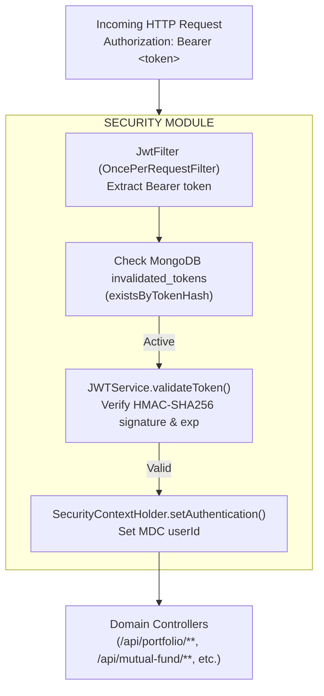
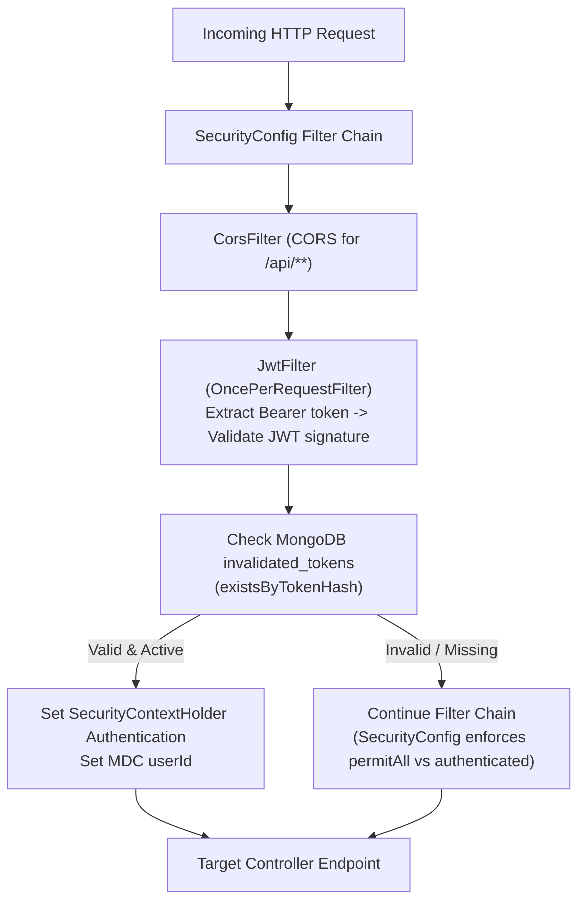
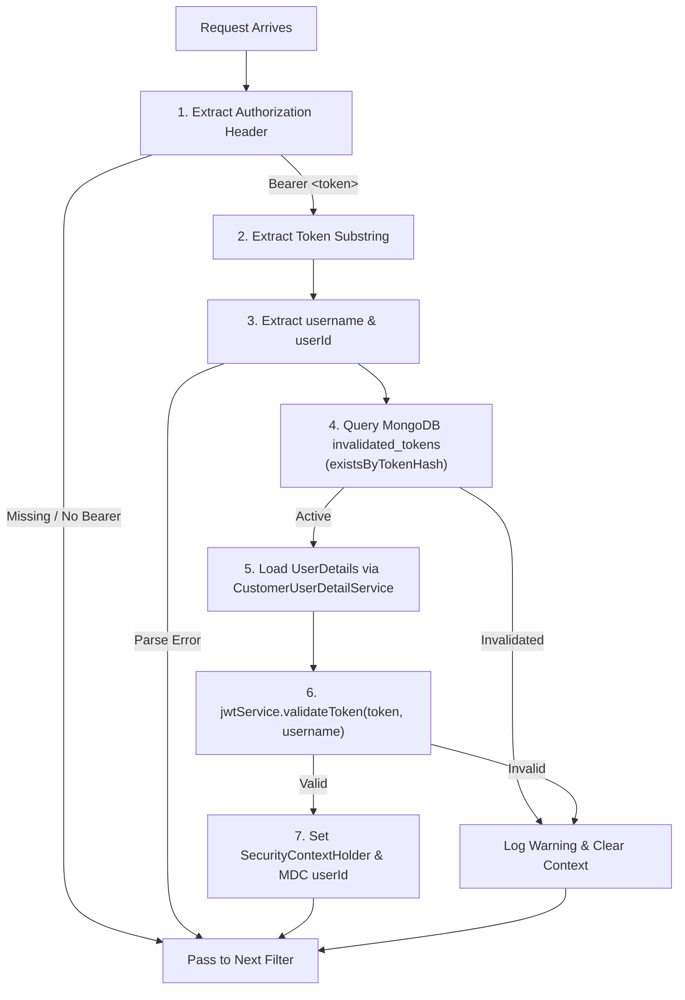
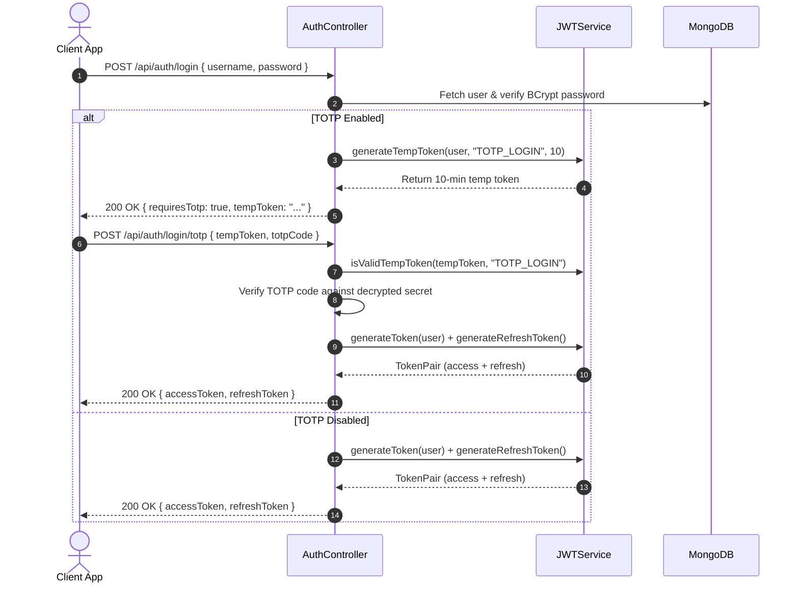
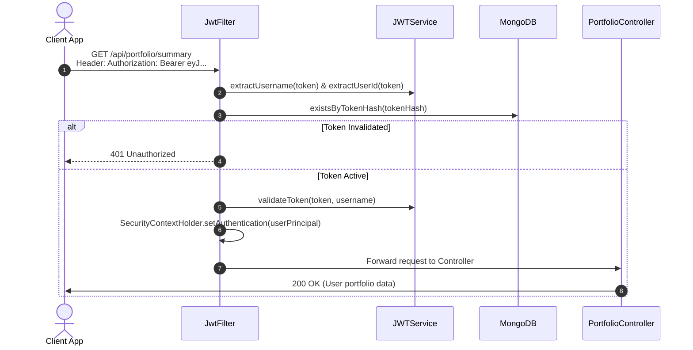

# Security Module – CoinTrack

> **Domain**: Authentication, authorization, and access control
> **Responsibility**: Gatekeeper ensuring identity verification (JWT) and protecting resources
> **Version**: 3.1.0
> **Last Updated**: 2026-08-23

---

## Table of Contents

1. [Overview](#1-overview)
2. [Architecture](#2-architecture)
3. [Directory Structure](#3-directory-structure)
4. [Configuration](#4-configuration)
5. [JWT & OAuth Services](#5-jwt--oauth-services)
6. [JWT Filter](#6-jwt-filter)
7. [User Details Service](#7-user-details-service)
8. [User Principal Model](#8-user-principal-model)
9. [TOTP & Credential Encryption](#9-totp--credential-encryption)
10. [Authentication Flow](#10-authentication-flow)
11. [Authorization Flow](#11-authorization-flow)
12. [Temporary Tokens](#12-temporary-tokens)
13. [Security Checklist](#13-security-checklist)
14. [Environment Variables](#14-environment-variables)
15. [Common Pitfalls](#15-common-pitfalls)
16. [Appendix A: File Reference](#appendix-a-file-reference)
17. [Appendix B: Related Documentation](#appendix-b-related-documentation)
18. [Appendix C: Changelog](#appendix-c-changelog)

---

## 1. Overview

### 1.1 Purpose

The Security module guards every API endpoint in CoinTrack. It employs a **stateless JWT architecture** to validate incoming requests, ensuring only authenticated users can access their financial data.

### 1.2 Core Responsibilities

| Component | Responsibility |
|-----------|----------------|
| **JwtFilter** | Intercepts requests, extracts Bearer token, checks token invalidation in MongoDB |
| **JWTService** | Access & refresh token generation, validation, temp token issuance |
| **GoogleOAuthService** | Google OIDC authorization code exchange & JWKS RSA public key verification |
| **SecurityConfig** | Spring Security filter chain, permitAll whitelists, CORS, statutory stateless configuration |
| **AsyncConfig** | Enables Spring `@EnableAsync` background task execution |
| **CustomerUserDetailService** | Load user from database by username or email |
| **UserPrincipal** | Adapter between `User` entity and Spring Security's `UserDetails` |
| **InvalidatedToken** | MongoDB collection (`invalidated_tokens`, TTL-indexed) checked per-request by `JwtFilter` |

> **Refresh tokens** are persisted by the `user` module (`refresh_tokens` collection, rotated on every `POST /api/auth/refresh`). Logout invalidates tokens by storing their SHA-256 hash in MongoDB (`invalidated_tokens`).
>
> **TOTP Encryption**: `TotpEncryptionUtil` has been refactored into `common`'s unified `EncryptionUtil` (AES-256-GCM with `${totp.encryption-key}` hex key support).

### 1.3 Key Features

| Feature | Description |
|---------|-------------|
| **Stateless Auth** | No server-side session state; JWT bearer token validated on every request |
| **HMAC-SHA256** | Industry-standard 256-bit signed access tokens |
| **Google OIDC SSO** | OpenID Connect login code exchange & JWKS RSA key validation |
| **TOTP Support** | Time-based One-Time Password for 2FA |
| **Temp Tokens** | Purpose-scoped short-lived tokens (`TOTP_LOGIN`, `TOTP_SETUP`, `TOTP_REGISTRATION`, `PROFILE_COMPLETION`) |
| **AES-256-GCM Encryption** | TOTP secrets & broker credentials encrypted at rest |
| **MDC Integration** | User ID & request ID added to logging context per request |

### 1.4 System Position



<details>
<summary>Click to view ASCII Diagram</summary>

```text
┌──────────────────────────────────────────────────────────────────────────┐
│                        INCOMING HTTP REQUEST                             │
│                    Authorization: Bearer eyJ...                          │
└─────────────────────────────────┬────────────────────────────────────────┘
                                  │
                                  ▼
┌──────────────────────────────────────────────────────────────────────────┐
│                         SECURITY MODULE                                  │
├──────────────────────────────────────────────────────────────────────────┤
│                                                                          │
│  ┌─────────────────────────────────────────────────────────────────┐   │
│  │  JwtFilter (OncePerRequestFilter)                               │   │
│  │  └── Extract token from "Authorization: Bearer <token>"        │   │
│  └─────────────────────────────────┬───────────────────────────────┘   │
│                                    │                                     │
│                                    ▼                                     │
│  ┌─────────────────────────────────────────────────────────────────┐   │
│  │  Token Invalidation Check                                       │   │
│  │  └── Query invalidated_tokens in MongoDB                        │   │
│  └─────────────────────────────────┬───────────────────────────────┘   │
│                                    │                                     │
│                                    ▼                                     │
│  ┌─────────────────────────────────────────────────────────────────┐   │
│  │  JWTService.validateToken()                                     │   │
│  │  └── Verify signature with ${jwt.secret} (min 32 bytes)         │   │
│  └─────────────────────────────────┬───────────────────────────────┘   │
│                                    │                                     │
│                                    ▼                                     │
│  ┌─────────────────────────────────────────────────────────────────┐   │
│  │  Set SecurityContextHolder & MDC userId                         │   │
│  └─────────────────────────────────────────────────────────────────┘   │
│                                                                          │
└─────────────────────────────────┬────────────────────────────────────────┘
                                  │
                                  ▼
┌──────────────────────────────────────────────────────────────────────────┐
│                       PROTECTED CONTROLLERS                              │
│         /api/portfolio/**, /api/mutual-fund/**, /api/users/**            │
└──────────────────────────────────────────────────────────────────────────┘
```

</details>

---

## 2. Architecture



---

## 3. Directory Structure

```
security/
├── config/
│   ├── AsyncConfig.java                 # @EnableAsync marker config
│   ├── CorsConfig.java                  # CORS policy configuration (/api/**)
│   └── SecurityConfig.java              # Spring Security filter chain & permitAll rules
├── filter/
│   └── JwtFilter.java                   # Bearer token & invalidation check filter
├── model/
│   └── UserPrincipal.java               # UserDetails implementation wrapper
└── service/
    ├── CustomerUserDetailService.java   # UserDetailsService loader
    ├── GoogleOAuthService.java          # Google OIDC code exchange & JWKS verification
    └── JWTService.java                  # JWT token issuance, refresh, & temp token validation
```

---

## 4. Configuration

### 4.1 SecurityConfig Filter Chain

**Location**: `config/SecurityConfig.java`

`SecurityConfig` defines the primary Spring Security filter chain using `SessionCreationPolicy.STATELESS`.

```java
.authorizeHttpRequests(request -> request
    // Health & Actuator
    .requestMatchers("/api/health", "/api/health/**", "/actuator", "/actuator/**", "/health").permitAll()

    // Admin endpoints (Dev-only controllers: AdminCleanupController & AdminEmailPreviewController)
    .requestMatchers("/api/mutual-fund/admin/**", "/admin/emails/**").permitAll()

    // CORS preflight
    .requestMatchers(HttpMethod.OPTIONS, "/**").permitAll()

    // Auth endpoints (public)
    .requestMatchers(
        "/api/auth/login", "/api/auth/register", "/api/auth/verify-token",
        "/api/auth/check-username/*", "/api/auth/login/totp", "/api/auth/login/recovery",
        "/api/auth/2fa/setup", "/api/auth/2fa/verify", "/api/auth/2fa/register/setup",
        "/api/auth/2fa/register/verify", "/api/auth/refresh", "/api/auth/oauth2/**",
        "/api/auth/email/verify", "/api/auth/email/change/verify",
        "/api/auth/forgot-password", "/api/auth/forgot-password/verify", "/api/auth/reset-password"
    ).permitAll()

    // Contact & static resources
    .requestMatchers("/api/contact", "/", "/index.html", "/favicon.ico", "/static/**", "/public/**", "/api/public/**", "/logo/**").permitAll()

    // OpenAPI / Swagger UI
    .requestMatchers("/swagger-ui.html", "/swagger-ui/**", "/v3/api-docs", "/v3/api-docs/**").permitAll()

    // Broker whitelisted routes (plural /api/brokers/)
    .requestMatchers(
        "/api/brokers/ZERODHA/callback", "/api/brokers/UPSTOX/callback", "/api/brokers/ANGELONE/callback",
        "/api/brokers/zerodha/callback", "/api/brokers/upstox/callback", "/api/brokers/angelone/callback",
        "/zerodha/callback"
    ).permitAll()
    .requestMatchers(HttpMethod.GET, "/api/brokers/ZERODHA/login-url", "/api/brokers/zerodha/login-url").permitAll()
    .requestMatchers(HttpMethod.GET, "/api/brokers/ZERODHA/connect", "/api/brokers/zerodha/connect").permitAll()
    .requestMatchers(HttpMethod.POST, "/api/brokers/ZERODHA/connect", "/api/brokers/zerodha/connect").permitAll()
    .requestMatchers(HttpMethod.GET, "/api/brokers/ANGELONE/login-url", "/api/brokers/angelone/login-url").permitAll()
    .requestMatchers(HttpMethod.GET, "/api/brokers/ANGELONE/connect", "/api/brokers/angelone/connect").permitAll()
    .requestMatchers(HttpMethod.POST, "/api/brokers/ANGELONE/connect", "/api/brokers/angelone/connect").permitAll()
    .requestMatchers(HttpMethod.GET, "/api/brokers/ANGELONE/test-totp", "/api/brokers/angelone/test-totp").permitAll()

    // Calculator endpoints (public with Bucket4j rate limiting)
    .requestMatchers("/api/calculators/**").permitAll()

    // Everything else requires JWT authentication
    .anyRequest().authenticated()
)
```

> **Admin Guarding Note**: Both `AdminCleanupController` (`/api/mutual-fund/admin/**`) and `AdminEmailPreviewController` (`/admin/emails/**`) are annotated with `@Profile("dev")`. In non-dev environments (such as production), Spring Boot does not instantiate these controllers, causing requests to return `404 Not Found`.

### 4.2 Public vs Protected Endpoints

**Public (No Authentication)**:
| Pattern | Description |
|---------|-------------|
| `/`, `/index.html`, `/favicon.ico`, `/static/**`, `/logo/**` | Static web app assets |
| `/api/health/**`, `/health`, `/actuator/**` | Health checks & metrics |
| `/api/auth/login`, `/register`, `/verify-token`, `/check-username/*` | Core authentication & registration |
| `/api/auth/login/totp`, `/login/recovery`, `/2fa/*` | 2FA / TOTP authentication flows |
| `/api/auth/refresh`, `/api/auth/oauth2/**` | Refresh token rotation & Google OAuth2 |
| `/api/auth/email/**`, `/forgot-password*`, `/reset-password` | Email verification & password resets |
| `/api/contact` | Public contact submission |
| `/api/brokers/{BROKER}/callback|connect|login-url`, `/zerodha/callback` | OAuth redirect callbacks & login URLs |
| `/swagger-ui/**`, `/v3/api-docs/**` | OpenAPI documentation |
| `/admin/emails/**`, `/api/mutual-fund/admin/**` | Dev-only admin previews (guarded by `@Profile("dev")`) |
| `OPTIONS /**` | CORS preflight requests |

**Protected (JWT Required)**:
| Pattern | Description |
|---------|-------------|
| Everything else under `/api/**` (enforced via `.anyRequest().authenticated()`) | e.g. `/api/portfolio/**`, `/api/mutual-fund/**`, `/api/brokers/accounts/**`, `/api/users/**`, `/api/notes/**`, `/api/auth/logout`, `/api/auth/2fa/reset` |

### 4.3 AsyncConfig

**Location**: `config/AsyncConfig.java`

Annotated with `@Configuration` and `@EnableAsync`. Enables Spring's asynchronous method execution (used by `TransactionSequenceService` reordering methods and background email tasks).

---

## 5. JWT & OAuth Services

### 5.1 JWTService

**Location**: `service/JWTService.java`

**Token Configuration**:
| Setting | Value | Notes |
|---------|-------|-------|
| Algorithm | HMAC-SHA256 | Via JJWT library |
| Expiry | 30 minutes | Access tokens |
| Refresh Expiry | 30 days | Persisted hashed in MongoDB (`refresh_tokens`) |
| Secret | `${jwt.secret}` | Raw UTF-8 bytes decoded from Base64 (min 32 bytes / 256 bits required) |

**Methods**:
| Method | Purpose | Returns |
|--------|---------|---------|
| `generateToken(User)` | Create access token for user (`userId`, `email`, `sub`) | JWT string |
| `generateRefreshToken(userId, deviceInfo, ip)` | Generate 256-bit refresh token, store SHA-256 in DB | String |
| `generateTempToken(User, purpose, expiryMins)` | Create purpose-scoped temp token | JWT string |
| `generateTempToken(username, purpose)` | Create registration temp token (no user ID) | JWT string |
| `extractUsername(token)` | Extract subject claim | String |
| `extractUserId(token)` | Extract `userId` claim | String |
| `extractEmail(token)` | Extract `email` claim | String |
| `extractPurpose(token)` | Extract `purpose` claim | String |
| `validateToken(token, username)` | Verify signature, username match, & non-expiration | boolean |
| `isValidTempToken(token, purpose)` | Validate token & check matching purpose | boolean |

### 5.2 Token Structure

**Standard Access Token**:
```json
{
  "sub": "john_doe",
  "userId": "66bc1234567890abcdef1234",
  "email": "john@example.com",
  "iat": 1702800000,
  "exp": 1702801800
}
```

**Temporary Token** (for TOTP / Onboarding):
```json
{
  "sub": "john_doe",
  "purpose": "TOTP_LOGIN",
  "userId": "66bc1234567890abcdef1234",
  "iat": 1702800000,
  "exp": 1702800600
}
```

### 5.3 GoogleOAuthService

**Location**: `service/GoogleOAuthService.java`

Provides OpenID Connect (OIDC) authentication with Google:
1. **Authorization Code Exchange**: POST to `https://oauth2.googleapis.com/token` using `${google.client-id}`, `${google.client-secret}`, and matching `${google.redirect-uri}`.
2. **ID Token Verification**: Fetches Google's public JWK set (`https://www.googleapis.com/oauth2/v3/certs`), parses RSA public key specs, and caches them in a `ConcurrentHashMap` keyed by `kid`.
3. **Claims Validation**: Verifies signature, expiration, issuer (`accounts.google.com` or `https://accounts.google.com`), and audience (`google.client-id`).

---

## 6. JWT Filter

### 6.1 JwtFilter

**Location**: `filter/JwtFilter.java`  
**Extends**: `OncePerRequestFilter`

**Filter Logic**:



<details>
<summary>Click to view ASCII Diagram</summary>

```text
┌────────────────────────────────────────────────────────────────────────┐
│                       JWT FILTER FLOW                                  │
├────────────────────────────────────────────────────────────────────────┤
│                                                                        │
│  1. Extract "Authorization" header                                    │
│     └── No header / not Bearer? → Pass to next filter                  │
│                                                                        │
│  2. Extract token substring                                            │
│                                                                        │
│  3. Extract username & userId                                          │
│     └── Parse error? → Pass to next filter                             │
│                                                                        │
│  4. Check MongoDB invalidated_tokens collection (existsByTokenHash)    │
│     └── Invalidated (logged out)? → Log warning & clear context        │
│                                                                        │
│  5. Load UserDetails from database via CustomerUserDetailService       │
│                                                                        │
│  6. Validate token (signature + expiration)                            │
│     ├── Valid → Set SecurityContextHolder & MDC userId                 │
│     └── Invalid → Log warning & clear context                          │
│                                                                        │
│  7. Continue filter chain                                              │
│                                                                        │
└────────────────────────────────────────────────────────────────────────┘
```

</details>

---

## 7. User Details Service

### 7.1 CustomerUserDetailService

**Location**: `service/CustomerUserDetailService.java`  
**Implements**: `UserDetailsService`

**Purpose**: Loads user accounts from MongoDB for authentication. First attempts lookup by username via `UserRepository.findByUsername(identifier)`, falling back to `findByEmail(identifier)`. Wraps the returned `User` document in a `UserPrincipal`.

---

## 8. User Principal Model

### 8.1 UserPrincipal

**Location**: `model/UserPrincipal.java`  
**Implements**: `UserDetails`

**Purpose**: Adapter pattern wrapping the MongoDB `User` entity to implement Spring Security's `UserDetails` contract.

| Method | Returns | Notes |
|--------|---------|-------|
| `getUsername()` | `user.getUsername()` | Account username |
| `getPassword()` | `user.getPassword()` | BCrypt hashed password |
| `getAuthorities()` | `[ROLE_USER]` | Default user role |
| `isAccountNonExpired()` | `true` | Always enabled |
| `isAccountNonLocked()` | `true` | Always enabled |
| `isCredentialsNonExpired()` | `true` | Always enabled |
| `isEnabled()` | `true` | Always enabled |
| `getUserId()` | `user.getId()` | MongoDB BSON ObjectId string |

---

## 9. TOTP & Credential Encryption

TOTP secrets and external API credentials are encrypted at rest using `common`'s unified `EncryptionUtil`.

| Setting | Value |
|---------|-------|
| Algorithm | AES-256-GCM |
| IV Length | 12 bytes (randomly generated per encryption via `SecureRandom`) |
| Tag Length | 128 bits |
| Key Source | `${totp.encryption-key}` (64 hex chars = 32 bytes) or `${app.encryption.secret-key}` |
| Output Format | `Base64( IV [12 bytes] || Ciphertext || Tag [16 bytes] )` |

---

## 10. Authentication Flow

### 10.1 Login Flow (with 2FA / TOTP)



<details>
<summary>Click to view ASCII Diagram</summary>

```text
┌─────────────────────────────────────────────────────────────────────────┐
│                         LOGIN FLOW                                      │
├─────────────────────────────────────────────────────────────────────────┤
│                                                                         │
│  1. POST /api/auth/login                                               │
│     Body: { username, password }                                       │
│           │                                                             │
│           ▼                                                             │
│     ┌─────────────────────────────────┐                                │
│     │ Verify password (BCrypt)        │                                │
│     │ Check TOTP enabled              │                                │
│     └─────────────────────────────────┘                                │
│           │                                                             │
│     ┌─────┴─────┐                                                      │
│     │           │                                                       │
│     ▼           ▼                                                       │
│  TOTP OFF    TOTP ON                                                   │
│     │           │                                                       │
│     ▼           ▼                                                       │
│  Return     Return 10-min tempToken                                    │
│  TokenPair  { requiresTotp: true, tempToken: "eyJ..." }                │
│                 │                                                       │
│                 ▼                                                       │
│  2. POST /api/auth/login/totp                                          │
│     Body: { tempToken, totpCode }                                      │
│           │                                                             │
│           ▼                                                             │
│     ┌─────────────────────────────────┐                                │
│     │ Validate tempToken purpose      │                                │
│     │ Verify TOTP code against secret │                                │
│     └─────────────────────────────────┘                                │
│           │                                                             │
│           ▼                                                             │
│     Return TokenPair (accessToken + refreshToken)                       │
│                                                                         │
└─────────────────────────────────────────────────────────────────────────┘
```

</details>

---

## 11. Authorization Flow

### 11.1 Accessing Protected Resources



<details>
<summary>Click to view ASCII Diagram</summary>

```text
┌─────────────────────────────────────────────────────────────────────────┐
│                      AUTHORIZATION FLOW                                 │
├─────────────────────────────────────────────────────────────────────────┤
│                                                                         │
│  1. GET /api/portfolio/summary                                         │
│     Header: Authorization: Bearer eyJhbGc...                           │
│           │                                                             │
│           ▼                                                             │
│     ┌─────────────────────────────────────────────────────────────┐   │
│     │ JwtFilter                                                   │   │
│     │ ├── Extract token from header                               │   │
│     │ ├── jwtService.extractUsername("eyJ...") → "john"           │   │
│     │ ├── invalidatedTokenRepository.existsByTokenHash() → false │   │
│     │ ├── customerUserDetailService.loadUser("john")              │   │
│     │ ├── jwtService.validateToken() → true                       │   │
│     │ └── SecurityContextHolder.setAuthentication(john)           │   │
│     └─────────────────────────────────────────────────────────────┘   │
│           │                                                             │
│           ▼                                                             │
│     ┌─────────────────────────────────────────────────────────────┐   │
│     │ PortfolioController                                         │   │
│     │ └── principal.getUserId() → "66bc1234567890abcdef1234"      │   │
│     │     portfolioService.getSummary(userId) → data for john     │   │
│     └─────────────────────────────────────────────────────────────┘   │
│           │                                                             │
│           ▼                                                             │
│     Return portfolio data (only john's data)                           │
│                                                                         │
└─────────────────────────────────────────────────────────────────────────┘
```

</details>

---

## 12. Temporary Tokens

Temporary tokens are short-lived JWTs issued for multi-step onboarding and authentication flows. They carry a `purpose` claim validated by `JWTService.isValidTempToken(token, expectedPurpose)`.

### Token Purpose & Expiry Table

| Purpose | Description / Flow | Expiry | Method Called |
|---------|-------------------|--------|---------------|
| `TOTP_LOGIN` | Issued after valid password check when 2FA is enabled | **10 minutes** | `JWTService.generateTempToken(user, "TOTP_LOGIN", 10)` |
| `TOTP_SETUP` | Issued during initial 2FA setup for existing user | **30 minutes** | `JWTService.generateTempToken(user, "TOTP_SETUP", 30)` |
| `TOTP_REGISTRATION` | Issued during initial signup 2FA registration | **15 minutes** | `JWTService.generateTempToken(username, "TOTP_REGISTRATION")` |
| `PROFILE_COMPLETION` | Issued after Google SSO for new users requiring username selection | **15 minutes** | `JWTService.generateTempToken(user, "PROFILE_COMPLETION", 15)` |

---

## 13. Security Checklist

### 13.1 Authentication Security

| Requirement | Implementation |
|-------------|----------------|
| Password Hashing | BCrypt via Spring Security (`PasswordEncoder`) |
| Session Management | Stateless (`SessionCreationPolicy.STATELESS`) |
| Token Signing | HMAC-SHA256 (JJWT) |
| Token Expiry | 30 minutes for access tokens; 30 days for refresh tokens |
| 2FA Support | TOTP with AES-256-GCM encrypted secrets |

### 13.2 Authorization Security

| Requirement | Implementation |
|-------------|----------------|
| Endpoint Protection | `SecurityConfig` explicit whitelist + `.anyRequest().authenticated()` |
| User Isolation | `userId` extracted from validated JWT, never trusted from request body |
| Role-Based Access | `ROLE_USER` assigned via `UserPrincipal` |
| Admin Route Protection | Dev-only admin controllers guarded with `@Profile("dev")` |

### 13.3 Data Protection

| Requirement | Implementation |
|-------------|----------------|
| TOTP & API Secrets | AES-256-GCM encrypted at rest via `EncryptionUtil` |
| Refresh Tokens | Only SHA-256 hashes stored in MongoDB (`refresh_tokens`) |
| Log Safety | MDC logging sanitizes tokens; credentials never logged |

---

## 14. Environment Variables

| Variable | Type | Description | Example |
|----------|------|-------------|---------|
| `jwt.secret` | String | Base signing secret (min 32 bytes) | `my-super-secret-jwt-key-32chars-long` |
| `totp.encryption-key` | Hex | 32-byte AES key (64 hex characters) | `0123456789abcdef0123456789abcdef0123456789abcdef0123456789abcdef` |
| `google.client-id` | String | Google OAuth2 Client ID | `xxxx.apps.googleusercontent.com` |
| `google.client-secret` | String | Google OAuth2 Client Secret | `GOCSPX-xxxx` |
| `google.redirect-uri` | String | OAuth2 Redirect URI | `http://localhost:3000/login` |

**Generating Secure Keys**:

```bash
# Generate JWT secret (32+ characters)
openssl rand -base64 32

# Generate TOTP encryption key (64 hex characters)
openssl rand -hex 32
```

---

## 15. Common Pitfalls

| Pitfall | Impact | Prevention |
|---------|--------|------------|
| Hardcoding secrets | Total compromise | Inject via `@Value("${...}")` |
| Logging tokens | Credential leak | Never log Authorization headers |
| Weak JWT secret | Brute-force attacks | Require min 32 bytes (256 bits) |
| Missing `@Profile("dev")` on admin tools | Production security hole | Always annotate dev admin controllers with `@Profile("dev")` |
| Missing path in permitAll | Auth bypass | Review `SecurityConfig` permitAll whitelists |
| Trusting `userId` from request body | User impersonation | Extract `userId` strictly from `UserPrincipal` |

---

## Appendix A: File Reference

| File | Size | Lines | Description |
|------|------|-------|-------------|
| `SecurityConfig.java` | ~8.3KB | 171 | Spring Security filter chain & permitAll rules |
| `JWTService.java` | ~11.2KB | 295 | Token issuance, rotation, & temp token validation |
| `GoogleOAuthService.java` | ~8.5KB | 209 | Google OIDC code exchange & JWKS verification |
| `JwtFilter.java` | ~4.7KB | 114 | Intercepts requests, validates JWT, checks MongoDB token invalidation |
| `CustomerUserDetailService.java` | ~1.4KB | 36 | UserDetailsService implementation loading users by username/email |
| `UserPrincipal.java` | ~1.3KB | 55 | UserDetails adapter wrapping User entity |
| `AsyncConfig.java` | ~0.2KB | 10 | `@EnableAsync` Spring configuration marker |

---

## Appendix B: Related Documentation

- [Common Module README](../common/README.md) - EncryptionUtil, logging & response formats
- [User Module README](../user/README.md) - User entity, authentication endpoints
- [Broker Module README](../broker/README.md) - Broker OAuth callbacks & integration

---

## Appendix C: Changelog

| Version | Date | Changes |
|---------|------|---------|
| 3.1.0 | 2026-08-23 | Comprehensive rewrite & code audit: added Mermaid & ASCII diagrams, `GoogleOAuthService`, `@Profile("dev")` guards, dynamic temp tokens, direct MongoDB invalidation, and restored full appendices & checklists. |
| 2.0.0 | 2025-12-17 | Updated stateless JWT architecture documentation |
