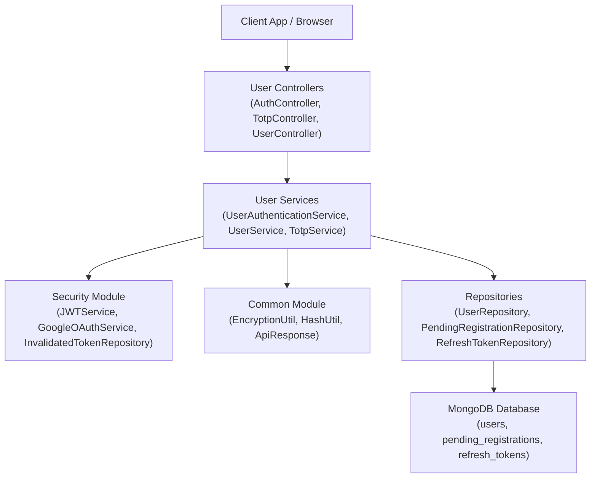
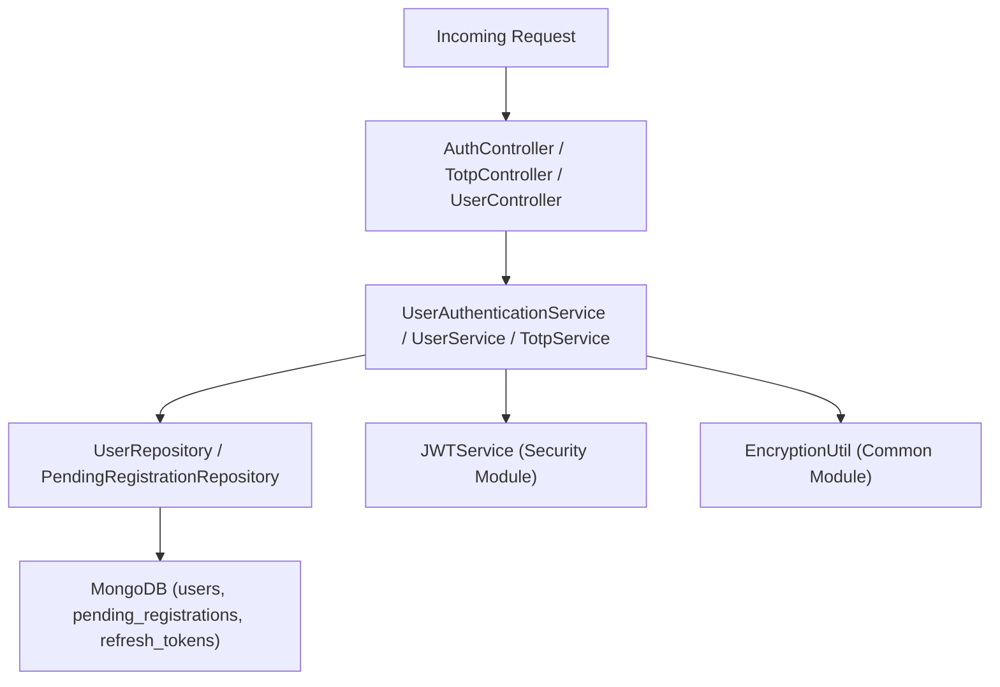
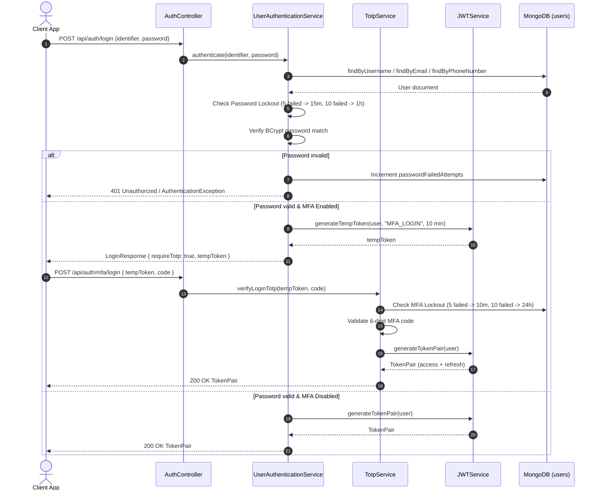
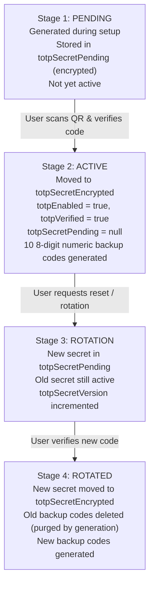
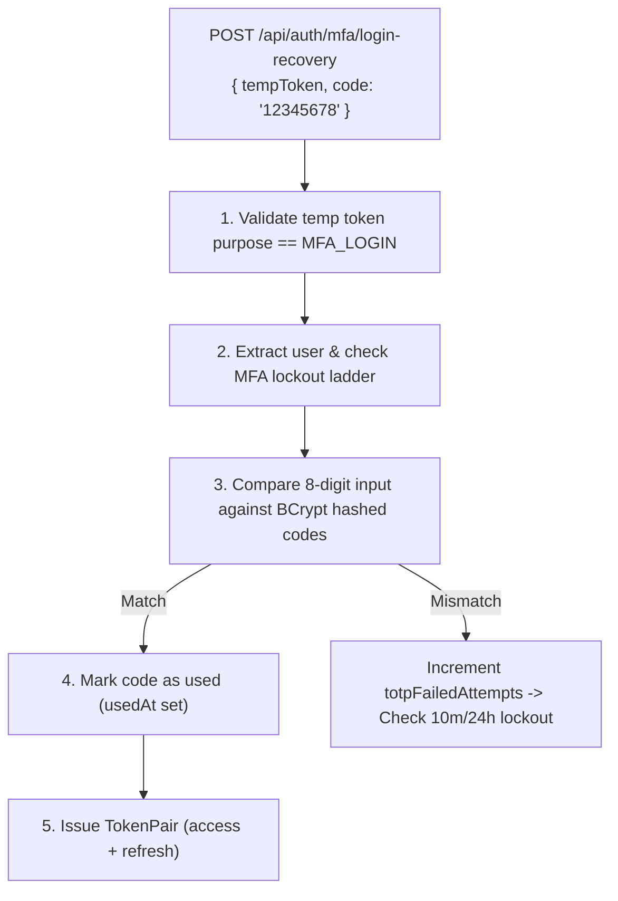

# User Module – CoinTrack

> **Domain**: User identity, registration, authentication, MFA/MFA management, and profile settings
> **Responsibility**: Manages user accounts, authentication workflows, security lockouts, and embedded preferences
> **Version**: 3.1.0
> **Last Updated**: 2026-08-23

---

## Table of Contents

1. [Overview](#1-overview)
2. [Architecture](#2-architecture)
3. [Authentication &amp; Login Flow](#3-authentication--login-flow)
4. [Directory Structure](#4-directory-structure)
5. [Domain Models](#5-domain-models)
6. [Repositories](#6-repositories)
7. [Services](#7-services)
8. [Controllers](#8-controllers)
9. [Lockout &amp; Security Ladders](#9-lockout--security-ladders)
10. [MFA / MFA Architecture](#10-2fa--totp-architecture)
11. [Backup Codes](#11-backup-codes)
12. [OAuth2 / Google SSO Integration](#12-oauth2--google-sso-integration)
13. [API Reference](#13-api-reference)
14. [Security Checklist](#14-security-checklist)
15. [Environment Variables](#15-environment-variables)
16. [Common Pitfalls](#16-common-pitfalls)
17. [Appendix A: File Size Reference](#appendix-a-file-size-reference)
18. [Appendix B: Related Documentation](#appendix-b-related-documentation)
19. [Appendix C: Changelog](#appendix-c-changelog)

---

## 1. Overview

### 1.1 Purpose

The User module handles core identity operations in CoinTrack. It manages user registration, password verification, MFA/MFA setup and verification, Google OpenID Connect SSO, refresh token rotation, and profile preferences.

### 1.2 Key Features

| Feature                                                  | Description                                                                                      |
| -------------------------------------------------------- | ------------------------------------------------------------------------------------------------ |
| **Multi-Identifier Login**                         | Users log in using username, email (lowercased), or mobile phone number                          |
| **Stateless MFA / MFA**                           | Mandatory MFA using Google Authenticator / MFA with 8-digit numeric backup codes                |
| **Google OIDC SSO**                                | OAuth2 single sign-on with strict`email_verified` validation before account linking            |
| **Pending Signup Persistence**                     | Multi-instance restart-safe signup state stored in MongoDB`pending_registrations` (TTL 15 min) |
| **Dual Lockout Ladders**                           | Progressive time-based locks for failed passwords (15m/1h) and failed MFA codes (10m/24h)        |
| **Token Invalidation on Password Change / Delete** | Revokes all active refresh tokens immediately on password change or account deletion             |

### 1.3 System Position



<details>
<summary>Click to view ASCII Diagram</summary>

```text
┌──────────────────────────────────────────────────────────────────────────┐
│                           CLIENT APP / BROWSER                           │
└─────────────────────────────────┬────────────────────────────────────────┘
                                  │
                                  ▼
┌──────────────────────────────────────────────────────────────────────────┐
│                              USER MODULE                                 │
├──────────────────────────────────────────────────────────────────────────┤
│                                                                          │
│  ┌───────────────────────────────────────────────────────────────────┐  │
│  │  CONTROLLERS                                                      │  │
│  │  AuthController · TotpController · UserController                 │  │
│  └──────────────────────────────┬────────────────────────────────────┘  │
│                                 │                                        │
│                                 ▼                                        │
│  ┌───────────────────────────────────────────────────────────────────┐  │
│  │  SERVICES                                                         │  │
│  │  UserAuthenticationService · UserService · TotpService            │  │
│  └──────────────┬───────────────────────────────┬────────────────────┘  │
│                 │                               │                        │
│                 ▼                               ▼                        │
│  ┌──────────────────────────────┐    ┌───────────────────────────────┐  │
│  │  REPOSITORIES                │    │  EXTERNAL DEPENDENCIES        │  │
│  │  UserRepository              │    │  JWTService (security)        │  │
│  │  PendingRegistrationRepo     │    │  EncryptionUtil (common)      │  │
│  │  RefreshTokenRepository      │    │  HashUtil (common)            │  │
│  └──────────────┬───────────────┘    └───────────────────────────────┘  │
│                 │                                                        │
└─────────────────┼────────────────────────────────────────────────────────┘
                  │
                  ▼
┌──────────────────────────────────────────────────────────────────────────┐
│                            MONGODB DATABASE                              │
│       collections: users, pending_registrations, refresh_tokens          │
└──────────────────────────────────────────────────────────────────────────┘
```

</details>

---

## 2. Architecture



<details>
<summary>Click to view ASCII Diagram</summary>

```text
Incoming Request ──► Auth/Totp/UserController ──► UserAuth/User/TotpService
                                                        │
                      ┌─────────────────────────────────┼────────────────────────────────┐
                      ▼                                 ▼                                ▼
              UserRepository               JWTService (Security)               EncryptionUtil (Common)
                      │
                      ▼
         MongoDB (users, pending_reg, refresh_tokens)
```

</details>

---

## 3. Authentication & Login Flow



<details>
<summary>Click to view ASCII Diagram</summary>

```text
┌──────────┐            ┌────────────────┐            ┌─────────────────────────┐            ┌────────────┐            ┌─────────┐
│  Client  │            │ AuthController │            │ UserAuthService / Totp  │            │ JWTService │            │ MongoDB │
└────┬─────┘            └───────┬────────┘            └────────────┬────────────┘            └─────┬──────┘            └────┬────┘
     │                          │                                  │                               │                    │
     │ 1. POST /login           │                                  │                               │                    │
     ├─────────────────────────►│                                  │                               │                    │
     │                          │ 2. authenticate(id, pass)        │                               │                    │
     │                          ├─────────────────────────────────►│                               │                    │
     │                          │                                  │ 3. findUser                   │                    │
     │                          │                                  ├───────────────────────────────────────────────────►│
     │                          │                                  │◄───────────────────────────────────────────────────┤
     │                          │                                  │                               │                    │
     │                          │                                  │ 4. Verify BCrypt & Lockouts   │                    │
     │                          │                                  │                               │                    │
     │                          │                                  │ 5. If MFA -> TempToken (10m) │                    │
     │                          │                                  ├──────────────────────────────►│                    │
     │                          │                                  │◄──────────────────────────────┤                    │
     │                          │◄─────────────────────────────────┤                               │                    │
     │◄─────────────────────────┤                                  │                               │                    │
     │ 6. Response (tempToken)  │                                  │                               │                    │
     │                          │                                  │                               │                    │
     │ 7. POST /api/auth/mfa/login      │                                  │                               │                    │
     ├─────────────────────────►│                                  │                               │                    │
     │                          │ 8. verifyLoginTotp(code)         │                               │                    │
     │                          ├─────────────────────────────────►│                               │                    │
     │                          │                                  │ 9. Issue Access + Refresh     │                    │
     │                          │                                  ├──────────────────────────────►│                    │
     │                          │◄─────────────────────────────────┤                               │                    │
     │                          │◄─────────────────────────────────┤                               │                    │
     │◄─────────────────────────┤                                  │                               │                    │
     │ 10. Return TokenPair     │                                  │                               │                    │
```

</details>

---

## 4. Directory Structure

```
user/
├── controller/
│   ├── AuthController.java             # Login, register, token verify, check username, Google SSO
│   ├── TotpController.java             # MFA setup, verify, login-MFA, recovery codes
│   └── UserController.java             # Authenticated /api/users/me profile GET, PUT, password, DELETE
├── dto/
│   ├── ChangePasswordRequest.java
│   ├── LoginRequest.java
│   ├── LoginResponse.java
│   ├── RegisterRequest.java
│   └── TotpVerificationRequest.java
├── model/
│   ├── AuthProvider.java               # Enum: LOCAL, GOOGLE
│   ├── EpfSettingsEmbed.java           # Embedded EPF settings inside User
│   ├── MetalRateSettingsEmbed.java     # Embedded Metal Rate settings inside User
│   ├── PendingRegistration.java        # Temporary MongoDB document during onboarding (TTL 15 min)
│   ├── PpfSettingsEmbed.java           # Embedded PPF settings inside User
│   ├── RefreshToken.java               # MongoDB collection for refresh token hashes
│   ├── User.java                       # Main User document (@Indexed email, phone, googleId)
│   └── UserStatus.java                 # Enum: ACTIVE, INACTIVE, PENDING
├── repository/
│   ├── PendingRegistrationRepository.java
│   ├── RefreshTokenRepository.java
│   └── UserRepository.java
└── service/
    ├── TotpService.java                # MFA generation, validation, & 8-digit backup code management
    ├── UserAuthenticationService.java  # Login, Google SSO, password lockout, onboarding completion
    └── UserService.java                 # Profile updates, password changes, account deletion, token validation
```

---

## 5. Domain Models

### 5.1 User Document (`users`)

* **MongoDB Indexes**:
  * `username`: Unique index (`@Indexed(unique = true)`)
  * `email`: Unique sparse index (`@Indexed(unique = true, sparse = true)`), lowercased on save & lookup
  * `phoneNumber`: Sparse index (`@Indexed(sparse = true)`)
  * `googleId`: Unique sparse index (`@Indexed(unique = true, sparse = true)`)

### 5.2 Embedded Settings Models

Rather than scattering user configuration into multiple collections, settings are embedded directly inside the `User` document:

* `EpfSettingsEmbed`: EPF UAN, establishment ID, member ID, default interest rate.
* `PpfSettingsEmbed`: PPF account number, bank name, opening date.
* `MetalRateSettingsEmbed`: Gold/silver local spread premiums.

### 5.3 Pending Registration (`pending_registrations`)

Stores intermediate signup state during multi-step MFA onboarding. Configured with a TTL index (`expiresAt`) in MongoDB so pending registrations automatically expire after 15 minutes if incomplete. Multi-instance & restart safe.

---

## 6. Repositories

| Repository                        | Entity                  | Key Methods                                                                                                                                      |
| --------------------------------- | ----------------------- | ------------------------------------------------------------------------------------------------------------------------------------------------ |
| `UserRepository`                | `User`                | `findByUsername`, `findByEmail`, `findByPhoneNumber`, `findByGoogleId`, `existsByUsername`, `existsByEmail`, `existsByPhoneNumber` |
| `PendingRegistrationRepository` | `PendingRegistration` | `findByUsername`, `findByEmail`, `deleteByUsername`                                                                                        |
| `RefreshTokenRepository`        | `RefreshToken`        | `findByTokenHash`, `revokeAllByUserId`, `deleteByExpiresAtBefore`                                                                          |

---

## 7. Services

### 7.1 UserAuthenticationService

**Location**: `service/UserAuthenticationService.java`

* **`authenticate(identifier, password)`**: Verifies username/email/mobile & BCrypt password. Evaluates password lockout ladder. Returns 10-min `MFA_LOGIN` tempToken if MFA active, or TokenPair if MFA disabled.
* **`authenticateGoogle(idToken, deviceInfo, ip)`**: Exchanges Google OIDC token. Checks `email_verified == true` before linking existing email accounts.
* **`completeGoogleProfile(tempToken, username, name, phone)`**: Completes Google SSO profile for new users requiring a chosen username.

### 7.2 UserService

**Location**: `service/UserService.java`

* **`updateUser(userId, user)`**: Updates whitelisted profile fields (`name`, `dateOfBirth`, `bio`, `location`, `phoneNumber`, `email`). Phone uniqueness checked against users **and** pending registrations via `isPhoneNumberRegistered`.
* **`changePassword(userId, oldPassword, newPassword)`**: Verifies current password, updates BCrypt hash, and **revokes all active refresh tokens**.
* **`deleteUser(userId)`**: Deletes user document, revokes all active refresh tokens, purges stale pending registrations, and **publishes `UserDeletedEvent`** so every module cascades its own user-keyed collections.
* **`isTokenValid(token)`**: Validates JWT signature, expiration, AND checks MongoDB `invalidated_tokens` blacklist (`HashUtil.sha256(token)`).
* **`isPhoneNumberRegistered(normalizedPhone)`**: Null-safe uniqueness check across `users` + `pending_registrations`.

### 7.3 TotpService

**Location**: `service/TotpService.java`

* **`generateSecret()`**: Generates 160-bit SecretKey using `SecureRandom` Base32 encoding.
* **`verifyCode(secret, code)`**: Validates 6-digit MFA code using time window of 30 seconds. Evaluates MFA lockout ladder.
* **`generateBackupCodes(userId, version)`**: Generates configurable count of plain 8-digit numeric backup codes (`00000000` to `99999999`, default `totp.max-backup-codes=10`) and persists BCrypt hashes.
* **Rotation purge (`verifySetup`)**: on every secret rotation the previous generation's backup codes are **fully deleted** via `deleteByUserIdAndGeneration`, and code-verification drift is driven by `totp.window` (default 1).

---

## 8. Controllers

### 8.1 AuthController (`/api/auth`)

| Method   | Path                                    | Access | Description                                                                 |
| -------- | --------------------------------------- | ------ | --------------------------------------------------------------------------- |
| `POST` | `/api/auth/login`                     | Public | Password authentication; returns`LoginResponse` (tempToken if MFA active) |
| `POST` | `/api/auth/register`                  | Public | Initiate registration; returns 15-min`MFA_REGISTRATION` tempToken        |
| `POST` | `/api/auth/refresh`                   | Public | Rotates refresh token & issues new access token                             |
| `POST` | `/api/auth/oauth2/google`             | Public | Google SSO code exchange & account resolution                               |
| `GET`  | `/api/auth/verify-token`              | Public | Validates access token (checks signature, expiration, & MongoDB blacklist)  |
| `GET`  | `/api/auth/check-username/{username}` | Public | Checks username availability                                                |

### 8.2 TotpController (`/api/auth`)

| Method   | Path                              | Access | Description                                                      |
| -------- | --------------------------------- | ------ | ---------------------------------------------------------------- |
| `POST` | `/api/auth/mfa/login`          | Public | Complete MFA login with`MFA_LOGIN` tempToken & 6-digit code   |
| `POST` | `/api/auth/mfa/login-recovery`      | Public | MFA recovery login using an 8-digit numeric backup code          |
| `POST` | `/api/auth/mfa/setup`           | Public | Generate QR code URI & secret for initial MFA setup             |
| `POST` | `/api/auth/mfa/verify`          | Public | Verify initial MFA setup code & receive 10 numeric backup codes |
| `POST` | `/api/auth/mfa/register/setup`  | Public | MFA setup during onboarding                                      |
| `POST` | `/api/auth/mfa/register/verify` | Public | Finalize onboarding, persist`User` document, return TokenPair  |

### 8.3 UserController (`/api/users`)

| Method     | Path                       | Access    | Description                                                                                |
| ---------- | -------------------------- | --------- | ------------------------------------------------------------------------------------------ |
| `GET`    | `/api/users/me`          | Protected | Fetch current user's profile as `UserProfileResponse` DTO (whitelisted fields only)        |
| `PUT`    | `/api/users/me`          | Protected | Update profile via `UpdateProfileRequest` DTO (`username`, `name`, `email`, `phoneNumber`, `dateOfBirth`, `bio`, `location`) — no raw entity binding |
| `POST`   | `/api/users/me/password` | Protected | Change password (verifies current password, revokes all refresh tokens)                    |
| `DELETE` | `/api/users/me`          | Protected | Delete account, revoke refresh tokens & publish `UserDeletedEvent` — every module cascades its own user-keyed collections (notes, broker accounts, portfolio canonical data, MF schemes/ledgers, PPF/EPF/FD/Gold-Silver ledgers, invalidated tokens) |

---

## 9. Lockout & Security Ladders

To defend against brute-force attacks, the User module enforces two separate progressive lockout ladders:

### 9.1 Password Lockout Ladder (`UserAuthenticationService`)

| Failed Password Attempts     | Lockout Duration                                           |
| ---------------------------- | ---------------------------------------------------------- |
| 1 to 4 attempts              | Allowed (increment`passwordFailedAttempts`)              |
| **5 failed attempts**  | **15 minutes lockout** (`passwordLockedUntil` set) |
| **10 failed attempts** | **1 hour lockout**                                   |

### 9.2 MFA / MFA Lockout Ladder (`TotpService`)

| Failed MFA Attempts         | Lockout Duration                                       |
| ---------------------------- | ------------------------------------------------------ |
| 1 to 4 attempts              | Allowed (increment`totpFailedAttempts`)              |
| **5 failed attempts**  | **10 minutes lockout** (`totpLockedUntil` set) |
| **10 failed attempts** | **24 hours lockout**                             |

---

## 10. MFA / MFA Architecture



<details>
<summary>Click to view ASCII Diagram</summary>

```text
┌────────────────────────────────────────────────────────────────────────┐
│                    MFA SECRET LIFECYCLE                               │
├────────────────────────────────────────────────────────────────────────┤
│                                                                        │
│  Stage 1: PENDING                                                     │
│  ├── Generated during setup                                           │
│  ├── Stored in totpSecretPending (encrypted)                         │
│  └── Not yet active                                                   │
│           │                                                            │
│           │ User scans QR and enters code                             │
│           ▼                                                            │
│  Stage 2: ACTIVE                                                      │
│  ├── Moved to totpSecretEncrypted                                    │
│  ├── totpEnabled = true, totpVerified = true                          │
│  ├── totpSecretPending = null                                         │
│  └── 10 8-digit numeric backup codes generated                         │
│           │                                                            │
│           │ User requests reset / rotation                             │
│           ▼                                                            │
│  Stage 3: ROTATION                                                    │
│  ├── New secret in totpSecretPending                                 │
│  ├── Old secret still active                                          │
│  └── totpSecretVersion incremented                                    │
│           │                                                            │
│           │ User verifies new code                                     │
│           ▼                                                            │
│  Stage 4: ROTATED                                                     │
│  ├── New secret moved to totpSecretEncrypted                         │
│  ├── Old backup codes deleted (purged by generation)                 │
│  └── New 8-digit numeric backup codes generated                       │
│                                                                        │
└────────────────────────────────────────────────────────────────────────┘
```

</details>

---

## 11. Backup Codes

### 11.1 Configuration & Format

| Setting           | Value                                                           |
| ----------------- | --------------------------------------------------------------- |
| **Count**   | 10 codes per user                                               |
| **Format**  | **Plain 8-digit numerics** (`00000000` to `99999999`) |
| **Storage** | BCrypt hashed in`users.backupCodes`                           |
| **Usage**   | One-time recovery use only                                      |
| **Version** | Guarded by`totpSecretVersion`                                 |

### 11.2 Recovery Flow



<details>
<summary>Click to view ASCII Diagram</summary>

```text
POST /api/auth/mfa/login-recovery
Body: { tempToken, code: "12345678" }

1. Validate temp token purpose = MFA_LOGIN
2. Find unused backup codes for user's current version
3. Compare 8-digit input against hashed codes (BCrypt)
4. Mark matching code as used (set usedAt)
5. Generate TokenPair (access + refresh tokens)
```

</details>

---

## 12. OAuth2 / Google SSO Integration

* **OIDC Token Verification**: Handled via `GoogleOAuthService` in `security`.
* **Account Linking Safeguard**:
  If a user attempts Google SSO with an email matching an existing account, linking is **only allowed if Google asserts `email_verified == true`**. Unverified Google emails trigger an `AuthenticationException`.

---

## 13. API Reference

### 13.1 Authentication Endpoints

```http
# Login
POST /api/auth/login
Content-Type: application/json

{
  "identifier": "john_doe",
  "password": "secret123"
}

# Response (MFA enabled)
{
  "requireTotp": true,
  "tempToken": "eyJhbGciOiJIUzI1NiIs...",
  "message": "MFA verification required"
}

# Response (MFA disabled)
{
  "accessToken": "eyJhbGciOiJIUzI1NiIs...",
  "refreshToken": "4f9a8b...",
  "user": { "id": "66bc1234...", "username": "john_doe", "email": "john@example.com" }
}
```

### 13.2 MFA Endpoints

```http
# Setup MFA
POST /api/auth/mfa/setup
Authorization: Bearer <tempToken_or_accessToken>

# Response
{
  "qrCodeUrl": "data:image/png;base64,iVBORw0KGgo...",
  "secret": "JBSWY3DPEHPK3PXP"
}

# Verify MFA Setup
POST /api/auth/mfa/verify
Authorization: Bearer <tempToken_or_accessToken>
Content-Type: application/json

{
  "code": "123456"
}

# Response
{
  "success": true,
  "backupCodes": ["12345678", "87654321", ...]
}
```

### 13.3 Profile Endpoints

```http
# Get current user profile
GET /api/users/me
Authorization: Bearer <accessToken>

# Update profile
PUT /api/users/me
Authorization: Bearer <accessToken>
Content-Type: application/json

{
  "name": "John Doe",
  "bio": "Investor",
  "location": "Mumbai"
}

# Change password
POST /api/users/me/password
Authorization: Bearer <accessToken>
Content-Type: application/json

{
  "oldPassword": "current123",
  "newPassword": "newSecret456"
}
```

---

## 14. Security Checklist

### 14.1 Password Security

| Aspect         | Implementation                                                              |
| -------------- | --------------------------------------------------------------------------- |
| Algorithm      | BCrypt via Spring Security`PasswordEncoder`                               |
| Lockout Ladder | 5 failed attempts$\rightarrow$ 15m; 10 failed attempts $\rightarrow$ 1h |
| Storage        | Password hashes set to`null` before sending `User` in response DTOs     |
| Transmission   | HTTPS only; passwords never logged                                          |

### 14.2 MFA Secret Security

| Aspect         | Implementation                                                               |
| -------------- | ---------------------------------------------------------------------------- |
| Encryption     | AES-256-GCM via`EncryptionUtil`                                            |
| Key Source     | `${totp.encryption-key}` (64 hex chars = 32 bytes)                         |
| Lockout Ladder | 5 failed attempts$\rightarrow$ 10m; 10 failed attempts $\rightarrow$ 24h |
| Backup Codes   | 10 8-digit numeric codes, BCrypt hashed at rest                              |

---

## 15. Environment Variables

| Variable                | Type   | Description                         | Example                                  |
| ----------------------- | ------ | ----------------------------------- | ---------------------------------------- |
| `jwt.secret`          | String | JWT signing secret (min 32 bytes)   | `my-super-secret-jwt-key-32chars-long` |
| `totp.encryption-key` | Hex    | 32-byte AES key (64 hex characters) | `0123456789abcdef0123456789abcdef...`  |

---

## 16. Common Pitfalls

| Pitfall                                  | Impact                                         | Prevention                                                                              |
| ---------------------------------------- | ---------------------------------------------- | --------------------------------------------------------------------------------------- |
| Returning raw password hash              | Security leak                                  | Explicitly set`user.setPassword(null)` before returning response                      |
| Case sensitivity on email                | Duplicate user registrations                   | Always trim and lowercase email (`email.trim().toLowerCase()`)                        |
| Unverified Google email linking          | Account takeover                               | Check`email_verified == true` before linking Google accounts                          |
| Password change without token revocation | Stolen active sessions survive password change | Invoke`jwtService.revokeAllRefreshTokens(userId)` on password change & account delete |

---

## Appendix A: File Size Reference

| File                               | Size    | Lines | Description                                          |
| ---------------------------------- | ------- | ----- | ---------------------------------------------------- |
| `UserAuthenticationService.java` | ~19.3KB | 451   | Authentication, Google SSO, password lockout ladders |
| `UserService.java`               | ~16.4KB | 403   | User CRUD, email verification, token invalidation    |
| `TotpService.java`               | ~14KB   | 361   | MFA generation, validation, & 8-digit backup codes  |
| `AuthController.java`            | ~14.2KB | 301   | Auth REST endpoints                                  |
| `TotpController.java`            | ~14.8KB | 329   | MFA REST endpoints                                   |
| `UserController.java`            | ~8KB    | 185   | `/api/users/me` REST endpoints                     |
| `User.java`                      | ~3.5KB  | 114   | Main MongoDB document model                          |

---

## Appendix B: Related Documentation

- [Security Module README](../security/README.md) - JWTService, SecurityConfig & JwtFilter
- [Common Module README](../common/README.md) - EncryptionUtil, HashUtil, ApiResponse
- [Notes Module README](../notes/README.md) - NoteService default notes seeding

---

## Appendix C: Changelog

| Version | Date       | Changes                                                                                                                                                                                                                                                                                                                                                                                                                                                                                                        |
| ------- | ---------- | -------------------------------------------------------------------------------------------------------------------------------------------------------------------------------------------------------------------------------------------------------------------------------------------------------------------------------------------------------------------------------------------------------------------------------------------------------------------------------------------------------------- |
| 3.1.0   | 2026-08-23 | Complete alignment with codebase: added Authentication & Login Flow sequence diagram, removed dead `UserProfileService` & `LoginController`, documented MongoDB `@Indexed` fields on `User`, updated 8-digit numeric backup code format, documented dual lockout ladders (15m/1h password, 10m/24h MFA), `pending_registrations` TTL storage, token revocation on password change/delete, enforced registration email lowercasing + startup DB migration (`migrateMixedCaseEmailsToLowerCase`), centralized blacklist check in `JWTService` for temp & access tokens, and added collapsible ASCII diagram toggles across all Mermaid diagrams. |
| 3.2.0   | 2026-08-23 | DTO-only profile contract (`UserProfileResponse` out, validated `UpdateProfileRequest` in — no raw entity binding); account-deletion cascade via `UserDeletedEvent` (all modules purge their user-keyed data); phone uniqueness now includes pending registrations + null-safe (`isPhoneNumberRegistered`); rotation fully deletes previous-generation backup codes; `totp.window` & `totp.max-backup-codes` properties wired into TotpService; dead code removed (3 legacy DTOs, `getAllUsers`); `isTokenValid` delegates to blacklist-enforcing `JWTService.validateToken`. |
| 2.0.0   | 2025-12-17 | Refactored MFA MFA architecture and embedded user settings                                                                                                                                                                                                                                                                                                                                                                                                                                                    |
