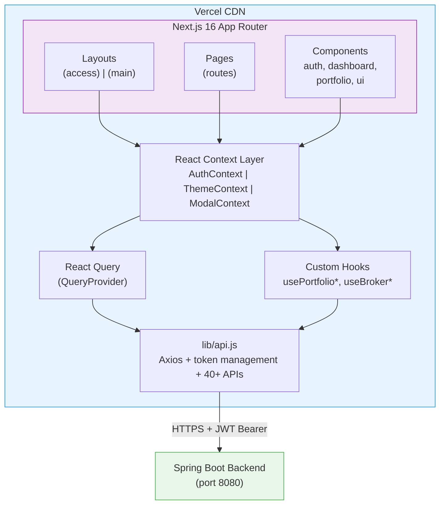
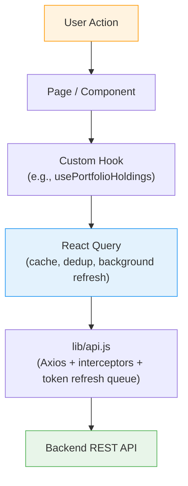
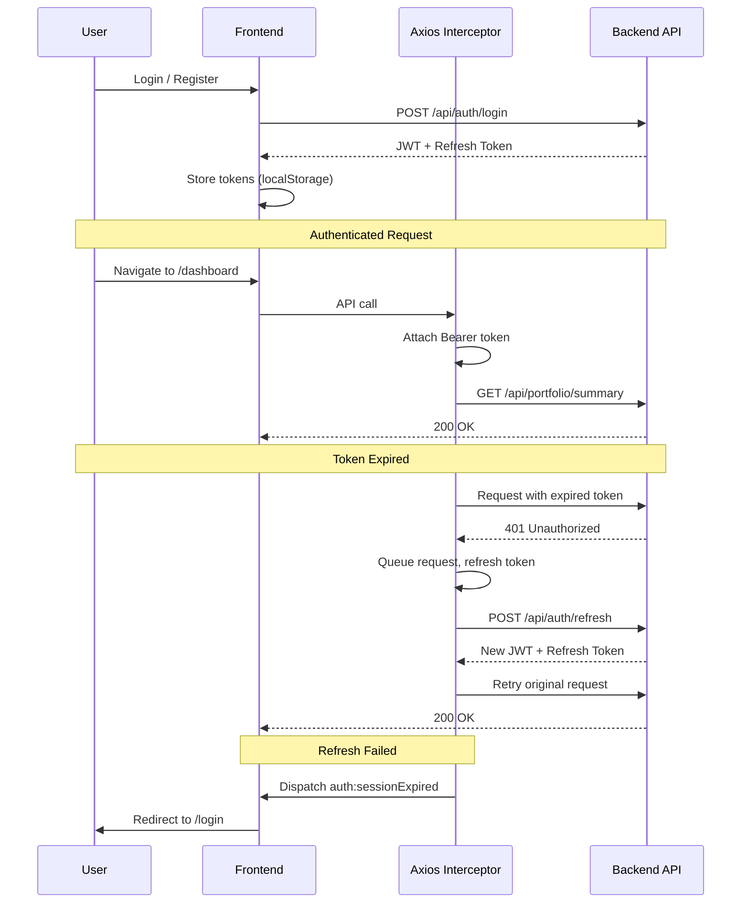
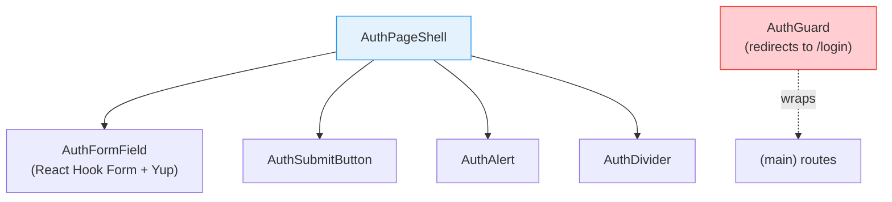
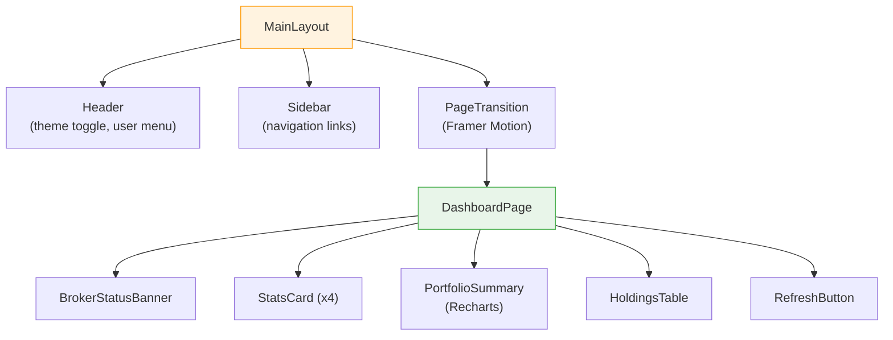
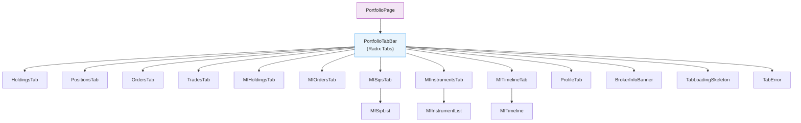
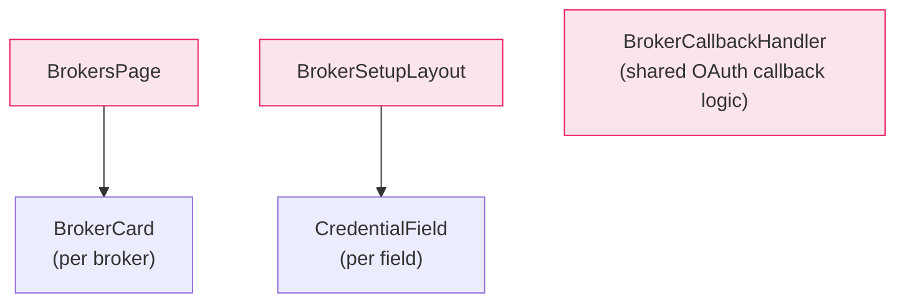
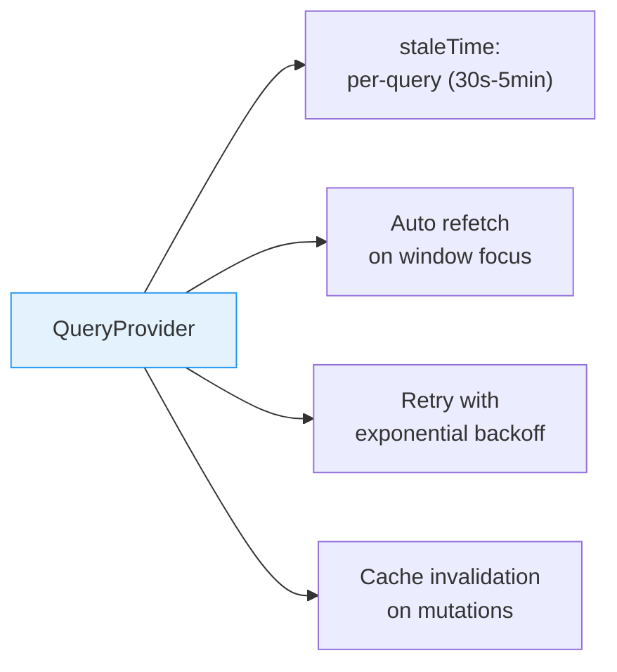

# CoinTrack Frontend

> **Version 3.0.0** | Last updated: 2026-03-19
> Status: Active Development
> Stack: Next.js 16 / React 18 / Tailwind CSS 3 / React Query 5

---

## Table of Contents

1. [Overview](#overview)
2. [Architecture](#architecture)
3. [Directory Structure](#directory-structure)
4. [Key Features](#key-features)
5. [Route Map](#route-map)
6. [Component Hierarchy](#component-hierarchy)
7. [State Management](#state-management)
8. [Hooks](#hooks)
9. [Library Modules](#library-modules)
10. [Environment Variables](#environment-variables)
11. [Development Setup](#development-setup)
12. [Scripts Reference](#scripts-reference)
13. [Testing](#testing)
14. [Deployment](#deployment)
15. [Tech Stack Reference](#tech-stack-reference)

---

## Overview

CoinTrack is a personal finance dashboard that aggregates portfolio data from
multiple Indian stockbrokers (Zerodha, AngelOne, Upstox). The frontend is a
Next.js App Router application providing:

- Authenticated dashboard with real-time portfolio summaries
- Multi-broker connection management with OAuth callbacks
- Detailed portfolio views (holdings, positions, orders, mutual funds)
- 32+ financial calculators (public, no auth required)
- Secure 2FA (TOTP) setup and management
- Notes system for personal finance tracking
- Dark/light theme support

---

## Architecture


```mermaid
graph TB
    subgraph Vercel["Vercel CDN"]
        subgraph NextApp["Next.js 16 App Router"]
            direction TB
            LY["Layouts<br/>(access) | (main)"]
            PG["Pages<br/>(routes)"]
            CMP["Components<br/>auth, dashboard,<br/>portfolio, ui"]
        end

        LY & PG & CMP --> CTX["React Context Layer<br/>AuthContext | ThemeContext | ModalContext"]

        CTX --> RQ["React Query<br/>(QueryProvider)"]
        CTX --> HK["Custom Hooks<br/>usePortfolio*, useBroker*"]

        RQ & HK --> API["lib/api.js<br/>Axios + token management + 40+ APIs"]
    end

    API -->|"HTTPS + JWT Bearer"| BE["Spring Boot Backend<br/>(port 8080)"]

    style Vercel fill:#e8f4fd,stroke:#2196F3
    style NextApp fill:#f3e5f5,stroke:#9C27B0
    style BE fill:#e8f5e9,stroke:#4CAF50
```

### Data Flow


```mermaid
flowchart TD
    A["User Action"] --> B["Page / Component"]
    B --> C["Custom Hook<br/>(e.g., usePortfolioHoldings)"]
    C --> D["React Query<br/>(cache, dedup, background refresh)"]
    D --> E["lib/api.js<br/>(Axios + interceptors + token refresh queue)"]
    E --> F["Backend REST API"]

    style A fill:#fff3e0,stroke:#FF9800
    style D fill:#e3f2fd,stroke:#2196F3
    style F fill:#e8f5e9,stroke:#4CAF50
```

### Authentication Flow


```mermaid
sequenceDiagram
    participant U as User
    participant FE as Frontend
    participant AX as Axios Interceptor
    participant BE as Backend API

    U->>FE: Login / Register
    FE->>BE: POST /api/auth/login
    BE-->>FE: JWT + Refresh Token
    FE->>FE: Store tokens (localStorage)

    Note over U,BE: Authenticated Request
    U->>FE: Navigate to /dashboard
    FE->>AX: API call
    AX->>AX: Attach Bearer token
    AX->>BE: GET /api/portfolio/summary
    BE-->>FE: 200 OK

    Note over U,BE: Token Expired
    AX->>BE: Request with expired token
    BE-->>AX: 401 Unauthorized
    AX->>AX: Queue request, refresh token
    AX->>BE: POST /api/auth/refresh
    BE-->>AX: New JWT + Refresh Token
    AX->>BE: Retry original request
    BE-->>FE: 200 OK

    Note over AX,FE: Refresh Failed
    AX->>FE: Dispatch auth:sessionExpired
    FE->>U: Redirect to /login
```

---

## Directory Structure

```
frontend/
|-- public/                          # Static assets
|-- src/
|   |-- app/
|   |   |-- layout.js               # Root layout (providers, fonts, metadata)
|   |   |-- page.jsx                # Landing page (public)
|   |   |-- not-found.js            # Global 404
|   |   |-- globals.css             # Tailwind base + custom styles
|   |   |-- icon.png                # Favicon
|   |   |
|   |   |-- (access)/               # Auth route group (no sidebar)
|   |   |   |-- layout.js           # Shared auth layout
|   |   |   |-- login/
|   |   |   |-- register/
|   |   |   |-- forgot-password/
|   |   |   |-- verify-email/
|   |   |   |-- setup-2fa/
|   |   |   |-- reset-2fa/
|   |   |   |-- reset-password/
|   |   |   +-- not-found.js
|   |   |
|   |   |-- (main)/                  # Authenticated route group (with sidebar)
|   |   |   |-- dashboard/
|   |   |   |-- portfolio/
|   |   |   |-- brokers/
|   |   |   |   |-- page.jsx        # Broker listing
|   |   |   |   |-- zerodha/        # setup, callback, dashboard
|   |   |   |   |-- angelone/       # setup, callback, dashboard
|   |   |   |   +-- upstox/         # setup, callback, dashboard
|   |   |   |-- notes/
|   |   |   |-- profile/
|   |   |   +-- settings/
|   |   |       +-- 2fa-settings/
|   |   |
|   |   +-- calculators/            # Public route group (no auth)
|   |       |-- layout.jsx
|   |       |-- page.jsx            # Calculator index
|   |       |-- investment/          # 7 calculators
|   |       |-- loans/               # 6 calculators
|   |       |-- savings/             # 10 calculators
|   |       |-- tax/                 # 6 calculators
|   |       |-- trading/             # 2 calculators
|   |       +-- planning/            # 1 calculator
|   |
|   |-- components/
|   |   |-- auth/                    # 6 components
|   |   |-- brokers/                 # 1 + 4 shared
|   |   |-- calculators/             # Calculator framework
|   |   |-- dashboard/               # 5 components
|   |   |-- layout/                  # 3 components (Header, Sidebar, MainLayout)
|   |   |-- modals/                  # 3 components
|   |   |-- notes/                   # 1 component
|   |   |-- portfolio/               # 4 + 13 tab components
|   |   |-- ui/                      # 11 primitives
|   |   +-- TotpSetup.jsx
|   |
|   |-- contexts/                    # 3 contexts
|   |-- hooks/                       # 8 custom hooks
|   |-- lib/                         # 8 utility modules
|   +-- providers/                   # 1 provider (React Query)
|
|-- cypress/                         # E2E test suites
|-- jest.config.js
|-- tailwind.config.js
|-- next.config.mjs
|-- package.json
+-- vercel.json
```

---

## Key Features

### Multi-Broker Portfolio Aggregation

Connect multiple Indian stockbrokers through OAuth and view consolidated data:

- **Zerodha** -- KiteConnect API (API key + secret)
- **AngelOne** -- SmartAPI (client ID + password + TOTP)
- **Upstox** -- Upstox API v2 (API key + secret)

Each broker follows a consistent pattern: setup page, OAuth callback handler,
and dedicated dashboard view. Broker-specific configuration lives in
`lib/brokerConfig.js`.

### Portfolio Views (13 Tabs)

| Tab              | Data Source               |
|------------------|---------------------------|
| Holdings         | Equity holdings           |
| Positions        | Open positions            |
| Orders           | Order history             |
| Trades           | Trade executions          |
| MF Holdings      | Mutual fund holdings      |
| MF Orders        | MF order history          |
| MF SIPs          | Active SIP list           |
| MF Instruments   | Available MF instruments  |
| MF Timeline      | MF transaction timeline   |
| Profile          | Broker account profile    |
| Broker Info      | Connection status banner  |

### Financial Calculators (32+)

All calculators are publicly accessible (no authentication required) and share
a common framework in `components/calculators/framework/CalculatorComponents`.

| Category    | Count | Examples                                      |
|-------------|-------|-----------------------------------------------|
| Investment  | 7     | SIP, Lumpsum, CAGR, XIRR, Step-up SIP        |
| Savings     | 10    | FD, RD, PPF, NPS, EPF, SSY, NPS, NSC, SCSS   |
| Loans       | 6     | EMI, Home Loan, Car Loan, Compound Interest   |
| Tax         | 6     | Income Tax, HRA, TDS, GST, Salary, Gratuity  |
| Trading     | 2     | Brokerage, Margin                             |
| Planning    | 1     | Retirement                                    |

### Authentication and Security

- JWT + Refresh token with automatic silent refresh
- Mandatory 2FA (TOTP) setup after registration
- Password reset flow with email verification
- 2FA recovery flow
- AuthGuard component wraps all (main) routes
- Token race condition prevention via refresh queue

### UI/UX

- Dark/light theme via ThemeContext
- Page transitions with Framer Motion
- Responsive sidebar navigation
- Toast notifications via Radix UI
- Recharts-based portfolio charts
- Skeleton loading states for all data views

---

## Route Map

```
/                                   Landing page (public)
/calculators                        Calculator index (public)
/calculators/{category}/{calc}      Individual calculator (public)

/login                              Sign in
/register                           Create account
/forgot-password                    Request password reset
/reset-password                     Set new password (via email link)
/verify-email                       Email verification
/setup-2fa                          TOTP setup (post-registration)
/reset-2fa                          2FA recovery

/dashboard                          Portfolio overview [auth]
/portfolio                          Detailed portfolio tabs [auth]
/brokers                            Broker listing [auth]
/brokers/{broker}                   Broker setup page [auth]
/brokers/{broker}/callback          OAuth callback handler [auth]
/brokers/{broker}/dashboard         Broker-specific dashboard [auth]
/notes                              Personal notes [auth]
/profile                            User profile [auth]
/settings/2fa-settings              2FA management [auth]
```

Where `{broker}` is one of: `zerodha`, `angelone`, `upstox`.
Where `{category}` is one of: `investment`, `loans`, `savings`, `tax`, `trading`, `planning`.

---

## Component Hierarchy

### Auth Components


```mermaid
graph TD
    APS["AuthPageShell"] --> AFF["AuthFormField<br/>(React Hook Form + Yup)"]
    APS --> ASB["AuthSubmitButton"]
    APS --> AA["AuthAlert"]
    APS --> AD["AuthDivider"]
    AG["AuthGuard<br/>(redirects to /login)"] -.->|wraps| MAIN["(main) routes"]

    style APS fill:#e3f2fd,stroke:#2196F3
    style AG fill:#ffcdd2,stroke:#F44336
```

### Dashboard Components


```mermaid
graph TD
    ML["MainLayout"] --> HD["Header<br/>(theme toggle, user menu)"]
    ML --> SB["Sidebar<br/>(navigation links)"]
    ML --> PT["PageTransition<br/>(Framer Motion)"]
    PT --> DP["DashboardPage"]
    DP --> BSB["BrokerStatusBanner"]
    DP --> SC["StatsCard (x4)"]
    DP --> PS["PortfolioSummary<br/>(Recharts)"]
    DP --> HT["HoldingsTable"]
    DP --> RB["RefreshButton"]

    style ML fill:#fff3e0,stroke:#FF9800
    style DP fill:#e8f5e9,stroke:#4CAF50
```

### Portfolio Components


```mermaid
graph TD
    PP["PortfolioPage"] --> PTB["PortfolioTabBar<br/>(Radix Tabs)"]
    PTB --> HT["HoldingsTab"]
    PTB --> POST["PositionsTab"]
    PTB --> OT["OrdersTab"]
    PTB --> TT["TradesTab"]
    PTB --> MFH["MfHoldingsTab"]
    PTB --> MFO["MfOrdersTab"]
    PTB --> MFS["MfSipsTab"]
    MFS --> SL["MfSipList"]
    PTB --> MFI["MfInstrumentsTab"]
    MFI --> IL["MfInstrumentList"]
    PTB --> MFT["MfTimelineTab"]
    MFT --> TL["MfTimeline"]
    PTB --> PRT["ProfileTab"]
    PTB --> BIB["BrokerInfoBanner"]
    PTB --> TLS["TabLoadingSkeleton"]
    PTB --> TE["TabError"]

    style PP fill:#f3e5f5,stroke:#9C27B0
    style PTB fill:#e8f4fd,stroke:#2196F3
```

### Broker Components


```mermaid
graph TD
    BP["BrokersPage"] --> BC["BrokerCard<br/>(per broker)"]
    BSL["BrokerSetupLayout"] --> CF["CredentialField<br/>(per field)"]
    BCH["BrokerCallbackHandler<br/>(shared OAuth callback logic)"]

    style BP fill:#fce4ec,stroke:#E91E63
    style BSL fill:#fce4ec,stroke:#E91E63
    style BCH fill:#fce4ec,stroke:#E91E63
```

### UI Primitives

Built on Radix UI and styled with Tailwind + class-variance-authority:

`alert` | `badge` | `button` | `card` | `input` | `label` |
`PageTransition` | `Skeleton` | `toast` | `toaster` | `use-toast`

---

## State Management

### React Query (TanStack Query v5)

Primary data fetching and caching layer configured in `providers/QueryProvider`.


```mermaid
graph LR
    QP["QueryProvider"] --> ST["staleTime:<br/>per-query (30s-5min)"]
    QP --> RF["Auto refetch<br/>on window focus"]
    QP --> RT["Retry with<br/>exponential backoff"]
    QP --> CI["Cache invalidation<br/>on mutations"]

    style QP fill:#e3f2fd,stroke:#2196F3
```

All portfolio data flows through React Query via custom hooks. Each hook
encapsulates the query key, fetch function, and transformation logic.

### React Contexts

| Context        | Purpose                              | Scope          |
|----------------|--------------------------------------|----------------|
| AuthContext     | User state, login/logout, token mgmt | Global         |
| ThemeContext    | Dark/light mode toggle               | Global         |
| ModalContext    | Contact, legal modal visibility      | Global         |

AuthContext uses `useReducer` for predictable state transitions across
login, logout, loading, and error states. It listens for `auth:sessionExpired`
events dispatched by the Axios interceptor.

---

## Hooks

| Hook                    | Purpose                                          |
|-------------------------|--------------------------------------------------|
| `useBrokerConnection`   | Broker OAuth flow, credentials, connection state  |
| `usePortfolioFunds`     | Fetch broker fund/balance data                   |
| `usePortfolioHoldings`  | Fetch equity holdings for connected broker       |
| `usePortfolioOrders`    | Fetch order history                              |
| `usePortfolioPositions` | Fetch open positions                             |
| `usePortfolioSummary`   | Aggregated portfolio summary (dashboard)         |
| `usePortfolioTab`       | Tab-specific data loading orchestration          |
| `useZerodhaDashboard`   | Zerodha-specific dashboard data                  |

All `usePortfolio*` hooks return `{ data, isLoading, error, refetch }` and
integrate with React Query for caching and background refresh.

---

## Library Modules

| Module                 | Purpose                                          |
|------------------------|--------------------------------------------------|
| `api.js`               | Axios instance, 40+ API methods, token manager   |
| `brokerConfig.js`      | Broker metadata, OAuth URLs, field definitions   |
| `calculator.service.js`| Calculator computation functions                 |
| `format.js`            | Currency, percentage, number formatting          |
| `logger.js`            | Structured console logging (dev/prod aware)      |
| `motion.js`            | Framer Motion animation presets                  |
| `stockNameMapping.js`  | NSE/BSE symbol to display name mapping           |
| `utils.js`             | Tailwind `cn()` merge helper and misc utilities  |

### API Module (`lib/api.js`)

The API module exports named method groups:

- `authAPI` -- login, register, verify-email, refresh, logout
- `userAPI` -- profile, update, change-password, change-email
- `totpAPI` -- setup, verify, disable, recovery
- `brokerAPI` -- connect, disconnect, credentials, status
- `portfolioAPI` -- holdings, positions, orders, trades, MF data
- `notesAPI` -- CRUD operations for personal notes
- `tokenManager` -- get/set/remove JWT and refresh tokens

Request interceptor attaches `Authorization: Bearer <token>` to every request.
Response interceptor handles 401s with a queued refresh mechanism to prevent
parallel refresh token race conditions.

---

## Environment Variables

| Variable                | Required | Description                          |
|-------------------------|----------|--------------------------------------|
| `NEXT_PUBLIC_API_BASE`  | Yes      | Backend API base URL                 |
| `NEXT_PUBLIC_APP_URL`   | Yes      | Frontend public URL (for callbacks)  |

Create a `.env.local` file in the `frontend/` directory:

```env
NEXT_PUBLIC_API_BASE=http://localhost:8080
NEXT_PUBLIC_APP_URL=http://localhost:3000
```

In production (Vercel), these are set via the Vercel dashboard as environment
variables.

---

## Development Setup

### Prerequisites

- Node.js >= 18.17.0
- npm >= 9.0.0
- Backend running on port 8080 (for API calls)

### Installation

```bash
cd frontend
npm install
```

### Running Development Server

```bash
npm run dev
```

The app starts at `http://localhost:3000`. In development, Next.js rewrites
`/api/*` requests to the backend at `http://localhost:8080`.

### Linting and Formatting

```bash
npm run lint          # ESLint check
npm run lint:fix      # ESLint auto-fix
npm run format        # Prettier format all files
npm run format:check  # Prettier check (CI)
```

Husky pre-commit hooks run lint checks automatically on commit.

---

## Scripts Reference

| Script              | Command                  | Description                    |
|---------------------|--------------------------|--------------------------------|
| `dev`               | `next dev --webpack`     | Start dev server               |
| `build`             | `next build`             | Production build               |
| `start`             | `next start`             | Start production server        |
| `lint`              | `next lint`              | Run ESLint                     |
| `lint:fix`          | `next lint --fix`        | Auto-fix lint issues           |
| `format`            | `prettier --write ...`   | Format all files               |
| `format:check`      | `prettier --check ...`   | Check formatting               |
| `test`              | `jest`                   | Run unit tests                 |
| `test:watch`        | `jest --watch`           | Run tests in watch mode        |
| `test:coverage`     | `jest --coverage`        | Generate coverage report       |
| `cypress:open`      | `cypress open`           | Open Cypress GUI               |
| `cypress:run`       | `cypress run`            | Run Cypress headless           |

---

## Testing

### Unit Tests (Jest + Testing Library)

```bash
npm test                 # Single run
npm run test:watch       # Watch mode
npm run test:coverage    # With coverage report
```

Configuration: `jest.config.js` with `jest-environment-jsdom`.
Testing utilities: `@testing-library/react`, `@testing-library/jest-dom`,
`@testing-library/user-event`.

### E2E Tests (Cypress)

```bash
npm run cypress:open      # Interactive mode
npm run cypress:run       # Headless (CI)
```

Cypress tests live in the `cypress/` directory and test full user flows
including authentication, broker connection, and portfolio navigation.

---

## Deployment

### Vercel (Production)

The frontend auto-deploys to Vercel on push to `main`.

- **Build command:** `next build`
- **Output directory:** `.next`
- **Node.js version:** 18.x
- **Environment variables:** Set via Vercel dashboard

### Vercel Configuration

Additional configuration is managed through `vercel.json` in the project root.
Vercel Analytics and Speed Insights are integrated via `@vercel/analytics` and
`@vercel/speed-insights`.

---

## Tech Stack Reference

| Library                    | Version   | Purpose                          |
|----------------------------|-----------|----------------------------------|
| Next.js                    | 16.0.10   | React framework (App Router)     |
| React                      | 18.3.1    | UI library                       |
| Tailwind CSS               | 3.4.14    | Utility-first CSS                |
| @tanstack/react-query      | 5.90.12   | Server state management          |
| Axios                      | 1.7.0     | HTTP client                      |
| Framer Motion              | 11.0.0    | Animations and transitions       |
| React Hook Form            | 7.52.0    | Form state management            |
| Yup                        | 1.3.0     | Schema validation                |
| Recharts                   | 2.9.0     | Charting library                 |
| Lucide React               | 0.545.0   | Icon library                     |
| date-fns                   | 3.6.0     | Date utilities                   |
| class-variance-authority   | 0.7.1     | Component variant styling        |
| @radix-ui/*                | various   | Accessible UI primitives         |
| Cypress                    | 13.7.0    | E2E testing                      |
| Jest                       | 29.7.0    | Unit testing                     |
| @testing-library/react     | 14.2.0    | Component testing utilities      |
| ESLint                     | 9.0.0     | Code linting                     |
| Prettier                   | 3.3.3     | Code formatting                  |
| Husky                      | 9.1.7     | Git hooks                        |
