# 🦅 CoinTrack Frontend (Production)

> **Role:** FinTech Dashboard & Broker Aggregator
> **Stack:** Next.js 16 (App Router), React Query, Tailwind CSS, Recharts

## 📖 Overview

The CoinTrack Frontend is a high-performance, secure, and opinionated Single Page Application (SPA) built on Next.js 16. It serves as the primary interface for users to:
- Aggregate portfolios across brokers (Zerodha, Upstox, AngelOne).
- Manage personal trading notes.
- View real-time P&L analysis.
- Execute secure authentication and session management.

It is designed to be **strict**, **type-safe**, and **predictable**, enforcing a standardized "Constitution" for data flow and state management.

---

## 🏛️ Architecture Principles

### 1. Separation of Concerns
- **UI Components** (`src/components`): Dumb, presentational, receive data via props.
- **Data Hooks** (`src/hooks`): Smart, own the data fetching lifecycle, caching, and refresh logic.
- **API Layer** (`src/lib/api.js`): The ONLY place HTTP calls happen. Normalizes backend errors into predictable objects.

### 2. The "No-Leak" Policy
- **Auth Tokens**: Never accessed directly by components. Only `useAuth()` or `api.js` interceptors touch them.
- **API Errors**: Backend 500s/400s are caught in `api.js` and converted to safe messages before reaching the UI.
- **Direct Fetch**: Usage of `fetch` or `axios` inside components is strictly forbidden.

### 3. Production Readiness
- **Logging**: `console.log` is banned. We use `src/lib/logger.js` which is stripped/silenced in production.
- **Caching**: React Query handles valid-while-revalidate. Token expiry auto-triggers logout.
- **Build**: Turbopack-compatible, static generation where possible, standalone Docker output.

---

## Frontend Architecture Diagram

```mermaid
graph TD
    %% =======================
    %% Client Side
    %% =======================
    subgraph Client["Browser Runtime"]
        User((User))

        %% -------- Router --------
        subgraph Router["Next.js App Router"]
            AccessGroup["(access) Routes<br/>/login · /register"]
            MainGroup["(main) Routes<br/>/dashboard · /brokers · /portfolio"]
        end

        %% -------- Pages & UI --------
        subgraph UI["Pages & UI Components"]
            Pages["Page Components"]
            AuthGuard["AuthGuard"]
            Components["Shared UI Components"]
        end

        %% -------- State --------
        subgraph State["Global State & Providers"]
            AuthCtx["AuthContext<br/>(Auth & Token Lifecycle)"]
            QueryProv["QueryProvider<br/>(React Query Cache)"]
        end

        %% -------- Hooks --------
        subgraph Hooks["Hooks Layer (Domain Logic)"]
            useBroker["useBrokerConnection"]
            useZerodha["useZerodhaDashboard"]
            useSummary["usePortfolioSummary"]
            usePositions["usePortfolioPositions"]
        end

        %% -------- Infra --------
        subgraph Infra["Infrastructure Layer"]
            API["lib/api.js<br/>(Axios + Normalization)"]
            Logger["lib/logger.js"]
            TokenMgr["tokenManager"]
        end
    end

    %% =======================
    %% Backend
    %% =======================
    subgraph Backend["Backend System"]
        SpringBoot["Spring Boot REST APIs"]
    end

    %% =======================
    %% Navigation Flow
    %% =======================
    User --> Router
    Router --> Pages
    Pages --> AuthGuard
    AuthGuard --> Components

    %% =======================
    %% Data Flow
    %% =======================
    Components --> Hooks
    Hooks --> QueryProv
    QueryProv --> API

    API -->|HTTP| SpringBoot
    SpringBoot -->|JSON| API

    API -->|Normalized Data| Hooks
    Hooks -->|Domain Data| Components

    %% =======================
    %% Auth Flow
    %% =======================
    AuthCtx -->|Hydrate / Logout| TokenMgr
    TokenMgr -->|Attach Token| API
    API -->|401| AuthCtx

    %% =======================
    %% Logging
    %% =======================
    API -.-> Logger
    AuthCtx -.-> Logger
    Hooks -.-> Logger
```



### Architectural Key Points
*   **Router & Components**: URL drives the UI, but Components are "dumb" and delegate logic.
*   **Hooks Layer**: The critical abstraction. It translates "UI needs" (e.g., "Show Profile") into "API calls". It owns caching.
*   **API Layer**: The security gatekeeper. It injects the `Authorization` header and normalizes 500/400 errors into safe objects.
*   **State**: `AuthContext` reacts globally to 401 errors, forcing a logout to protect data.
*   **Backend**: Completely decoupled. The Frontend knows *endpoints*, not backend implementation details.

---

## 🔌 Frontend ↔ Backend Integration

### API Contract (`src/lib/api.js`)
This file is the **single source of truth** for all backend endpoints.
- **Mappings**: named exports like `brokerAPI.getZerodhaHoldings` map to `/api/brokers/zerodha/holdings`.
- **Normalization**: Ensures `data` is always the payload, not the axios wrapper.
- **Security**: auto-injects `Authorization: Bearer <token>` and handles 401 redirects globally.

### Broker Flow
1. **Connect**: User clicks "Link Zerodha" -> calls `brokerAPI.getConnectUrl`.
2. **Redirect**: Backend returns Zerodha login URL -> Frontend redirects window.
3. **Callback**: Zerodha redirects to `/brokers/zerodha/callback`.
4. **Exchange**: Callback page sends `request_token` to Backend -> Backend returns success.
5. **Dashboard**: Frontend redirects to Dashboard -> `useZerodhaDashboard` hook wakes up and fetches data.

---

## 📜 The Frontend Constitution (Non-Negotiable)

1.  **❌ Strict Ban**: No `fetch()`, no `useEffect` for data fetching. Use `useQuery`.
2.  **❌ Strict Ban**: No `console.log`. Use `logger.info()`.
3.  **❌ Strict Ban**: No reading `localStorage` in simple components. Use `useAuth()`.
4.  **✅ Constraint**: All broker logic must live in `src/app/(main)/brokers/`.
5.  **✅ Constraint**: `api.js` must handle all error normalization.

---

## 🚀 Getting Started

### Prerequisites
- Node.js 18+
- Backend running on `http://localhost:8080` (default)

### Environment Variables
Create `.env.local`:
```bash
NEXT_PUBLIC_API_BASE=http://localhost:8080
```

### Commands
| Command | Description |
| :--- | :--- |
| `npm run dev` | Start dev server (Turbopack or Webpack) |
| `npm run build` | Production build (Static + Dynamic) |
| `npm start` | Serve production build |
| `npm run lint` | Check strict rules |

---

## 📚 Documentation Index

- [App Router Structure](docs/app.md)
- [Components Library](docs/components.md)
- [Hooks & Data Fetching](docs/hooks.md)
- [Contexts & State](docs/contexts.md)
- [API & Libs](docs/lib.md)
- [Deployment Guide](docs/deployment.md)
